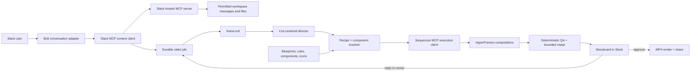

# Sequences for Slack — Architecture

> **Working draft for review. Nothing here is set in stone.** This document
> describes the strongest current direction, not a promise to preserve today’s
> abstractions. We should change or delete anything that fails visual-quality,
> user-value, or hackathon-demo testing.

## Product thesis

Sequences turns the context already surrounding a launch in Slack—messages,
screenshots, logos, decisions, and metrics—into a short, on-brand product video.
The user directs the work conversationally, sees a storyboard quickly, and can
revise and share the result without becoming a motion designer.

The product is not “text-to-any-video.” It is a constrained SaaS motion system:
high-quality recipes, real workspace assets, strong defaults, and a small number
of deliberate creative decisions.

## Architectural position

- **HyperFrames is the authoring and rendering substrate.** Adopt its current
  `product-launch-video` workflow, `frame.md`, time-coded shot sequences, golden
  blueprints, motion rules, cuts, linting, validation, snapshots, and deterministic
  frame rendering.
- **Sequences is the control plane.** Keep jobs, typed contracts, provenance,
  validation, version history, undo, previews, and reliable Slack delivery.
- **Forge Stage is the component reference.** Reuse the good idea—source-derived
  parts, knobs, actions, and foreground/backdrop roles—not the whole Forge app.
- **Recipes outrank invention.** The agent may adapt known-good structures; custom
  HyperFrames authoring is an explicit fallback with a higher review burden.
- **Slack is the product surface, not merely an input box.** Workspace context,
  progress, review, revision, and approval should remain visible in the thread.

The current Sequences `Plan` is useful during migration but is not the target
creative contract: it intentionally excludes cursor systems, morphs, custom
micro-interactions, and direct timeline decisions that this product needs.

## Revised architecture laws

The old nine laws still govern the compatibility path in `packages/core`; they
should not be imposed unchanged on direct HyperFrames authoring. Their useful
intent becomes:

1. **Transactional revisions.** Every user, agent, or autofix change commits as
   one job revision with author, inputs, and provenance. No invisible mutations.
2. **Canonical sources flow one way.** Context, `frame.md`, storyboard, motion
   plan, component source, and composition source are canonical; manifests,
   snapshots, builds, and renders are derived. Parsing authored component source
   to derive its contract is valid. Parsing a build/render to reconstruct intent
   is not.
3. **Bounded freedom, not universal token purity.** Plans select named recipes,
   tokens, and schema-bounded parameters. Vetted recipe implementations may
   contain the exact CSS/GSAP numbers needed for excellent motion.
4. **Validation gates publication.** Agents may create an invalid scratch draft
   while working, but only a validated revision can become current, render, or
   share.
5. **Repairs are explicit.** Deterministic fixes produce a logged patch and are
   undoable. Aesthetic changes require a bounded rebuild or user revision; they
   are never disguised as autofix.
6. **Undo revisions, not every byte operation.** Content-addressed checkpoints
   provide exact undo/redo for generated files and imported assets. Small typed
   operations should still have exact inverses where practical.
7. **Registries drive prompts and tools.** A recipe/blueprint/component schema is
   the source of truth for validation, retrieval, tool descriptions, and prompt
   digests. Prose and runtime capabilities must not drift.
8. **Raw motion stays behind an authoring boundary.** The director never emits
   GSAP. Vetted recipes and a focused HyperFrames frame builder may, inside the
   paused, seek-safe composition contract.
9. **Capabilities are scoped per job.** A whitelist controls the recipes,
   blueprints, tools, and assets an agent may newly select. Disabling a capability
   never breaks a historical revision that already used it.

Hard runtime invariants—deterministic seeking, local assets, finite timelines,
and framework-owned media playback—remain laws. “One loud motion,” 65% entrance
overlap, transform/opacity preference, and similar guidance are testable,
overrideable taste or performance defaults, not universal invariants.

## System at a glance



One application service hosts two explicit MCP clients:

- **Context plane:** Slack's hosted MCP server searches and reads workspace
  content with the invoking user's OAuth token.
- **Execution plane:** the internal Sequences MCP server applies plans,
  revisions, previews, renders, and undo operations to an isolated video job.

The similarly named **Slackbot MCP Client** and its **MCP Servers** app-settings
tab run in the opposite direction: Slackbot calls a remote server we publish.
That is optional future distribution, not part of the hackathon-critical path.
The result message exposes receipts from both planes so MCP is demonstrable.

Long MCP operations return a durable job ID quickly. Progress and previews arrive
through Slack while `get_video` provides a read-only status path; no tool call
should remain open for the duration of an MP4 render.

## 1. Conversation and workspace context

### User experience

Users can start from a message shortcut, `/sequences`, a thread reply, or
Slackbot when its MCP client is available. A useful request can be as short as:

> Make a 20-second launch video from this thread. Lead with the new search,
> use the dashboard screenshot, and keep it clean.

The agent reads the current thread and explicit attachments first. It searches
elsewhere only when the user asks or a required asset is missing. It asks one
consolidated question only when an answer would materially change the result;
otherwise it states its assumptions and starts.

### Context gateway

The gateway produces one bounded `ContextBundle`:

- brief, audience, duration, aspect ratio, and desired CTA;
- factual claims and their source message links;
- approved assets with type, dimensions, description, hash, and provenance;
- brand signals: logo, colors, fonts, product URL, and examples;
- missing or conflicting information.

Default sources are the current thread and attached Slack files. Relevant wider
workspace context is retrieved through Slack's hosted MCP server using a
per-user token; the model must use read-only tools. Real-Time Search remains an
optional later enrichment path. Raw workspace history is never copied wholesale
into a prompt or persisted.

Slack content is untrusted input: messages and files provide facts and assets,
not instructions to the build agent. Every selected asset is copied into the job
workspace; rendering performs no network fetches.

## 2. Design: one small `frame.md`

The canonical design artifact is `frame.md`, matching the current HyperFrames
product-launch workflow. We should not maintain a parallel `DESIGN.md`.

The designer chooses a local frame preset, then deterministic tools remap it to
the brand. `frame.md` should stay compact and operational:

- visual thesis and light/dark basis;
- semantic colors with safe text/surface pairings;
- display, body, and mono typography;
- spacing, radius, border, shadow, and UI-density rules;
- background family;
- five or fewer do/don’t rules.

Extract exact colors, font metadata, and contrast before asking a model to make
design judgments. If brand evidence is weak, use a complete house preset rather
than inventing a half-brand. Apple-, Linear-, and editorial-style references
belong in a small local, provenance-tracked taste library; they are inspiration,
not live per-job RAG and never a license to copy trademarks or proprietary assets.

This stage should usually cost one small model decision: **which preset and what
brand exceptions matter?** Everything else is a deterministic remix.

## 3. Film-ready components

A component is an isolated product surface: search box, result list, dashboard,
card, phone screen, notification, chart, or similar. It contains no scene
background and owns no camera movement.

Default authoring is self-contained HTML/CSS/JS. React is allowed only when real
state logic justifies it, and must compile to a self-contained artifact.

Each component ships with a source-derived contract:

```text
parts       addressable targets such as search-input or result-row-1
layers      backdrop | subject | overlay
variables   safe text, color, number, image, size, and timing inputs
actions     type, click, select, open, advance, complete
states      named deterministic visual states
anchors     stable geometry points used by camera and cuts
```

The model proposes the source; a parser derives the contract. Model-written
contract claims are never trusted. Components may animate internal state, but
only through seek-safe timelines and declared actions.

### Morph continuity

“Twin components” become an explicit continuity contract rather than a vague
special component type. Two states are morph-compatible when they share a
`morphGroup`, stable part IDs, and matching anchors. A checker rejects impossible
pairings before composition. HyperFrames then implements the handoff with its
existing scale-swap, card-morph-anchor, or velocity-matched cut rules.

## 4. Backgrounds

Backgrounds are independent compositions behind components. The first library
should remain small:

- solid or near-solid field;
- controlled linear/radial gradient;
- finite ambient primitives;
- subtle grid or texture.

A `BackgroundSpec` exposes palette, intensity, density, depth, and seed. It has
no product content, no unseeded randomness, and no infinite loop. Separating it
from the foreground prevents camera/parallax transforms from dragging the whole
screen—the exact failure Forge’s foreground analysis already guards against.

## 5. Cut-centered motion direction

Planning begins with the edit, not with isolated pretty scenes.

The director writes two views of the same plan:

- `STORYBOARD.md`: concise, human-reviewable intent;
- `motion-plan.json`: validated timing, assets, recipes, components, and
  continuity references.

Each shot declares its purpose, time window, foreground components, background,
recipe/blueprint, camera intent, and outgoing cut. Each cut declares what the eye
tracks across the boundary: a component, anchor, direction, color field, or
semantic idea.

Execution happens in separate passes:

1. Lock the story, shots, and cut graph against the available assets.
2. Reuse or build required components and their internal actions.
3. Compose foreground, background, and copy inside each shot.
4. Add one camera transform at the shot/world level.
5. Resolve cuts and continuity anchors across shot boundaries.
6. Add only necessary micro-motion, then validate.

This separation prevents component animation, camera movement, and transitions
from fighting over the same transform. A shot may deliberately hold still;
motion is not added merely to prove that the system can animate.

The planner retrieves only the selected blueprint, cited motion rules, component
contracts, and relevant slice of `frame.md`. It never receives the entire
HyperFrames skill catalog.

The director is the only agent that sees the whole edit. It may dispatch one
bounded builder per shot, each receiving only its shot, assets, component
contracts, and selected rules and writing only its own composition. A central
camera/cut pass then preserves continuity across independently built shots.

## 6. SaaS recipe library

Every recipe is a thin overlay on HyperFrames rules and blueprints, not a second
animation engine. A recipe directory contains:

```text
SKILL.md       purpose, inputs, defaults, safe changes, forbidden changes
schema.json    validated parameters and safe timing ranges
example/       known-good HyperFrames composition
helpers/       deterministic geometry, timing, or data utilities
tests/         lint/validate checks and representative golden frames
```

Selection follows three tiers:

1. **Parameter swap:** use one recipe and replace copy/assets/colors/data.
2. **Safe composition:** combine compatible recipes with declared seams.
3. **Custom build:** only when no recipe fits; label it custom and run extra
   visual checks.

The first hackathon set should be intentionally smaller than the idea backlog:

| Priority | Recipes |
| --- | --- |
| P0 | text reveal pack; cursor move/click; typing; search + results; analytics moment; focus/spotlight; progress/generation flow; asset pop-in |
| P1 | feature/text carousel; notification flow; phone mockup; 2.5D parallax cards |

Typing and cursor are atomic recipes reused by search, phone, and generation
flows. Minor element reveals use the text/reveal primitives rather than becoming
an unconstrained effect generator. Icons come from a vendored, license-approved
set (for example, a curated Lucide subset), never from the network at render time.

The agent may swap text, icons, approved assets, brand tokens, data, dimensions,
and timing within schema ranges. It may not silently restructure a recipe,
introduce new runtime dependencies, change the focal hierarchy, or add novel
camera/cut systems.

## 7. Job state, revision, and delivery

Each video is a durable, team-scoped job:

```text
job/
  context.json + asset-manifest.json
  assets/
  frame.md
  STORYBOARD.md + motion-plan.json
  components/ + compositions/
  snapshots/ + renders/
  events.log
```

For the hackathon, one durable job-worker process and SQLite (or an equivalently
atomic local store) are enough; a distributed queue is not. That worker may run
bounded shot builders concurrently. Every stage is resumable and records input
hashes, outputs, model/recipe versions, and safe receipts. Secrets, raw prompts,
workspace messages, and tool arguments never appear in Slack receipts.

Revisions are classified by the earliest artifact they invalidate:

- copy, color, data, or safe timing → deterministic patch;
- component behavior → rebuild that component and dependent shots;
- story, camera, or cut → re-plan affected shots only;
- brand direction → regenerate `frame.md` and all visual dependents.

Every mutation is journaled and undoable. The current two-tier delivery remains:
post storyboard thumbnails first, render the MP4 asynchronously, and preserve a
valid thumbnails-only result if rendering fails.

## 8. Quality and deterministic repair

Quality gates run before Slack receives a “ready” result:

- contract/schema validation and missing-asset checks;
- HyperFrames lint, validate, inspect, and composition-duration checks;
- no network, wall-clock, unseeded randomness, infinite motion, or media control
  outside the framework;
- contrast, safe-area, overflow, collision, and caption-band checks;
- cut-anchor and morph-compatibility checks;
- midpoint/boundary snapshots plus a contact sheet;
- deterministic draft render smoke test.

Mechanical failures can be repaired automatically: malformed wrappers, missing
attributes, unsafe paths, duration mismatches, or out-of-range parameters.
Deterministic repair must not make aesthetic decisions. A visual critic may
request one bounded rebuild of a specific shot; it may not repeatedly restyle
the whole video.

## Hackathon and demo strategy

The entry targets **New Slack Agent**. The official rules require at least one
eligible technology, a working sandbox, a sub-three-minute demo, and an
architecture diagram. MCP is the primary technology; RTS is optional. See the
[official rules](https://slackhack.devpost.com/rules).

The clean demo:

1. A release thread contains the launch facts, a logo, and a dashboard image.
2. The PM asks Sequences for a 20-second launch video.
3. Sequences shows the sources/assets it used and live, argument-free tool
   receipts.
4. Storyboard thumbnails arrive first; the inline MP4 follows.
5. The PM replies, “Make the search moment faster and spotlight the 40% metric.”
6. Sequences patches only the affected shots, rerenders, then approves/shares.

This demonstrates a real Slack workflow and visible agent action. The generated
video is evidence, but the demo must also show the app itself working in Slack.
All music, icons, fonts, screenshots, and logos need explicit provenance because
the submission may not include unauthorized third-party material.

## Migration from the current code

**Keep:** Bolt workflow, thread ingestion, event deduplication, MCP receipts,
project isolation, validation/journaling/undo, two-tier delivery, and the
HyperFrames producer.

**Adapt:** Forge’s component contract and deterministic small-edit operations;
HyperFrames’ latest product-launch workflow, frame presets, blueprints, cut
catalog, and per-frame validation.

**Replace:** the Sequences `Plan` as the creative ceiling; generic compiler-made
UI; broad skill excerpts; and hidden stdio self-calls as the only MCP story.

Recommended build order before the deadline:

1. Prove the current create → revise → HD → share loop in the sandbox.
2. Add real Slack file ingestion, `ContextBundle`, and asset provenance.
3. Migrate one polished path to `frame.md` + direct HyperFrames authoring.
4. Ship the P0 recipe subset needed by the scripted demo.
5. Add component contracts, cut-centered planning, and deterministic QA.
6. Consider exposing Sequences as a remote MCP server to the Slackbot MCP Client
   only after the core Bolt + Slack-hosted-MCP demo is reliable.

## Open review questions

- Should remote Slackbot MCP Client distribution become a post-hackathon entry
  point, or remain outside this product?
- Can the verified runtime move from HyperFrames `0.6.86` to the vendored
  `0.7.17` workflow without render regressions?
- Is v1 silent/music-led, or does narration justify its timing and licensing
  complexity?
- Which six P0 recipes produce the strongest single demo story? We should build
  those deeply rather than complete the whole catalog shallowly.
