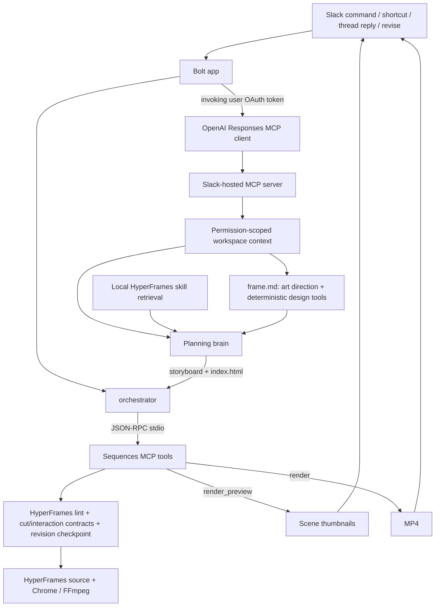

# ROADMAP.md — Current State, Priorities, and TODOs

> Slack Agent Builder Challenge · deadline July 13, 2026 at 8pm EDT.
> Rules: [HACKATHON_RULES.md](HACKATHON_RULES.md). Setup/deploy:
> [OPERATIONS.md](OPERATIONS.md). Agent/runtime boundaries: [CLAUDE.md](CLAUDE.md).
> Target design: [ARCHITECTURE.md](ARCHITECTURE.md).

## Product

Sequences for Slack turns a release message into a launch-video draft in the channel. A PM can create from `/sequences` or a message shortcut, inspect a storyboard immediately, receive an inline MP4 when rendering finishes, and ask for a revision without leaving Slack.

The product line is still “from shipped to shown.” The implementation strategy is:

- **HyperFrames is the primary authoring/rendering substrate and creative knowledge base.** Its native prompting already produces stronger motion graphics than the current Sequences/Forge abstractions.
- **Sequences contributes deterministic guardrails and Slack workflow plumbing:** direct-source validation, revision checkpoints, linting, repeatable previews, and resilient delivery.
- **Forge Stage remains useful as a component-making direction.** It is not the default visual system, but its component model can become a tool exposed to the agent later.

The live planning brain authors canonical HyperFrames HTML directly, dressed in a per-job `frame.md` design system (curated mood DNA plus art-directed tokens checked by deterministic design tools). The typed Sequences plan compiler remains only for the deterministic `/sequences demo` fallback while richer asset ingestion, capability sync, and component contracts are developed.

---

## Major Features (point agents here to optimize)

Scan this to find a capability and the file that owns it. To improve one — e.g.
"tighten the spatial placement audit" or "make context retrieval more resilient" —
point an agent at the listed file.

| Feature | Owner file(s) | What you'd tune |
| --- | --- | --- |
| Create / revise / undo / share · two-tier delivery | `src/index.ts`, `src/orchestrator.ts` | Slack UX, message flow, MCP-vs-local policy |
| Slack workspace context (hosted MCP retrieval) | `src/slackMcpContext.ts` | retrieval prompt, resilience/retry, degrade-gracefully note |
| Direct HyperFrames authoring | `src/engine/compositionRunner.ts`, `src/engine/directComposition.ts`, `src/engine/fallbackComposition.ts` | director prompt, storyboard/HTML parse, validation gate, model-free failure net |
| Per-job design system (`frame.md`) | `src/engine/frameDesign.ts`, `framePresets.ts`, `brandTokens.ts`, `frameTools.ts` | presets, palette/type derivation, contrast/font safety |
| Cinematography kit (light/material/grade/grain) | `src/engine/cinemaKit.ts`, `src/engine/templates/sequences-cinema.v1.css` | grain/vignette floor, key lights, lit materials, bloom, scene grades / color arc |
| Spatial / layout placement ("spacing" tool) | `frame.md` flow compositions + relational `data-layout-*` + `src/engine/layoutInspector.ts` | flow-first placement, safe-area / anchor / align / gap / optical audit |
| Cursor interactions | `src/engine/interactionContract.ts`, `src/engine/templates/sequences-interactions.v1.js` | hotspot / target / ripple geometry, interaction QA |
| Executable boundary cuts | `src/engine/cutContract.ts`, `src/engine/templates/sequences-cuts.v1.js`, `src/engine/compositionRunner.ts` | typed cut styles, wrapper ownership, object/shape-match bindings, plan-time silhouette-family sanity (`auditShapeMatchHints`), repairable+honest degradation (`cut_degraded` finding, `reconcileDegradedCutPaperwork`) |
| Framing coverage audit | `src/engine/layoutInspector.ts` | `camera_framed_sparse` — whole-scene on-frame content coverage floor at camera landings + static mid-windows (WS5) |
| Hold-what-matters pacing audits | `src/engine/pacingAudit.ts` (called from `validateStoryboardPlan`) | plan-stage findings: introduction→development ratio, typed-copy reading floor, outcome holds after press/set-state/toast, camera-move budget per scene + whip cap per film (WS3) |
| Eye-trace continuity audit | `src/engine/eyeTrace.ts` + `src/engine/layoutInspector.ts` | `eye_trace_jump` (gaze displacement across hard/undeclared cuts, strictOk-blocking; `SLACK_SEQUENCES_EYE_TRACE=audit\|0`) + advisory `eye_trace_pingpong` beat-pair findings (WS2) |
| Exit discipline (assets disappear, don't overlap) | `src/engine/componentContract.ts` (`auditSurfaceExits`, plan-stage) + `src/engine/layoutInspector.ts` (`stale_asset_lingers`, QA advisory) | plan gate: two station-dominating overlays stacked without closing the first → cheap findings-retry (degrades to advisory late); QA: a done surface still opaque and overlapping the focal element → advisory (WS4) |
| Transition-language coherence | `src/engine/cutContract.ts` (`auditCutCoherence`) + `src/engine/cameraContract.ts` (`auditCameraEnergy`) | plan gate: a cut-style ZOO (≥5 distinct non-hard styles, scaled by length) → findings-retry; camera repeat-verb rule relaxed to fire only on a repeated HIGH-energy verb (whip/orbit); `browserQualityPenalty` weights make sparse/clipped/degraded/jump findings stick at the least-bad-draft pick (WS6) |
| Static motion-density guard | `src/engine/motionDensity.ts` | blocking liveness errors (quiet gaps, slide scenes, front-loading) + advisory warnings (dense bursts, empty holds) |
| Storyboard moment contract | `src/engine/storyboardMoments.ts` | typed reviewable moments: planned floor (≥7 for 12s+), evidence binding, interval gate, synthesis for legacy films |
| Motion-native component system | `src/engine/componentContract.ts`, `src/engine/templates/sequences-components.v1.css` / `.v1.js` | 22-kind SaaS component catalog, typed beats (type/open/count/chart/stream/morph/…), FLIP twin morphs, kit CSS, markup contract retrieval |
| Staged GLM planning (concept → beats → critic) | `src/engine/compositionRunner.ts` | cached concept artifact, moment-bearing storyboard with bounded retry, post-authoring continuity critic + patch |
| Explicit fallback stages | `src/orchestrator.ts` | named stage receipts, `fallback:{stage,reason}`, Slack-safe fallback labeling |
| Temporal motion evidence | `src/engine/temporalInspector.ts` | development strips, cut triptychs, change curve, quiet-window review |
| Zero-token revise ("shorter" / "warmer") | `src/engine/tweakRunner.ts` | deterministic tweak matcher |
| Render + thumbnails | `src/engine/render.ts`, `src/engine/thumbs.ts`, `src/engine/directComposition.ts` (`generateDirectThumbnails`) | Chrome / FFmpeg pipeline, draft vs HD; WS7 moment-thumbnail walk-forward: a scene-start moment whose subject hasn't revealed (opacity check) or whose copy clip-reveals later (relative painted-pixel check) walks to the first frame that actually shows the moment |
| Curated model-free demo | `src/demo.ts` | the bulletproof preset reel |
| Golden Slack ad film | `scripts/slackAdFilm.ts` | cinematic quality bar and end-to-end cut proof (`npm run film:demo`) |
| Local `/sequences` simulator | `scripts/sequenceCheck.ts` | Slack-free create checks, model/provider receipts, validation, motion/artifact report |
| Self-check | `src/diagnostics.ts` | `/sequences mcp-test` coverage |
| Per-user OAuth + hosted MCP | `src/slackOAuth.ts`, `src/slackTokenStore.ts` | install flow, encrypted token storage |

---

## What is Built

### Slack Surface & Two-Tier Delivery
- `/sequences` opens the create modal.
- `/sequences demo` builds the curated five-scene Relay reel with no model call.
- The “🎬 Make a launch video” message shortcut reads the complete release thread and prefills a brief.
- Storyboard tier completes first (plan/apply and thumbnails upload immediately), updating to "storyboard ready — rendering the video...".
- Video tier MP4 rendering continues asynchronously; the message updates to "ready" once finished. If rendering fails, it falls back to thumbnails-only.
- Human replies in a reel thread trigger revision conversationally, guarded against retries and concurrent changes.
- Live Thinking Steps update as operations run, exposing Undo, Render HD, and Approve & share controls on ready drafts.

### MCP Integration
- Stdio MCP server runs as default unless `SLACK_SEQUENCES_USE_MCP=0`.
- Create/Revise invoke `submit_composition` → `render_preview` → `render`.
- Curated demo runs `submit_plan` → `render_preview` → `render` without model calls.
- Progress updates are posted as incremental `chat.update` Thinking Steps, settling with an argument-free build trace.

### Brand, Presets, and Spatial Intent
- Per-job `frame.md` design system choosing mood, harmony, typography, and spatial density.
- Five curated presets in `src/engine/framePresets.ts` (clean-corporate, dark-premium, editorial, bold-launch, crisp-dev) on embedded fonts.
- Deterministic brand color/font extraction (`brandTokens.ts`) + URL capture (`brandCapture.ts`). Enforced WCAG contrast and font safety (`frameTools.ts`).
- Semantic spatial/cursor foundation: storyboard can declare a stable focal part and hover/click/drag intent (`SpatialIntentV1` / `InteractionIntentV1`).
- Project-local pointer geometry resolution (`sequences-interactions.v1.js`) and interaction-time browser QA (`qa/spatial.json`).
- `frame.md` supplies six flow-first scene compositions plus semantic `.zone` / `.stack` / `.row` / `.cluster` helpers. Primary content stays in safe-area Grid/Flex flow; scoped absolute positioning remains available for decoration and deliberate hero overlap.
- Interaction targets are reconciled only when an exact element id or one unique semantic candidate makes the binding unambiguous; genuinely ambiguous interactions still quarantine safely.
- Browser-QA infrastructure failure still publishes a statically valid draft
  with an explicit QA marker. Exhausted storyboard/source authoring ships the
  labeled `fallbackComposition.ts` proof film by default (Slack banner + debug
  receipts mark it); `SLACK_SEQUENCES_ALLOW_DETERMINISTIC_FALLBACK=0` opts out
  to a visible named-stage error instead.
- Model A/B (July 1): DeepSeek remains the default production author. The GLM override emitted truncated/invalid inline JavaScript and failed all three static-validation attempts; GLM remains on bounded frame/storyboard decisions, where it is reliable and high leverage.
- Post-change paid RADAR smoke: guessed `top/left/right/bottom` pixel edges fell from 47 to 0, absolute rules from 20 to 11, and all four shots selected named flow layouts with ten semantic zones. Replaying its planned CTA click through the final binding normalizer produced clean interaction QA; arrival, press, and release all landed inside the target.

### Cinematography — the host light kit (2026-07-01)
- Diagnosis: choreography (typed cuts, sequential reveals, holds) was solved,
  but frames read as dim wireframe slides — no lighting model, near-zero
  surface/canvas separation, no color arc, timid scale. The film had
  choreography but no cinematography.
- `sequences-cinema.v1.css` (`src/engine/cinemaKit.ts`) is a versioned,
  host-owned static-CSS kit: automatic film grain (fixed-seed feTurbulence) +
  corner vignette on the composition root; `.keylight` directional light
  fields; `.bloom` hero halos; `.material` / `.material-hero` /
  `.material-chrome` / `.inset-well` lit-surface recipes; and scene grades
  (`.grade-cold|neutral|warm|noir`) that retint light per scene so a film has
  a color script instead of one flat palette.
- `compositionRunner.ts` injects it as an inline
  `<style id="sequences-cinema">` block into every live-authored document
  (inline, not a `<link>` — immune to static-server MIME quirks across QA,
  thumbnails, and the render producer) and adds `cinema-light` to the root for
  light-basis frames. Zero author output budget; a hand-written or stale kit
  block is replaced with the canonical source.
- `frame.md` renders per-job `--cinema-key` / `--cinema-bloom` values derived
  from the palette (atmosphere/accent) plus a "Cinematography (host kit)"
  section; `prompts/planning-director.md` teaches the vocabulary and the
  grade-arc doctrine (cold problem → neutral turn → warm payoff).
- Pure CSS: gradients + layered shadows only. No blend modes, filters,
  animation, randomness, or network — deterministic under seek by
  construction. Kit classes are enhancement-only; no new publication gate.
- The golden film (`npm run film:demo`) is rebuilt on the kit as the quality
  bar: cold→neutral→warm grade arc where the brand gold enters with the
  product, masked-rise typography, believable UI microcopy, 400px lit app
  windows, a bloomed player payoff, and a warm lockup hold — proven through
  validation, checkpoint, 48-sample browser QA, thumbnails, temporal
  evidence, and a local MP4 render.

### Motion Direction & Temporal Evidence
- Storyboard shots may declare a typed outgoing cut: `hard`,
  `cut-left/right/up/down`, `zoom-through`, `inverse-zoom`, `flash-white`, or
  `object-match`.
- `compositionRunner.ts` deterministically injects the canonical cut JSON island,
  local runtime, and compile call from the locked storyboard. The source author
  does not spend output budget reimplementing seams and cannot silently omit one.
- `cutContract.ts` normalizes timing/travel, validates source bindings, persists
  the resolved cut plan/runtime hash, and warns when authored scene-wrapper
  tweens compete with host-owned boundary motion.
- `sequences-cuts.v1.js` compiles velocity-matched directional/zoom/flash motion
  and a measured object-match bridge into the one paused GSAP timeline.
- Browser layout heuristics are suppressed only inside declared cut windows;
  runtime and interaction failures remain authoritative there.
- `npm run film:demo` builds the model-free 24-second Slack ad quality bar through
  submit, validation, checkpoint, 48-sample browser QA, thumbnails, and optional
  MP4 rendering.
- `temporalInspector.ts` produces a compact development strip, per-cut evidence
  sheets, visual-change curve, quiet windows, and promised-vs-observed movement.
  It is developer-facing in `film:demo`, not yet part of live create/revise.
- `motionDensity.ts` runs in the live static validation path. For 10s+, 3+
  shot compositions it classifies scene starts/cuts as major activity, authored
  GSAP/component/camera beats as medium activity, and cursor interactions as
  medium activity. Long quiet gaps, under-beaten scenes, and front-loaded
  scenes are now **blocking publication errors** (they feed the bounded repair
  loop); over-dense bursts, empty camera holds, and unplaceable tweens remain
  advisory. The summary persists in `motion-plan.json`. This is static
  liveness, not rendered temporal proof.
- `storyboardMoments.ts` (2026-07-02) implements the motion-storyboard-density
  plan: `StoryboardMomentV1` moments beside scenes, a planned floor (≥7 for
  12s+ films, ~1 per 2.25s, ≤2.6s spacing for declared plans), publication-time
  evidence binding (every moment must coincide with a cut / typed camera move /
  interaction / positioned non-wrapper tween), synthesis for storyboards that
  declare none, moment-led Slack outlines, and a per-moment thumbnail strip
  (primaries first, cap 10). GLM planning is staged into three bounded jobs —
  cached concept pass → moment-bearing storyboard (up to two findings-driven retries) →
  post-authoring continuity critic whose ≤5 directives are applied as DeepSeek
  patches under full deterministic QA. `createVideo` attributes failures to
  named stages. Normal Slack creates fail visibly instead of publishing generic
  work; `sequence:check` preserves the stage/reason, and an explicitly enabled
  emergency fallback carries 11 evidence-bound information moments. Decorative
  underline/divider beats no longer mint moments.
### Motion-native component system (2026-07-02)
- Components are the **fourth host-owned contract** beside cuts, camera, and
  interactions: the storyboard declares typed per-scene `components`
  (stable id + kind from a 22-kind catalog: app-window, sidebar, search,
  command-palette, dropdown, context-menu, button, toggle, toast, modal,
  stat-card, table, list, kanban, chat, chart-bars, chart-line,
  progress-ring, progress, terminal, tabs, avatar-stack) and typed `beats` —
  state changes at absolute seconds (`type`, `open`, `close`, `select`,
  `press`, `set-state`, `count`, `progress`, `chart`, `rows`, `stream`,
  `highlight`, `swap`, `morph`).
- Terminal components support `stream` as well as `type`/`rows`; the runtime
  already compiled streamed text generically, and the catalog now exposes that
  capability so plans such as “terminal confirms rollback” are not rejected.
- `engine/componentContract.ts` normalizes/resolves the plan;
  `compositionRunner.ts` injects the `sequences-components` JSON island,
  `templates/sequences-components.v1.js`, and the
  `SequencesComponents.compile(tl, root)` call deterministically from the
  locked storyboard, plus the always-on component kit CSS
  (`templates/sequences-components.v1.css`, inline
  `<style id="sequences-components-kit">`) so kit markup costs the author
  structure only. The runtime compiles seek-safe internal state motion from
  live geometry: typewriter text with a synthesized caret, menu/modal/toast
  opens with item stagger, count-up values parsed from the authored final
  text, bar/line/ring chart growth, staggered rows, AI chat streaming with a
  typing indicator, press/select micro-motion, and **FLIP twin morphs**
  (search→command-palette, card→modal) that measure both endpoints and own
  the crossfade.
- Ownership split: the KIT owns structure and both end states (pure static
  CSS, no transitions), the AUTHOR owns placement/copy/entrances and the
  FINAL state, the RUNTIME owns motion between states. A component id doubles
  as its `data-part`, so camera `track-to-anchor`, object-match cuts, and
  cursor interactions address the same object.
- `validateComponentContract` gates publication (one kind-marked element per
  declared component, island equality, runtime + compile presence, morph
  endpoint binding); kit-class adoption and missing planned regions are
  advisory. `motionDensity.ts` counts beats as medium activities (they
  satisfy liveness floors) and `storyboardMoments.ts` binds moments to
  `component` evidence. Layout QA suppresses heuristics inside morph/open
  windows. GLM's storyboard pass receives a compact catalog vocabulary; the
  DeepSeek authoring prompt receives the exact markup contract for only the
  declared kinds. The model-free fallback ships a typed `progress` beat as
  the deterministic proof; `test/componentRuntime.browser.test.ts` proves
  eight beat kinds (including a morph) through real browser QA.

- **Paid live-authoring proof (2026-07-01, OpenRouter smoke):** GLM's storyboard
  pass chose sensible typed cuts unprompted (`cut-left`, `cut-down`,
  `inverse-zoom`, `hard` — each with a coherent editorial rationale), DeepSeek's
  authored source passed the gate after two bounded repair passes, and the host
  injected both the cut bindings and the cinematography kit; the author used
  kit classes (`.material-hero`, `.inset-well`) on its own surfaces. GLM's
  reasoning storyboard budget was raised 8K→16K after the first attempt proved
  8K truncates. The exact Relay reproduction on 2026-07-02 then proved 16K also
  truncates because reasoning and JSON share the budget. The live limit is now
  30,720 under the route's 32,768-token ceiling, with six-minute headroom and
  one lower-reasoning truncation retry. The concept stays at high reasoning;
  beat expansion and continuity review use medium reasoning and the streaming
  transport, preventing healthy long reasoning from looking like an idle
  upstream request.

### Relay fallback incident and anti-slideshow hardening (2026-07-02)

- The supplied Relay screenshots exactly matched `fallbackComposition.ts`
  (`Now shipping`, ghost product initial, `What changed`, one proof card,
  centered `See what shipped`). This proved the component/camera authoring
  systems had never run; the result was not evidence that DeepSeek authored a
  boring film.
- The first paid local replay preserved the full failure chain:
  `frame-design` and GLM concept succeeded; the storyboard request first timed
  out, then ended with `finish_reason=length` at the old 16,384-token cap;
  `storyboard-plan` failed and the old orchestrator published the three-scene
  proof. DeepSeek source authoring was never reached.
- Normal create now refuses that substitution silently: since 2026-07-03 the
  labeled fallback ships by default (`VideoResult.fallback` + Slack banner +
  debug receipts) with `SLACK_SEQUENCES_ALLOW_DETERMINISTIC_FALLBACK=0` as the
  fail-visibly opt-out.
- A user duration is communicated as a ±20% pacing center rather than an exact
  cut length, but it is not a publication gate; the editor may run longer or
  shorter when the richer cut plays better.
  Brief product facts/quoted UI copy remain constraints, while shot and motion
  notes are interpreted as creative intent; long launch prose must be atomized
  into labels, values, and UI states.
- Briefs that explicitly name motion-native components, a large spatial world,
  camera travel, or object-match cuts create plan-time coverage gates. The
  Relay brief requires at least six of its eight named component kinds, eight
  typed component beats, two full camera moves, one multi-station world, and
  one object-match boundary.
- Ambient drift and decorative glows/rules/dividers/underlines are now small
  activity. They cannot close a liveness gap, count as a scene information
  beat, or prove a storyboard moment.
- Camera normalization had a separate silent-loss bug: when a later shot used
  natural scene-relative move times, the normalizer clamped the start to the
  absolute scene boundary but computed the end from the unshifted offset. Every
  move collapsed to zero duration and the path disappeared. Unambiguous
  scene-relative offsets are now shifted into composition time before clamping.

### Polish pass — camera energy, deterministic positioning, honest fallbacks (2026-07-03)

- **ETA countdown** (`src/engine/stageTimings.ts` + `BuildingView` in
  `index.ts`): the Slack build message shows estimated time *remaining* for
  the whole run instead of an elapsed stopwatch. Per-step seeds + a persisted
  EMA (`.data/stage-timings.json`) re-estimate after every stage completion;
  real render durations feed the EMA; overruns degrade to "still working…"
  copy. Judges are never surprised by a long generation.
- **`/sequences debug on|off`** (`src/debugFlags.ts`): persisted operator
  toggle that appends an argument-free model-stage receipt trail
  (stage/status/attempts/duration + fallback labeling) to result messages —
  the demo-day way to see every retry and fallback that happened.
- **Thinking knobs**: `SLACK_SEQUENCES_STORYBOARD_THINKING` /
  `SLACK_SEQUENCES_AUTHOR_THINKING` override a stage's reasoning effort
  (`modelPolicy.thinkingOverride`); unset/invalid keeps built-in defaults.
- **Camera-energy audit** (`auditCameraEnergy`, `cameraContract.ts`): blocking
  storyboard findings when a 12s+ film has no high-energy peak (no whip, no
  push-in with zoom ≥ 1.3, no zoom-through/inverse-zoom/flash-white/
  object-match cut) or when 4+ full camera moves all share one verb. The
  storyboard prompt binds camera verbs to the concept pass's energy curve;
  the audit makes that guidance enforceable in one findings-retry.
- **Anticipation wind-up** (`resolveCameraPlan`): the gap-fill drift before a
  whip/push-in/track-to-anchor is split so a 0.22s `seqAnticipate` segment
  (blend 0.06) lerps the camera backward past its start before the move
  commits. Pure resolver change — validation and injection share the resolver.
- **Whip motion blur + wider orbit** (`sequences-camera.v1.js`): whip segments
  drive a 0→7px→0 blur on the world plane (per-segment proxy, seek-safe);
  `ORBIT_DEG` 2.2 → 7 so orbit-lite reads as an arc, not a wobble.
- **Staggered settle** (`sequences-components.v1.js`): component beats declared
  at the same instant land 45ms apart in cascade — follow-through instead of
  one frozen shared frame.
- **World-layout station map** (`worldLayout` on `DirectScene`): the storyboard
  pins each camera region to a viewport-sized grid cell (`[0,0]` entry,
  integers −2..2); the author prompt renders deterministic plane sizes and
  station rects (1400×800 boxes centered per cell) so stations stop clipping
  each other or drifting off-camera. Degrades to free placement when absent.
  A small always-on layout-guidance block (safe area, morph-twin box parity,
  shared-grid gaps for simultaneous beats) rides with every locked storyboard.
- **Settled thumbnails** (`thumbnailCaptures`): moment frames are captured just
  after their bound evidence *ends* (`evidence.endSec + 0.08s`), clamped inside
  the scene and before the outgoing cut's exit window — no more mid-animation
  storyboard frames.
- **Fallback default flip**: see "Honest, labeled fallbacks" above/CLAUDE.md.
- **Stage-receipt attempts**: the storyboard/author retry loops write their
  attempt count into `StageReceipt.attempts` via an out-param;
  `/sequences debug on` renders it.
- **Reasoning-mandatory floor**: endpoints that 400 on `reasoning: none`
  (Kimi K2.7, GPT-5 tiers) no longer kill a stage — the retry keeps a
  `minimal` reasoning floor. Found live by the 2026-07-03 model experiments.
- **Author parse-failure reminder**: a wrapper/JSON parse failure (not a
  validation finding) appends one structural reminder line to the retry.
- **Spring easing decision**: deliberately skipped baking
  `@hyperframes/core` `generateSpringEaseData` curves into the camera runtime —
  build machinery + hash churn for a subtle delta over the proven hand-tuned
  curves. Revisit only with rendered A/B evidence.

### Shape-match cuts + camera depth (2026-07-03, second pass)

Implements the match-cut breakthrough plan (v1) and the camera-depth plan
(level 1 + rack focus; the unbuilt level-2 follow-up now lives in
`PLAN_camera_depth_level2.md`):

- **`shape-match` cut style** (`cutContract.ts` + `bindShapeMatch` in
  `sequences-cuts.v1.js`): two *different* rhyming-silhouette elements swap
  across a boundary through a dual-bridge crossfade (both parts cloned into
  the overlay, one live-measured interpolated rect path, mid-flight 0.35–0.65
  crossfade, border-radius interpolation). Optional planner hints
  `shapeOut`/`shapeIn` (`pill|bar|card|circle|window`) exist purely as the
  model's silhouette self-check. `object-match` is untouched.
- **Bind-time geometry audit + typed degrade**: >2.5× aspect mismatch,
  >60-node focal subtree, or a mostly off-frame static part compiles the
  boundary as `zoom-through` instead of flying a broken bridge, recording
  `{degraded, reason}` on `__sequencesCutBindings`; `layoutInspector` surfaces
  it as a `cut_degraded:` browser-QA warning (never a blocker). QA and render
  run the identical decision because the audit lives in the runtime compile.
- **Entry-framing warning** (static gate): a bridged cut whose `focalPartIn`
  is a component stationed at a region the incoming camera path does not open
  on gets a deterministic warning — the likeliest field failure (bridge flies
  outside the entry framing).
- **`requireShapeMatch`**: "shape-match transition/cut/boundary" in a brief
  becomes a blocking storyboard requirement, mirroring `requireObjectMatch`
  (probe-confirmed: GLM uses the style well only when the brief demands it).
- **`orbit` camera verb (level 1)** (`cameraContract.ts` +
  `sequences-camera.v1.js`): a true 3D arc around the framed subject —
  `perspective: 1200px` on the scene wrapper, a viewport-centered `rotateY`
  sandwich on the flat world plane (returns to rest; no preserve-3d, so the
  whip-blur filter landmine is structurally avoided). `arcDeg` clamps 8–35
  (default 28). Counts as a framing and as a high-energy peak; cursor
  interactions overlapping an orbit window are a deterministic
  `validateInteractionContract` error. `orbit-lite` unchanged.
- **Rack focus as a segment modifier**: any camera segment may carry
  `focus: {part|depth, blurMaxPx ≤ 10}`. The runtime resolves the focal
  depth (a part's enclosing depth layer, or explicit 0..1) and drives
  `blur = intensity · blurMax · |layerDepth − focalDepth|` across ≤4 depth
  layers via tweened proxies — blur on layers only, never the world element.
  Unresolvable focus or no depth layers compiles no filter tweens (a static
  warning flags the wasted rack); consecutive focus segments chain into a
  visible focus pull.
- **`data-depth` alias**: one depth vocabulary for parallax counter-motion
  and focus blur; `data-parallax` remains fully supported.
- **Proof**: `test/cutShapeMatch.browser.test.ts` (matched pair flies, the
  deliberately mismatched pair degrades with the aspect reason),
  `test/cameraDepth.browser.test.ts` (rotateY + perspective + focus blur,
  byte-identical transforms/filters under out-of-order seek), contract unit
  tests across cut/camera/interaction suites, and a paid OpenRouter live
  create (2026-07-03, `live-depth-shapematch-20260703b`) whose brief demanded
  all three: GLM planned `shape-match deploy-pill→deploy-status-bar`
  (pill/bar hints), a two-segment rack pull (`parallax-pass` focus depth
  0.35 → `track-to-anchor` focus on `rollback-button`), and `orbit arc=28`
  on the logo-resolve scene; the film published as `hyperframes-direct`
  with 13/13 moments bound and no fallback. The run also proved the degrade
  live — DeepSeek authored the status bar 11× too wide, and the geometry
  audit compiled that boundary as zoom-through with the typed aspect reason
  in browser QA. Storyboard cache contract bumped to v5.
- **FP clip-overlap fix** (`isFloatingPointClipOverlap`,
  `directComposition.ts`): the pinned linter's zero-tolerance
  `data-start + data-duration` sum rejected contiguous storyboard windows
  (7.4 + 4.2 = 11.600000000000001 "overlaps" 11.6) and burned an entire
  bounded repair loop on a phantom the model cannot see — found by the first
  paid live run of this pass. Sub-millisecond overlaps are now filtered
  before the gate.
- **`requireRackFocus`**: "rack focus" / "focus pull" / "depth of field" in a
  brief becomes a blocking storyboard requirement (the first live run showed
  GLM reads "focus onto X" as `track-to-anchor` unless the requirement is
  explicit).

**Breakthrough handoff candidate:** promote rendered temporal evidence into the
live publication boundary. Static source inspection can prove that a tween or
component beat exists, but not that two review frames are perceptually or
semantically different enough. The hard next step is a seek-and-render judge
that combines frame-difference/optical-flow evidence with a vision critic over
the primary storyboard moments, rejects near-identical or illegible states, and
returns bounded repair directives. `temporalInspector.ts` already supplies
sampling and change curves, but this needs latency/cost budgets, thresholds that
do not punish intentional holds, rendered-text legibility checks, caching, and
careful false-positive evaluation. This is the one high-leverage task to hand to
the engineering team rather than bolt onto the static gate casually.

### Speed ramping + shape-match discovery (2026-07-04)

Implements the speed-ramping breakthrough plan (Goal A) and the match-cut v2
discovery pass (Goal B) from the 2026-07-03 HANDOFF (both breakthrough docs
are retired; the shipped design is documented here and in CLAUDE.md):

- **`timeRamp` — the fifth host-owned contract** (`engine/timeRamp.ts` +
  `templates/sequences-time.v1.js`). A shot may declare ONE slow-motion dip
  (`{atSec, slowTo 0.2–0.6, holdSec 0.3–0.9, recoverSec 0.3–1.2}`); the solver
  compiles it into strictly monotonic piecewise-linear warp knots that are
  **net-zero per scene** (`warp(t) = t` at boundaries and exactly on
  `[sceneStart, rampStart]`/`[rampEnd, sceneEnd]` — cut windows are pure
  identity regions, so `cutContract.ts` needed no change). Catch-up slope is
  capped at 2.5× (recovery stretches first, then the ramp drops);
  max 2 dips per film, never shot 1; the plan gate additionally requires a
  declared moment inside the slow-motion hold (a dip must be *motivated*).
- **Nested master timeline at the registration seam**: the LAST deterministic
  injection rewrites `window.__timelines[id] = tl` to
  `var __seqWarped = SequencesTime.wrap(tl); window.__timelines[id] = __seqWarped;`.
  The runtime builds a paused equal-duration master whose single `ease:"none"`
  proxy tween seeks the content timeline at `warp(masterTime)` in `onUpdate` —
  child time is a pure function of master position, so frames render
  identically regardless of seek order. No island → `wrap` returns the
  timeline unchanged (non-ramped films byte-identical). The child is never
  registered and exposed as `__seqChild` for QA tween-boundary introspection.
  All four compile-call injection anchors now also match the wrapped
  registration (guarded by an all-five-contracts injection regression test).
- **QA time-base conversions at the seek choke points only**: browser QA,
  thumbnails, and the temporal inspector keep thinking in content time and
  convert via `warpInverse` at the physical seek (`layoutInspector`
  `seekContent`, `generateDirectThumbnails`, `temporalInspector`).
  Genuine output-time math lives in exactly two places: `motionDensity`
  quiet-gap math runs on viewer-time activity windows (a content-quiet dip is
  flagged as the dead air the viewer actually experiences — proven by test),
  and `storyboardMoments` spacing/dead-interval floors judge viewer time while
  evidence *binding* stays content time.
- **Static gate**: `validateTimeRampContract` requires island byte-equality
  with the resolved plan, the runtime file, `SequencesTime.wrap`, and the
  wrapped registration. Runtime file wired through all copy/allowlist/
  checkpoint/sidecar seams; resolved ramps + runtime hash persist in
  `motion-plan.json`. Storyboard cache contract bumped to v6;
  `requireTimeRamp` fires on "speed ramp / time remap / slow motion" briefs.
- **Deterministic proof paths**: the fallback film dips 0.45× on its
  proof-reveal moment (12s+ films), and `film:demo` dips 0.4× as the payoff
  title lands (17.1s) — both prove the contract through validation, browser
  QA, thumbnails, temporal evidence, and the `VERIFY_RENDER=1` MP4 gate.
- **Shape-match v2 — measure-then-upgrade** (`engine/cutDiscovery.ts`):
  browser QA now measures every boundary's visible `data-part` geometry
  (viewport rect, %-resolved border-radius, subtree node count, on-frame
  ratio — the same idioms as the runtime audit) just before the cut and after
  entry settles (`DirectBrowserQaResult.boundaries`). A pure scorer upgrades
  at most ONE `hard`/directional boundary per film to `shape-match` when the
  measured pair *provably* rhymes (aspect cap 2.0× — tighter than the
  runtime's 2.5× degrade; ≤60 nodes; ≥65% on-frame; radius-weighted score
  with a component-id/continuity-anchor bonus; floor 0.55). The upgrade is
  host-side and deterministic (no model in the loop): mutate the locked
  storyboard, re-run `applyDeterministicSourceRepairs` + static validation +
  browser QA, reject if anything regresses or the bind-time audit degrades
  the new boundary, then flow the mutated storyboard to the critic and
  everything downstream (manifest, moments, `motion-plan.json`,
  `STORYBOARD.md`, and the persisted `planning/storyboard.json` — no stale
  artifact can desync from the shipped island). Kill-switch:
  `SLACK_SEQUENCES_CUT_DISCOVERY=0`.
- **Enhancement passes mutate the SHIPPED storyboard** (found by the first
  paid live run of this pass): authoring can quarantine an optional
  interaction out of the locked plan, and both post-authoring enhancement
  passes (cut discovery, continuity critic) used to re-inject from the stale
  locked storyboard — resurrecting the proven-broken binding and getting
  their healthy work rejected by their own QA re-run. Both now re-inject from
  `result.draft.storyboard`.
- **Proof**: 301 tests green — `test/timeRamp.test.ts` (net-zero,
  monotonicity, inverse round-trip, degrade rules, plan gates, injection
  regression incl. wrapped-anchor re-entry, runtime hygiene),
  `test/timeRamp.browser.test.ts` (the master genuinely warps: rendered state
  at output t equals the child sought at warp(t); byte-identical transforms
  under shuffled seeks), `test/cutDiscovery.test.ts` (scoring policy: rhyme
  upgrades, premium styles protected, one-per-film, semantic preference,
  mismatch refusal), `test/cutDiscovery.browser.test.ts` (real measured
  inventory → exactly one upgrade → re-injected boundary flies without
  degrade). Full source gate + `VERIFY_RENDER=1 npm run film:demo` green.
- **Paid live create** (`timeramp-live-1`, GLM 5.2 + DeepSeek): the plan gate
  rejected two storyboards with actionable findings (a moment-grid gap, then
  a `timeRamp` that could not solve inside its shot) and attempt 3 passed
  with exactly ONE ramp on the p99-resolve scene (`atSec 9.5, slowTo 0.35`)
  with declared moments inside the hold — plus an object-match and a planner
  shape-match. The film published `hyperframes-direct`, no fallback, 18/18
  moments bound, `[author] injected 3 deterministic time-warp binding(s)`.
  Cut discovery fired live (score 1.07, `p99-trace-line → rollback-window`)
  and its rejection by the stale-storyboard mismatch above is what exposed
  the fix. A second run (`timeramp-live-2`) planned an equally sane ramp on
  attempt 1, but DeepSeek authored a terminal with no rows for its `stream`
  beat and burned all three bounded repairs on it (pre-existing failure
  class, unrelated to this pass) — the labeled deterministic fallback
  shipped and thereby proved the RAMPED fallback through the real live
  pipeline (11/11 moments bound, `sequences-time` island + wrap committed,
  browser QA clean with the warp active). A third run exhausted the
  storyboard stage on moment-grid findings (GLM variance) and shipped the
  same labeled ramped fallback. Post-fix enhancement-pass mechanics remain
  proven by `test/cutDiscovery.browser.test.ts` and the injection re-entry
  regression.
- **A graph-broken initial document no longer dooms the repair loop**
  (2026-07-04 live probe): when DeepSeek's first document contradicts the
  locked scene graph (extra/missing/renamed scenes), it used to become the
  patch scratch — and every subsequent patch was rejected atomically by
  `lockedSceneGraphError`, guaranteeing the fallback. Such a document is now
  never seeded as scratch; the next attempt re-authors fully with the
  findings.
- **Volunteered ramps degrade, never veto** (2026-07-04 live incident,
  found by the first real `/sequences` create after deploy): GLM reaches for
  the new `timeRamp` vocabulary even when the brief never asks for slow
  motion, and a mis-placed volunteered dip (unsolvable window, unmotivated
  hold) burned all three storyboard attempts on blocking findings about an
  *optional* enhancement — attempt 2 failed on the motivation gate alone.
  `dropUnusableVolunteeredTimeRamps` now strips shot-1 / over-cap /
  unsolvable / unmotivated dips before plan validation whenever the brief
  does not `requireTimeRamp`; brief-demanded ramps keep the blocking
  findings (the retry loop is the delivery mechanism there, proven by
  `timeramp-live-1`).

### Performance pass — latency defense, QA cache, MCP pool (2026-07-04)

A profiled paid create (15s brief, healthy 1-attempt storyboard) spent 527s
wall-clock: storyboard+concept 148s, author+repairs+critic 277s, commit re-QA
12s, thumbnails 2.5s, draft render 81s — ~80% serial model time, and one
stalled stream or storyboard retry pushes a run to ~15 minutes. Three
quality-neutral defenses (the deterministic gates remain the only arbiter of
what ships; none of them change prompts, models, reasoning effort, or QA
thresholds):

- **Stream idle watchdog** (`compositionRunner.ts`): every streaming model
  call (`storyboard`, `author source`, `critic`, now `concept` too) aborts
  after 90s with no delta and surfaces a transient idle-timeout, so the
  bounded retry replaces a silent 360s stall with a ~90s one. Tune with
  `SLACK_SEQUENCES_STREAM_IDLE_TIMEOUT_MS`.
- **Hedged requests** (`hedgedCompletion`): on OpenRouter, a duplicate of the
  same request launches after 25s (`SLACK_SEQUENCES_HEDGE_DELAY_MS`) and the
  first completion wins; the loser is aborted mid-stream. A duplicate never
  replaces the serial retry loop (fast failures reject immediately;
  non-transient errors settle the race). Costs up to 2× tokens on slow calls
  — accepted, policy is quality > price. Kill switch:
  `SLACK_SEQUENCES_HEDGED_REQUESTS=0`. First live probe: the storyboard
  duplicate finished first and was used.
- **Browser-QA evidence cache** (`layoutInspector.ts`): a clean inspection is
  cached on disk under `<projectDir>/qa-cache/` keyed by
  html+storyboard+runtime+audit content hash; identical bytes are never
  re-measured — most importantly `submit_composition`'s commit re-inspection
  (which runs in the MCP subprocess) becomes a file read. Failing or
  infra-degraded passes are never cached. The spatial guide is now captured
  on every pass with interactions so a cached result is a reusable superset.
  Kill switch: `SLACK_SEQUENCES_QA_CACHE=0`.
- **MCP connection pool** (`mcpClient.ts` `withPooledMcpClient`):
  submit/preview/render within a job reuse one MCP server instead of paying a
  tsx cold start per tool call; idle connections unref + close after 45s so
  CLI scripts still exit. (Lesson: a pooled child must be re-`ref()`ed while
  a call is in flight — an unref'd await lets node exit silently mid-build.)
- Verified: full suite green (310 tests, incl. new `test/perfPipeline.test.ts`
  hedge/cache contracts), `mcp:demo`, `direct:demo`, `film:demo`,
  `sequence:check --demo` through the pooled MCP path, plus paid live probes
  before/after.

### Storyboard-stage reliability pass — moment top-up + rescue ladder (2026-07-04)

Live `/sequences` runs kept shipping the labeled deterministic fallback with
`fallback:{stage:"storyboard-plan"}`. Railway logs showed the exact mechanism:
every GLM attempt produced a *rich* storyboard (typed beats, camera paths,
cuts) that deterministic validation vetoed on **marginal moment-spacing
findings** — `no planned moment between 1.5s and 4.5s (3.0s)` — and each
findings-retry fixed one gap while opening another until all three attempts
burned. The film had reviewable development in those windows; the *paperwork*
(declared moments) didn't. Two fixes, both keeping the strict contract:

- **Deterministic moment top-up** (`storyboardMoments.ts`
  `topUpStoryboardMoments`, run inside `parseStoryboardResponse` after the
  volunteered-ramp drop): dead intervals, a missed moment floor, and
  entrance-clustering are filled by *host-declared* moments anchored on the
  plan's own typed evidence — cut landings, full camera-move arrivals,
  component beats, cursor arrivals — all of which are host-compiled from the
  locked storyboard, so every added moment is guaranteed to bind to
  executable evidence at publication. Additive and idempotent: a compliant
  plan returns unchanged, declared moments are never moved, and genuine dead
  air (a gap with no typed evidence at all) still goes to the findings retry.
  Same philosophy as `dropUnusableVolunteeredTimeRamps`: degrade paperwork,
  never quality.
- **Cross-model rescue ladder** (`requestStoryboardPlan` +
  `modelPolicy.storyboardRescueModel`): when the primary storyboard model
  exhausts its 3 attempts — validation rejections OR transient route
  exhaustion OR endpoint 4xx — one rescue rung (2 attempts) runs on
  `tencent/hy3-preview` (the benched 2026-07-03 alternative; medium
  reasoning) with the accumulated findings, before the caller may ship the
  deterministic fallback. A fresh draw from an independent model recovers far
  more often than a fourth try of a model systematically missing the
  contract, and a different model rides a different upstream route during
  provider slowdowns. Override with `SLACK_SEQUENCES_STORYBOARD_RESCUE_MODEL`
  (+ `SLACK_SEQUENCES_STORYBOARD_RESCUE_THINKING`); `none`/`0` disables.
  Truncation detected at *parse time* (opened-but-unclosed wrapper) now also
  triggers the lower-reasoning truncation retry instead of failing the stage.
- **Stage probe** (`npm run storyboard:probe --workspace @sequences/slack --
  [runs] ["brief"]`): paid, Slack-free probe of concept + storyboard ladder +
  validation only — the cheap way to measure live storyboard reliability
  without authoring source or rendering.

---

### Motion-quality pass — de-doubled beats, compound camera, arrival QA, shape hint (2026-07-04)

A quality audit against a live baseline (`improve-baseline-1`) fixed five
defect classes the viewer reads as "messy":

- **Double-triggered animations** (`componentContract.ts`
  `dedupeRedundantBeats`, run in `parseStoryboardResponse` before moment
  top-up): the same pulse beat (press/select/highlight) repeated on one
  component within ~1.5s, two beats overlapping in one property channel
  (text/value/fill/chart/rows/panel/pulse/morph), and a `press`/`select`
  beat scheduled under a cursor-press interaction on the same part (the
  interaction runtime already owns that scale pulse — the baseline plan had
  exactly this on its CTA) all degrade to single triggers; a press with a
  `toState` survives as pure `set-state`. Degrade-never-veto, logged per drop.
- **Unmotivated blur**: the rack-focus runtime never released — after one
  focus pull, out-of-focus layers stayed blurred for the rest of the scene.
  `sequences-camera.v1.js` now ramps intensity back to zero over ≤0.45s when
  the focused segment ends (contiguous pulls still hand off directly);
  `cameraDepth.browser.test.ts` proves the release.
- **Camera-unaware placement / half-clipped components**: layout QA's
  off-world suppression exempted unframed stations but nothing audited them
  when framed. `layoutInspector.ts` now runs a **camera-arrival framing
  audit**: for every full-move landing at fit zoom it seeks past the settle,
  measures the framed station's meaning-bearing content against the viewport,
  confirms on a second sample (so mid-entrance travel can't false-positive),
  and reports `camera_framed_clipped` findings with a station-rect fix hint.
- **Compound camera moves** (`cameraContract.ts` `mergeCompoundMoves`):
  pan/track/parallax immediately followed by push-in/pull-back on the same
  target merges into ONE move (reframe verb + zoom multiplier) — the
  pan-then-zoom dead stop is gone; pan/track max windows widened to 6s for
  merged spans; a zoomed compound move now counts as a high-energy peak; the
  storyboard prompt teaches `zoom`-carrying moves and overlapping content
  beats during camera transit.
- **Plan-complexity governor** (`componentContract.ts`
  `auditComponentComplexity`): the baseline storyboard declared 11 components
  (4 in one 2.7s scene) for an 18s film and the author burned all three
  attempts failing to bind them. Scenes are now capped at 1 component per
  ~1.2s (max 4) and films at ~1 per 2s, as storyboard-stage blocking findings
  (a storyboard retry is far cheaper than an author failure), with matching
  budget guidance in the prompt.

Plus the first **small-agent helper** (`requestStoryboardShape`): DeepSeek
flash picks the film's pacing skeleton from six curated structural templates
(`STORYBOARD_SHAPES`) in PARALLEL with the GLM concept pass (≈zero added
wall-clock). The hint is one prompt paragraph the storyboard model treats as a
default, never a veto; anything but an exact template id degrades to no hint
(`parseStoryboardShapeHint`), and `SLACK_SEQUENCES_SHAPE_HINT=0` disables it.
Structure only — creativity and design stay with the big models.

**Live evidence (paid runs, 2026-07-04):** the post-fix run's storyboard hit
the complexity finding once and fixed it in one retry (7 components / 6 beats
vs the baseline's 11/13), and GLM planned a compound `pan` with `zoom:1.1`
unprompted. **Known next bottleneck — source-author reliability:** both paid
runs ultimately shipped the labeled fallback from `source-author`. Baseline:
the (then-ungoverned) plan was unbuildable. Post-fix: the authored draft was
structurally complete but one chart component had no bars (a runtime bind
exception aborts the whole compile, so browser QA reports an opaque
`Waiting failed: 12000ms` plus the real console error), and the compact
4K-token repair fixed the chart while breaking the last scene's markup
(`incoming scene is absent` at cut bind — present to static regex validation,
absent to the DOM). All three levers named here were BUILT later the same day
— see "Source-author reliability + rendered temporal judge + camera depth
level 2 (2026-07-04, later)" below.

---

### Source-author reliability + rendered temporal judge + camera depth level 2 (2026-07-04, later)

**Source-author reliability — the three levers from the motion-quality
diagnosis, all built:**

1. **Failed author scratches persist** (`compositionRunner.ts`
   `persistAuthorAttempt`): every rejected attempt writes its document (or
   raw response when nothing parsed) + findings JSON under
   `planning/attempts/author-<n>-<outcome>.*`
   (`static-rejected`/`browser-rejected`/`exception`). Best-effort,
   diagnostics-only — a disk error never touches authoring, nothing re-enters
   the pipeline.
2. **Bind-exception escalation**: `layoutInspector.ts` now classifies a
   loaded document that never registers its timeline as
   `runtime_bind_exception` and leads with the captured console error instead
   of the opaque `Waiting failed: 12000ms` (the timeout is the symptom, the
   exception is the diagnosis). On that marker the author loop drops the
   scratch and returns to **full-context re-authoring** — a compact patch
   against a document whose DOM disagrees with its source text repairs blind
   (the paid-run failure: the 4K patch fixed the chart and broke the last
   scene).
3. **Static kit-markup completeness** (`engine/kitMarkupAudit.ts`, new dep
   `linkedom`): re-runs the cut/camera/component runtimes' exact bind queries
   against a spec-parsed DOM inside `validateDirectComposition`. Chart beats
   with no bars/stroke, rows/select beats with no items, progress beats with
   no fill, absent morph twins, missing camera worlds/stations, bridged-cut
   focal parts, and scenes that exist in source text but not in the parsed
   DOM (`dom_markup_broken` — the repair-broke-markup class) all surface as
   named blocking findings *before* the browser, where they previously
   aborted the whole compile behind the timeout. Proven by
   `test/kitMarkupAudit.test.ts` (8 cases, including the
   present-to-regex/absent-to-DOM scene).

**Rendered temporal judge (HANDOFF goal, first promotion into live QA):**
browser QA (`layoutInspector.ts` `judgeRenderedMoments`) renders a
before/mid/after frame triple around every evidence-bound storyboard moment —
the same settled-capture policy as the thumbnail strip, clamped ahead of cut
exit windows, seeking in content time — at 0.2 device scale on the
already-open QA browser (≤3 tiny screenshots per moment, ≤12 moments, results
ride the existing qa-cache). Frames are pixel-diffed in-page (max channel
delta, tolerance 6); a moment whose claimed change moves fewer than ~0.12% of
pixels in BOTH comparisons is verdict `static` and becomes a
`moment_static_frame` finding. False-positive control, deliberately
conservative: only moments are judged (intentional holds are never punished),
the mid-frame catches pulse-shaped evidence that returns to rest (found live
by the component-runtime calibration test: a `highlight` ring reads static on
before/after alone), and findings are polish-grade — they drop `strictOk`
and feed the bounded repair loop but never unpublish a runnable draft (the
same boundary as every visual heuristic). Per-moment evidence
(changedRatio/meanDelta/verdict) persists as `temporalJudge` in the QA
result. Kill switch `SLACK_SEQUENCES_TEMPORAL_JUDGE=0`;
`QA_CACHE_VERSION` bumped to 3. Proof: `test/temporalJudge.browser.test.ts`
(a visible reveal passes, a tween inside a permanently-invisible container is
flagged; kill switch leaves QA untouched) and the component-runtime film (9
moments, 8 beat kinds, zero static verdicts). The vision-critic half of the
original breakthrough note (semantic legibility judgment) remains future
work; this is the deterministic frame-difference core with the cost/FP
budget solved.

**Camera depth level 2 (PLAN_camera_depth_level2.md — built, plan retired):**

- **Whip-blur relocation first** (the fence's precondition): whip blur moved
  off the world element onto a `.seq-whip-lens` overlay — a
  pointer-transparent sibling above the world whose `backdrop-filter` smears
  everything beneath it (same full-frame whip smear). The world element now
  NEVER carries a CSS filter, structurally removing the
  filter-flattens-preserve-3d landmine for good; rack focus already blurred
  layers only.
- **`depth3d` per-scene plan flag** (`"camera":{"depth3d":true,...}`):
  normalize keeps it only when the merged path carries an `orbit`
  (volunteered on a flat path → silent degrade, never a veto); resolution
  carries it into the island; validation warns when the scene has no
  `data-depth` layers. With the flag, the runtime puts
  `transform-style: preserve-3d` on the world and every depth layer gains
  `translateZ(envelope · (depth − 0.5) · 120px)` where the envelope is a pure
  function of orbit deflection (`|ry| / 10°`, capped 1) — layers separate in
  real 3D while the camera arcs and land flat at rest, so non-orbit frames
  stay byte-identical and text legibility never changes. Storyboard prompt
  teaches it as rare/hero-only; storyboard cache contract bumped to v7.
- Proof: `test/cameraDepth.browser.test.ts` gained a second film — preserve-3d
  + opposite-sign translateZ mid-orbit, flat at rest, world filter-free
  mid-whip with the lens carrying the blur, byte-identical replay after
  out-of-order seek. Remains **default-off** (opt-in flag, prompt-taught as
  rare); render-cost benchmarking at 1080p is still open before any
  broader-than-hero use.

**Verification:** slack typecheck; full slack suite 352/352 (one pre-existing
test updated for the named bind-exception class); `mcp:demo`, `direct:demo`,
`sequence:check --demo --no-mcp`, `film:demo` all green.

**Live evidence (paid probe `levers-live-1`, 2026-07-04):** a Pulseboard brief
deliberately demanding the previous session's failure shape (live chart +
palette + orbit finale) published **`hyperframes-direct`, no fallback** —
the first paid run through this failure class to ship authored source.
The author's attempt 1 made exactly the old mistake (missing camera world,
missing chart `data-part`) and the kit-markup audit named it statically —
corroborating the regex gate and adding the DOM-level cut focal-part catch on
attempt 2 (`revenue-chart-stroke`) — so both repairs ran against named
findings instead of a browser timeout; attempt 3 passed, the critic applied
5 directives, 14/14 moments bound, and both rejected attempts persisted to
`planning/attempts/`. The temporal judge ran on the live film's QA passes:
11/12 moments measured as real change with healthy margins (0.5%–85% of
pixels changed vs the 0.12% static threshold — the nearest real change sat
4× above it) and flagged one genuinely invisible supporting moment (`orders-tick`,
changedRatio 0) as `moment_static_frame` polish feedback — the film still
published, exactly the designed boundary. The bind-exception escalation path
did not fire this run (statics caught everything first — the intended
ordering); its behavior is proven by `test/layoutInspector.test.ts`.

### Source-author fallback elimination — binding reconciliation, volunteered-cut degradation, repair strategy (2026-07-04, latest)

**The incident:** the 17:49 UTC production run reached the deterministic safe
fallback at `source-author`. Attempt 1 omitted one shape-match incoming part
(`palette-input` in `trace-resolve`), two camera stations, and one moment's
evidence; both compact repairs fixed everything else but the same cut
signature survived all three static rejections (one patch also broke a
component root while "fixing" it). Every one of those findings was binding
paperwork over a film that otherwise existed. Four mechanisms in
`compositionRunner.ts` now close that class:

1. **Contract-binding reconciliation** (`reconcileContractBindings`, runs in
   `applyDeterministicSourceRepairs` before every validation): bridged-cut
   focal parts and camera `data-part` targets get the same conservative
   scene-scoped ladder as interaction targets (exact element id → unique
   ≥0.8 semantic candidate → duplicate cleanup), and missing `data-region`
   stations are annotated onto the one element already carrying the station's
   name as its id or data-part (exact-name only — regions place the camera,
   so no semantic scoring). Ambiguity always stays blocking; nothing visible
   is ever fabricated.
2. **Volunteered-cut degradation** (`degradeVolunteeredBridgedCuts`): a
   shape-match/object-match boundary the brief never explicitly requested
   (`inferStoryboardPlanRequirements` provenance) whose endpoint signature
   persists across two consecutive static rejections — i.e. it survived a
   model repair that was told to fix it — degrades to `zoom-through` (typed,
   energetic, keeps the boundary beat and cut-landing moment evidence). The
   mutated storyboard is re-injected, revalidated atomically (only a fully
   valid degraded draft is accepted), persisted via
   `persistUpgradedStoryboard`, and flows to everything downstream — the
   inverse of cut discovery's upgrade path. Attempt 1 never degrades, and a
   brief-required style never degrades: it stays blocking and falls back
   honestly.
3. **Non-convergence strategy switch** (`repairStrategyAfterStaticRejection`
   + `findingSignature`): equivalent findings from the regex gates and the
   kit-markup DOM audit collapse to one normalized signature; when a
   signature survives the very patch asked to fix it (and is not resolvable
   by degradation), the loop abandons the scratch and spends the final
   attempt as a full-context re-author instead of a third identical compact
   patch. Runtime bind exceptions keep their existing immediate escalation,
   and `near_blank_film:` browser findings join it: a scene rendering blank
   means the visual world is missing, and creating one is full-document work
   a compact patch provably cannot do (probe-cutfix-2 left the identical
   blank-scene signature after two patches in a row).
4. **Repair-prompt bindings discipline**: compact repairs now carry a
   bridged-cut endpoint checklist (both endpoints with live present/MISSING
   status — the stalled patches only ever saw the failing side) and an
   explicit warning never to remove other `data-part`/`data-region`/
   `data-component` attributes while repairing one finding (the attempt-2
   regression class).

**Diagnostics:** every authoring run persists `planning/author-run.json` —
per-attempt mode + outcome + normalized finding signatures, strategy changes,
and terminal signatures — so failed runs group into classes offline without
scraping logs. Signatures only; never brief content or model output.

**Proof:** `test/authorReliability.test.ts` (16 cases): signature collapse
across validators, the minimized `palette-input` replay in both variants
(uniquely identifiable endpoint reconciled without a model call; ambiguous
endpoint untouched and still blocking), station reconciliation + cross-scene
borrowing bans, persistent volunteered cut degraded with a consistent
re-injected island, required cut never degraded, persistence window enforced,
and all four strategy boundaries.

**Verification:** slack typecheck; slack suite green except four
browser-launch tests that time out identically on the *unmodified* tree
(local Chrome contention, pre-existing); `mcp:demo`, `direct:demo`,
`film:demo`, `sequence:check --demo --no-mcp` all green.

**Live evidence (paid probes, 2026-07-04):** `probe-cutfix-1` — an
incident-shaped RADAR brief (command palette, risk ring, rollback) published
**`hyperframes-direct`, no fallback**: storyboard passed attempt 1, the
author's single static rejection was component markup (named by the kit
audit, repaired by patch), 13/13 moments bound, `author-run.json` recorded
both rejected attempts' signatures. `probe-cutfix-2` — the same brief with
an explicitly *required* shape-match — fell back honestly on genuine visual
defects (a blank 4s hook scene, a clipped camera landing, focal silhouettes
8.7× apart in aspect): binding paperwork never appeared as a finding, the
required shape-match was correctly never silently degraded by the host, and
`author-run.json` exposed the new stall shape (identical browser signatures
across both patches) that motivated the blank-scene escalation above.
`probe-cutfix-3` — the same required-shape-match brief rerun — published
**`hyperframes-direct`, no fallback**, with the strategy switch firing live:
attempt 2's patch left the same `kit_markup_incomplete` signature it was
asked to fix, the loop abandoned the scratch and re-authored full-context,
and attempt 3 passed static + browser QA (13/13 moments bound; the critic's
own patch caused a runtime bind exception and was correctly rejected,
keeping the pre-critique draft). Contract-binding reconciliation also fired
(`reconciled 1 component binding(s)`).

### "Readable, not just alive" — honest morph cuts + framing coverage (2026-07-04, WS1+WS5)

The operator's verdict on `probe-cutfix-3` was that the film looked alive but
"very messy — I never see the morphing / match cuts happen; assets seem
tiny and random." Two mechanisms in that run traced the complaints: a
planner-declared `shape-match` was silently degraded to zoom-through at bind
time while every artifact still advertised the morph, and camera landings
that framed ~6-10% content in a dark void passed QA (only *clipping* was
checked, never *coverage*). WS1 makes declared morph/match cuts either happen
or be told honestly; WS5 catches tiny-content-in-the-void.

**WS1 — declared bridged cuts happen or are honestly labeled.** Three layers,
all in `compositionRunner.ts` + `layoutInspector.ts` + `cutContract.ts`:
1. **Repairable degradation.** Browser QA already read the runtime's
   `__sequencesCutBindings` degrade flag as a warning-only `cut_degraded:`
   string. A *planner-declared* bridged cut that degrades now ALSO becomes a
   measured `cut_degraded` polish finding (strictOk-blocking, never
   publication-blocking) carrying the endpoint boxes/aspects/radii from
   `DirectBoundaryInventory` and a concrete restyle directive — so the author
   loop gets a real repair chance instead of shipping a silent lie. Discovery
   upgrades need no finding (the upgrade pass already rejects any candidate
   that degrades).
2. **Plan-time silhouette sanity.** `cutContract.ts` groups the `shapeOut`/
   `shapeIn` hints into families (pill·bar strips vs card·circle·window
   blocks); `auditShapeMatchHints` rejects a cross-family declaration
   (pill→card) at storyboard validation so a cheap GLM findings-retry fixes
   the pair. On the FINAL storyboard attempt a volunteered hopeless pair
   degrades to zoom-through with honest prose (`degradeMismatchedShapeHintCuts`)
   — degrade-never-veto; brief-required shape-match stays blocking. The
   planning prompt now teaches the family table.
3. **Honest paperwork.** `reconcileDegradedCutPaperwork` runs LAST in
   `requestDirectComposition`: any declared bridged cut the runtime still
   degraded is rewritten in the SHIPPED storyboard (cut → zoom-through, plus
   truthful `outgoingCut` prose) from the QA warning, re-injected and
   re-validated, so STORYBOARD.md / the Slack outline / manifest.json can no
   longer advertise a morph that never compiled. The discovery-upgrade path
   likewise rewrites its `outgoingCut` prose.

**WS5 — framing coverage (`camera_framed_sparse`).** `layoutInspector.ts`
measures the union bbox of each scene's on-frame content (post camera
transform, clipped to the frame — text / media / `data-part` /
`data-layout-important`, decoration and blooms counting toward nothing) at
every fit-zoom camera landing and once mid-window for camera-less scenes.
Coverage < 18% of frame area (with a 60%-axis escape for deliberate
full-width bands and a final-scene exemption for compact end cards) →
`camera_framed_sparse` polish finding (strictOk-blocking, never
publication-blocking). Whole-scene scope, not station-scope, so a tight
track-to-anchor close-up passes when surrounding UI fills the margins and
only genuinely empty frames fire. `QA_CACHE_VERSION` 3→4.

**Live evidence (paid probe `improve-ws15-1`, 2026-07-04):** an SRE
incident-copilot brief whose language tempts a pill→card morph published
**`hyperframes-direct`, no fallback** (status pass). The plan avoided the
hopeless shape-match (used object-match on the same palette element instead,
consistent with the new prompt guidance), cut-discovery upgraded a `hard`
boundary to shape-match and its shipped `outgoingCut` was honestly rewritten
("Shape-match: incident-card carries into incident-card (measured…)"), and
WS5 fired on two genuinely sparse landings (a lone rollback button and a
tiny CTA card adrift in dark voids — confirmed by eye in the thumbnails) as
non-blocking warnings that fed the repair loop. Proof: `cutShapeMatch.browser.test.ts`
(measured repair finding), `authorReliability.test.ts` (hint audit, plan-time
degrade, paperwork rewrite, one-signature collapse), `cutContract.test.ts`
(`shapeHintsRhyme`), `framingCoverage.browser.test.ts` (sparse fires / filled
passes / final-scene exempt). The fallback film and `film:demo` stay clean of
both new audits.

### "Built for the eyes" — hold-what-matters pacing + eye-trace continuity (2026-07-04, WS3+WS2)

The remaining probe-cutfix-3 complaints were choreographed churn: "not built
for the eyes (I constantly look all over the place); important frames should
stay on screen longer after introducing many assets." Two mechanisms: the
system had density FLOORS everywhere (framings, moments, liveness) but no
ceiling and no hold discipline, and nothing ever measured WHERE the viewer's
eye is across a seam. WS3 adds the counterweight; WS2 adds the measurement.

**WS3 — hold-what-matters pacing (`pacingAudit.ts`).** Deterministic audits
run inside `validateStoryboardPlan` (post moment top-up, same findings-retry
plumbing as `auditCameraEnergy`/`auditComponentComplexity`; a violation costs
one cheap storyboard retry, never an author attempt). All windows are judged
in viewer time (`warpInverseOf` over the resolved ramp plan):
1. **Introduction→development ratio** — per scene, introductions = declared
   components (at their first open/rows/swap beat, else scene start) + extra
   swap beats; the last introduction must land by ~65% of the scene window
   and leave ≥0.9s × introductions of development after it.
2. **Reading-time floor** — a `type` beat's copy needs
   min(4s, max(1.2s, 0.3s × words)) between typing settling and the next cut
   or whip.
3. **Outcome holds** — after a `press`/`set-state`/toast-`open` payoff,
   ≥0.8s before the next framing change ("hold on outcomes longer than
   actions").
4. **Camera budget** — ≤ 1 + floor(sceneSec/3.5) full moves per scene
   (paths are already compound-merged at parse, so mergeable pan+push pairs
   count once) and ≤2 whips per film — the ceiling the system lacked.
Every fix hint carries "hold ≠ freeze: develop the held surface with a
count/progress/highlight beat" so plans don't thrash against the liveness
gate. Prompt surgery in the same pass: the storyboard prompt and
`planning-director.md` teach the pacing ceiling, single-focal discipline
("one focal element at a time" replaced "two focal points minimum"), the
outcome-hold rule, and per-word reading time; `STORYBOARD_SHAPES` long
segments now say "held & developed". Storyboard cache `contract` v7→v8.

**WS2 — eye-trace continuity (`eyeTrace.ts` + `layoutInspector.ts`).** The
existing `DirectBoundaryInventory` pass already measures every boundary's
visible `data-part` geometry just before the cut and at entry settle, under
the real camera transform — exactly the two gaze samples Murch's eye-trace
rule needs. A pure scorer resolves each boundary's attention targets from
declared intent (outgoing: cut `focalPartOut` → last beat's component →
`spatialIntent.focalPart`; incoming: cut `focalPartIn` → entry station's
hero component → first beat target), takes the measured viewport centers
(both must be ≥30% on frame), and emits `eye_trace_jump` when the
displacement exceeds 38% of the frame diagonal across a cut that neither
carries nor resets the eye — only `hard` and undeclared boundaries are
judged; directional/zoom/bridged cuts carry the gaze and `flash-white`
resets it. strictOk-blocking polish finding (never unpublishing), with
`SLACK_SEQUENCES_EYE_TRACE=audit` (advisory) / `=0` (off) as the observation
levers; the repair prompt carries both measured coordinates and a "move the
incoming subject to where the eye already is" directive. The within-scene
variant `eye_trace_pingpong` (always advisory) measures consecutive beats
0.25–1.2s apart on different components (≤6 extra seeks per film, both
targets sampled live just after the second beat) and flags gaze travel >50%
of the diagonal. `QA_CACHE_VERSION` 4→5.

Proof: `pacingAudit.test.ts` (15 cases: budget/whips/holds/reading/outcome +
marginal-miss tolerance + fallback-film silence), `eyeTrace.test.ts`
(attention resolution, scoring, exemptions, candidate selection/caps),
`eyeTrace.browser.test.ts` (a real browser run where the hard-cut corner
jump fires and blocks strictOk, the identical directional boundary stays
silent, ping-pong reports advisory, and audit mode un-blocks strictOk). The
fallback film, `film:demo`, and the demo `sequence:check` stay clean of all
new audits.

**Live evidence (paid probes, 2026-07-04):** `improve-ws32-1` (dense
incident-command brief, fallback disabled) died at `storyboard-plan` — and
its artifacts taught the audit its one real lesson: a rescue-rung plan was
vetoed SOLELY by a 0.2s reading-time shortfall. Marginal misses now pass
(`PACING_TOLERANCE_SEC` = 0.35s; the finding text still demands the full
window); the run's other rejections were pre-existing classes now logged as
LESS_FALLBACKS levers 8–10 (beat-support-map misuse, reasoning-stripped
truncation recovery, scene-timing arithmetic). The re-run `improve-ws32-2`
(same brief) **published `hyperframes-direct`, no fallback**: the storyboard
passed on attempt 1 with the pacing gate active (3 full camera moves across
the film, zero whip overload, zero pacing findings burned), 11/11 moments
bound, 6 component kinds / 8 beats, cut discovery upgraded a boundary to
shape-match, and browser QA raised **zero eye-trace findings** — the film's
boundaries were directional/bridged (exempt by design), so no false
positives; the true-positive path is proven by the browser test. Residual
thumbnail defects (a clipped alert card mid-move, one static-at-capture
moment) belong to WS4/WS6/WS7, not this pass. `eye_trace_jump` therefore
ships **blocking by default** with `SLACK_SEQUENCES_EYE_TRACE=audit` as the
observation lever.

### Exit discipline, transition coherence, honest thumbnails (2026-07-05, WS4+WS6+WS7)

The last IMPROVEMENT_PLAN commit. Three defects the operator named on
`probe-cutfix-3` — "assets don't disappear when necessary and overlap", a
different cut style at every seam, and a primary moment's thumbnail that was an
empty gray circle — each closed against an existing mechanism, none a new
system.

**WS4 — exit discipline.** Ownership was "author owns entrances + final
states"; exits were nobody's job, so surfaces piled up. Plan stage:
`auditSurfaceExits` (`componentContract.ts`, in `validateStoryboardPlan`)
flags TWO station-dominating overlays (command-palette/modal/dropdown/
context-menu) whose `open` windows overlap in the same region bucket without
the first being closed/swapped/morphed. It is deliberately narrow — base
content surfaces (app-window/stat-card/table/…) have no `open` beat, so an
overlay opening OVER base content (⌘K over a window, a modal over a
dashboard) is the designed pattern and is never flagged; false positives are
the whole game. QA stage: `stale_asset_lingers` (`layoutInspector.ts`) is an
ALWAYS-advisory, bounded-seek pass — a component whose last beat has passed,
not `role:"hero"`, still at opacity ≥0.9 AND overlapping the current focal
element's rect (real overlap, not mere presence). Prompt: an explicit exits
paragraph (exit short/directional ≤0.4s or recede to ≤40%; never stack a new
surface over a live one). `QA_CACHE_VERSION` 7 → 8.

**WS6 — transition-language coherence.** `auditCutCoherence`
(`cutContract.ts`) flags a cut-style ZOO: distinct non-`hard` styles beyond
`max(4, round(0.6 × boundaries))`. The floor is FIVE, not four — the golden
film runs four premium cuts (cut-left/flash-white/object-match/inverse-zoom)
across four boundaries and reads clean, so four signatures is the ceiling of
"good" (verification law: an audit that fires on the golden film is wrong).
`auditCameraEnergy`'s "all moves share one verb" rule is relaxed to fire ONLY
when the repeated verb is itself HIGH-energy (whip/orbit) — repeating a quiet
pan/drift/track is coherence, not churn. The shipping-policy slice (penalty
weights on `camera_framed_clipped`/`_sparse`/`cut_degraded`/`eye_trace_jump`
in `browserQualityPenalty`) already landed with the WS1/WS5 commit, so the
attempt-3 least-bad-draft pick prefers an unclipped/unsparse/undegraded film.
Both new plan findings degrade to advisory on late attempts alongside
`pacing/*`.

**WS7 — thumbnails show the moment.** `generateDirectThumbnails`
(`directComposition.ts`) verifies a moment's frame actually shows its subject
before capturing. A moment naming a `data-part` (component/interaction
evidence) walks forward from its capture time to the first frame the subject
is visible (opacity ≥0.5, on frame) — the palette "gray circle" class. A
no-subject moment (scene-start cut / camera / clip-revealed text tween) can't
use box+opacity (a title's container box carries opacity the whole scene
while the glyphs clip-reveal ~1s in), so it walks to the first frame that
paints meaningfully MORE than the capture frame — a RELATIVE painted-pixel
test, so a soft bloom that sits in every frame cancels out. Both walks stay
inside the cut-safe window. The `page.evaluate` bodies avoid named nested
functions: under the MCP server's `node --import tsx`, esbuild `__name`-wraps
them and the callback crashes ("`__name is not defined`") in the browser —
the pre-WS7 loop only used anonymous inline arrows, which is why it never hit
this.

**Verification.** Deterministic ladder green (typecheck, 451 tests including
new `auditSurfaceExits`/`auditCutCoherence`/relaxed-energy/`momentSubjectPart`
cases; `film:demo` with the lockup thumbnail now showing the title card, not a
bloom; `sequence:check --demo`). Live paid probe `ws467-probe-2` — a
deliberately dense command-palette + modal + stat-card + button + terminal
brief — **published `hyperframes-direct` with no fallback** through the full
recovery ladder (primary rung exhausted on pacing rejects + a token
truncation → storyboard rescue rung accepted with pacing demoted → compact
patch broke bindings → forced full re-author → critic → publish), 11/11
moments bound, 10 content-rich thumbnails (the command-palette moment, the
exact original "empty circle" failure class, renders as a crisp palette), and
**zero** `stale_asset_lingers` / `components/exit` / `cuts/coherence` false
positives on a five-surface film. WS1 (`cut_degraded` + honest paperwork
rewrite), WS3 (pacing demotion) and WS5 (`camera_framed_sparse` fired at 11%
then repaired) all composed correctly in the same run. A second probe
`ws467-probe-3b` (a revenue-analytics brief) delivered the **WS6 live
true-positive**: `auditCutCoherence` rejected storyboard attempt 2 for "5
distinct non-hard cut styles (cut-down, object-match, zoom-through,
inverse-zoom, cut-right) across 6 boundaries", the planner reduced the
palette on attempt 3 (the finding did not recur), and the film **published
with no fallback** — 10 content-rich thumbnails including the revenue-record
counter captured at its settled `$1,247,830` value (WS7 catching the landed
count, not a mid-animation frame).

### WS audit fixes + fallback-elimination levers (2026-07-05)

The WS_Improvements.md follow-ups and the LESS_FALLBACKS.md levers landed in
one pass (both docs carry a STATUS block naming what shipped and the small
deliberate deltas from their specs).

**Pacing/eye-trace bug fixes (WS3/WS2 hardening).** `auditPacing` now judges
single-surface scenes (one dense window opened at 90% of a scene was
invisible to the hold gate; the only exemption is a short final resolve card
inside the moment contract's allowance), treats a camera move already IN
FLIGHT at a payoff/typed-copy settle as an immediate framing conflict
(hold = 0), gives swapped-in copy the same word-count reading floor as typed
copy, floors primary `type-on`/headline moments without a typed beat at
READING_MIN_SEC, and converts the 65% introduction deadline through viewer
time (a ramp test proves a content-time-legal/viewer-time-late plan now
fires). Storyboard cache contract v8→v9. Eye-trace measurement bugs:
`measureBoundaryParts` measures declared attention/focal targets FIRST so
the 16-part cap can never drop the gaze target in a dense scene; the
boundary inventory samples the outgoing side before the declared cut exit
begins (`atSec − max(0.15, exitSec + 0.1)`); ping-pong samples each target
just after ITS OWN beat (two cached seeks per pair, same six-pair budget)
and judges/report its window in viewer time. WS5: final-scene camera
landings get a compact-resolve tier (`SPARSE_COVERAGE_MIN_FINAL` 8% — the
2% improve-ws15-1 disaster still fails, a deliberate badge+CTA resolve
passes) and the landing path skips zero-coverage frames like the static
path (near-blank owns fully-empty). New: framed-content containment is
re-checked at each PRIMARY moment's capture time against the framing that
holds there (the m08-m4-land "stat card cropped at its own moment" class),
double-sampled, deduped against landing findings. `QA_CACHE_VERSION` 5→6.
WS1: the hint-mismatch degrade fires only on the last attempt of the LAST
rung (the rescue model now gets its shot at saving a premium morph), and the
plan-time degrade preserves authored travelPx/exitSec/entrySec like the
QA-time rewrite. All repair feedback (static + browser) is deduped by
`findingSignature` before the 20-item slice, keeping the most detailed
encoding per signature; `browserQualityPenalty` weights
`camera_framed_clipped` 10 and `camera_framed_sparse`/`cut_degraded`/
`eye_trace_jump` 6 so the least-bad-draft pick prefers films without the
operator-visible "messy" classes (the WS6 shipping-policy slice).

**Fallback-elimination levers (LESS_FALLBACKS 1–10).** The #1 paid-attempt
waster is now a free repair: `topUpRowsMarkup` (inside
`applyDeterministicSourceRepairs`) injects three neutral kind-appropriate
kit children into a `rows` target that exists but has nothing revealable
(exactly-one-root + zero-revealable-children only; ambiguity stays a
finding), and the component authoring reference demands ≥3 authored
children. The author ladder never ends on a blind compact patch: the final
attempt forces a full-context re-author when no browser-valid draft is
banked, and when the primary model exhausts all attempts one full-context
rescue attempt runs on an independent model
(`SLACK_SEQUENCES_SOURCE_RESCUE_MODEL`, default `tencent/hy3-preview`,
`none` disables; publishes on the objective browser-ok boundary) before any
fallback. The patch applier validates inline-script syntax per patch
(mirroring the vendored lint's `new Function` check) and reverts only the
breaking edit instead of losing the attempt. Models never spend attempts on
mechanics the host owns: storyboard parse re-bases every `startSec`
sequentially from accumulated durations and clamps durations into 1.5–15s,
the locked-storyboard author prompt hands over the exact
`<section data-scene …>` skeleton to copy verbatim, and support-map beat
violations (`type` on a list, `rows` on a stat-card) degrade at parse to
the nearest supported analog (text→universal `swap`, rows→`count` where the
kind counts, else `highlight`) unless a declared moment anchors inside the
beat window — load-bearing beats keep the blocking finding. Storyboard
truncation recovery keeps the configured reasoning (reasoning-stripped GLM
recovery produced structurally broken plans 3/4) and instead demands a
smaller artifact in the prompt. Planning artifacts (concept/shape/
storyboard) mirror into a shared `.data/planning-cache/` keyed by
brief+contract so a fresh job id after a source failure never re-pays the
plan (`SLACK_SEQUENCES_SHARED_PLANNING_CACHE=0` opts out). Author-side
moment paperwork is degrade-never-veto: an unbound SUPPORTING moment
re-anchors onto same-scene evidence within 1.5s or drops with a warning;
primaries, the floor, and dead-interval contracts keep their teeth. (Lever
7 — the on-brand fallback film — was already implemented: `frameColor`/
`frameFont` have fed it the per-job palette and fonts since the frame
system landed.)

**Live-probe lesson → plan-stage convergence (same day).** Two paid probes
(fix-ws-probe-1b morph brief, fix-ws-probe-2 dense component brief, fallback
disabled) both died at `storyboard-plan` after 3 primary + 2 rescue
attempts, and the artifacts showed the same two killers across 10 attempts:
marginal dead intervals (2.8–3.0s gaps vetoing against the 2.6s cap with no
typed anchor for the top-up) and pacing whack-a-mole (each retry REDESIGNS
the storyboard, fixing old findings and minting new marginal ones — both
models). Per the plan's own rule ("a repair loop failing 3× on one finding
means suspect the finding"): the interval veto now carries the same 0.35s
grace as the pacing gate (`INTERVAL_GRACE_SEC`; finding text still demands
the full grid), and `pacing/*` findings stay fully blocking for the primary
rung's first two attempts, then degrade to logged advisories from its final
attempt onward (including rescue attempts) — a plan clean except for
pacing ships instead of triggering the far-worse deterministic fallback
(`degradePacingFindings` in `parseStoryboardResponse`). Browser-side gates
still own visual quality. Proof: `pacingAudit.test.ts`, `eyeTrace.test.ts`,
`authorReliability.test.ts` (rows top-up, feedback dedupe, timing-preserving
degrade), `directComposition.test.ts` (rescue rung, final-attempt policy,
per-patch revert, beat degrade, timing re-base via parse, shared cache,
pacing degrade-not-veto), `storyboardMoments.test.ts` (re-anchor/drop vs
primary blocking, interval grace); full suite 435 tests green, `film:demo`
+ demo `sequence:check` clean.

### Codex-audit fixes + WS5 sampling gap (2026-07-05, later)

An external audit of the WS1+WS5/WS3+WS2/LESS_FALLBACKS work confirmed three
defects, all fixed with regression tests:

1. **(High) Timing re-base re-timed nested choreography.** `parseStoryboard`
   re-based `startSec` but normalized nested beat/camera/interaction/moment/
   ramp times against the REBASED window while the model authored them
   against its own frame (and each normalizer's scene-relative recovery
   heuristic judged in the wrong frame). Now: nested intents normalize in
   the authored frame, then every absolute time shifts by the re-basing
   delta — same offsets inside the scene, byte-identical when the model's
   arithmetic was right. Storyboard cache contract v9→v10.
2. **(Medium) Final-resolve pacing exemption was kind-blind.** Any final
   single-introduction scene ≤3.25s was exempt from the holds rule; now only
   compact resolve kinds (button/stat-card/toast/toggle/progress/
   progress-ring/avatar-stack) qualify — a dense app-window/table/terminal
   in the final slot stays judged.
3. **(Low) Headline detection matched "prototype".** The reading-floor
   moment scan used `includes("type")`; now `\btype` (type-on/typed/
   typewriter yes, prototype/subtype no).

Inspecting the published `fix-ws-probe-3` run (13/13 moments, status warn)
also exposed a real **WS5 sampling gap**: the sparse audit samples full-move
landings, and mid-window only for CAMERA-LESS scenes — a scene whose path is
drift/hold-only (the probe's 3.5s toast scene: a toast at ~3% coverage
pinned to the bottom edge) was never sampled at all. Scenes without a
full-move landing now take the same mid-window coverage sample as
camera-less scenes (`QA_CACHE_VERSION` 6→7,
`framingCoverage.browser.test.ts` proves the drift-only case). Known
remaining (parked, by design): blank moment THUMBNAILS when a primary
moment's evidence is not yet visible at capture time (WS7), sparse films
still publishing as least-bad drafts (WS6 shipping policy beyond the
penalty weights), and planner PROSE advertising a morph while typing
zoom-through (honest-paperwork only rewrites typed degrades).

### Full audit of the WS + fallback work, storyboard grace replay (2026-07-05, audit pass)

A dedicated audit session re-verified everything IMPROVEMENT_PLAN /
WS_Improvements / LESS_FALLBACKS shipped, then **retired those three planning
docs** — this section and the ones above are their surviving record, plus the
per-feature rows in the map at the top of this file.

**Deterministic re-verification:** typecheck, 451 tests, `film:demo` (the m10
lockup thumbnail shows the title card — WS7 proof by eye), and demo
`sequence:check` all green. Code audit confirmed every WS gate is wired in
`validateStoryboardPlan` / browser QA, `reconcileDegradedCutPaperwork` still
runs LAST, `browserQualityPenalty` weights the WS5/WS6 codes, and levers 1–10
(rows/select top-up, never-end-on-a-blind-patch + source rescue rung,
host-owned timing re-base, per-patch syntax revert, shared planning cache,
supporting-moment re-anchor, branded fallback, unsupported-beat degrade,
reasoning-preserving truncation recovery) are all present with tests.

**Live probe, dense brief (`audit-final-b1`, LedgerOps close copilot — 8
component kinds, palette+modal+toast overlays):** **published
`hyperframes-direct`, no fallback**, 21/21 moments bound, 10 thumbnails. The
whole ladder composed live: WS6 `cuts/coherence` rejected a 6-style zoo on
storyboard attempt 1 (fixed on retry); WS3 reading-floor and dead-interval
findings drove retries; `dedupeRedundantBeats` and
`dropUnusableVolunteeredTimeRamps` degraded paperwork silently; author
attempt 2's compact patch broke the runtime (`fromTo is not defined`) and
`runtime_bind_exception` correctly forced a full-context re-author on
attempt 3; cut discovery upgraded a measured `variance-card → anomaly-table`
shape-match (score 0.88) and the shipped STORYBOARD.md labels it "(measured
silhouette rhyme, discovered at QA)" — paperwork inspected and honest; the
critic applied 5 directives. **Zero** `stale_asset_lingers` /
`components/exit` / `eye_trace_*` false positives; by eye the palette exits
before the modal scene and the anomalies table / CTA frames are crisp. Two
frames shipped sparse (10% cold open, 8% modal whip landing) — the
documented WS6 shipping-policy remainder, correctly non-blocking.

**Live probe, morph bait (`audit-final-a1`, PulseFind pill→card):** failed
VISIBLY at `storyboard-plan` (fallback disabled) and exposed one mechanical
waste class. Five attempts drew five different rejections — two WS1
`auditShapeMatchHints` true-positives (pill→card, pill→window), real
moment-clustering / dead-interval / outcome-hold findings (non-convergence:
each redesign mints new gaps elsewhere, the documented cost problem) — and
the run DIED on the rescue rung's final attempt returning prose with **no
`<storyboard_json>` at all**: a formatting fault, not a plan rejection,
consumed the last slot. Two fixes landed with regression tests
(`directComposition.test.ts`):

1. **Artifact-less grace replay** — a response with no storyboard artifact
   replays its attempt once per run instead of consuming a scarce slot
   (previous findings stay in the prompt untouched).
2. **LESS_FALLBACKS lever 12 (was parked)** — every rejected/truncated/
   artifact-less storyboard attempt now persists raw response + findings
   under `planning/attempts/storyboard-<n>-<outcome>.*` (author-stage
   parity), so a failed paid plan run can be studied offline.

The retest (`audit-final-a2`, same brief) **published `hyperframes-direct`,
no fallback**: the storyboard passed on primary attempt 3 with `pacing/*`
demoted to advisory (the designed degrade), 23/23 moments bound, honest cut
paperwork (a coherent hard/zoom-through/cut-down/inverse-zoom language — the
attempt-1/2 WS1 hint rejections taught the planner off the doomed morph), and
crisp search-pill / toast / CTA thumbnails. One real defect shipped: the
account-card whip landing is clipped mostly off frame (m06) — QA measured it
exactly (`camera_framed_clipped` + `camera_framed_sparse` at card-station,
both in the shipped warnings) and published least-bad anyway. Together with
`audit-final-b1`'s two sparse frames this makes the **WS6 shipping-policy
remainder** (least-bad drafts may still carry one measured clipped/sparse
hero frame; detection is complete, publication pressure is the open lever)
the top candidate for the next quality pass.

**Parked follow-ups carried out of the retired docs** (do not lose these):

- **Lever 11 (cost):** mirror the frame artifact into the shared planning
  cache (brief+contract key) so an immediate same-brief retry reuses the same
  look and therefore the whole validated plan — today the frame stage is an
  uncached creative call, so every retry changes all downstream keys and the
  shared-cache reuse path never fires across job ids. Decide first whether a
  deliberate user re-take SHOULD draw a new look (the cache cannot tell a
  retry from a re-take).
- **`stream`-beat top-up sibling:** `topUpRowsMarkup` covers childless
  `rows`/`select` targets; `stream` beats bind differently (text lines,
  terminal/chat) and are NOT covered — if a live run burns an attempt there,
  extend the same lever.
- **Hint-less shape-match declarations** skip plan-time sanity entirely
  (`auditShapeMatchHints` needs both hints); add a validation finding asking
  for hints only if live evidence shows hint-less declarations recurring.
- **WS5 v2 (occupancy grid):** the union-bbox coverage can be gamed by two
  small elements at opposite corners; upgrade to a 24×14 cell occupancy grid
  on the same sampled pass if probes show false negatives.
- **Empty plan-level holds** (WS_Improvements 17): a "hold" that renders as
  an empty frame is evidence for connecting WS3's develop-the-hold promise to
  rendered moment evidence, and for WS6 shipping policy beyond penalty
  weights.
- **WS7 walk-forward stops at the FIRST improving frame**, which can be
  mid-clip-reveal for a headline (golden film m01) — acceptable v1; a
  "settled" variant would walk until the painted fraction stabilizes.
- **Operator levers (from LESS_FALLBACKS):**
  `SLACK_SEQUENCES_ALLOW_DETERMINISTIC_FALLBACK=0` makes probes fail visibly
  (keep the fallback ON for the live bot); `/sequences debug on` shows
  per-stage attempt receipts; extract the probe key with an ABSOLUTE `.env`
  path and confirm it is non-empty (`no OpenRouter API key` at
  storyboard-plan is a harness error, never a code regression); job dirs are
  immutable — every retry needs a fresh `--job-id`. Do NOT raise attempt
  counts beyond 3+rescue, do NOT loosen static gates to "let more through",
  and never touch prompts/reasoning/QA thresholds as a cost lever (sanctioned
  seams: hedging, watchdogs, QA cache, MCP pooling).

---

## Current Architecture

---

## Files That Define the System

| File | Responsibility |
| --- | --- |
| [`src/index.ts`](src/index.ts) | Bolt listeners, two-tier delivery, uploads |
| [`src/orchestrator.ts`](src/orchestrator.ts) | create/revise lifecycle, MCP-first fallback policy, receipts |
| [`src/messageEvents.ts`](src/messageEvents.ts) | Human-reply filter and event deduplication |
| [`src/engine/mcpClient.ts`](src/engine/mcpClient.ts) | stdio MCP client |
| [`src/engine/mcp.ts`](src/engine/mcp.ts) | typed project/preview/render tools |
| [`src/engine/compositionRunner.ts`](src/engine/compositionRunner.ts) | direct-authoring prompt (incl. frame.md), response parse, bounded retry |
| [`src/engine/directComposition.ts`](src/engine/directComposition.ts) | canonical source, validation, checkpoints, direct previews/renders |
| [`src/engine/fallbackComposition.ts`](src/engine/fallbackComposition.ts) | model-free three-shot direct composition used only when live authoring fails |
| [`src/engine/layoutInspector.ts`](src/engine/layoutInspector.ts) | spatial/layout placement audit (safe-area, anchor, align, gap, optical) |
| [`src/engine/interactionContract.ts`](src/engine/interactionContract.ts) | cursor interaction contract + hotspot/target/ripple QA |
| [`src/engine/cutContract.ts`](src/engine/cutContract.ts) | typed cut normalization, resolution, source validation, runtime staging |
| [`src/engine/cameraContract.ts`](src/engine/cameraContract.ts) | continuous-spatial-world camera rig: typed camera paths, drift auto-fill, source validation |
| [`src/engine/componentContract.ts`](src/engine/componentContract.ts) | motion-native component catalog + typed beats/morphs: normalize, resolve, inject, validate, prompt renders |
| [`src/engine/motionDensity.ts`](src/engine/motionDensity.ts) | static liveness budget: blocking quiet-gap/slide errors, advisory bursts/holds |
| [`src/engine/storyboardMoments.ts`](src/engine/storyboardMoments.ts) | moment contract: floors, plan validation, evidence binding, synthesis |
| [`src/engine/temporalInspector.ts`](src/engine/temporalInspector.ts) | developer-facing motion strips, cut evidence, change/quiet-window report |
| [`src/engine/cinemaKit.ts`](src/engine/cinemaKit.ts) | host-owned cinematography kit: inline injection of `sequences-cinema.v1.css` |
| [`src/engine/frameDesign.ts`](src/engine/frameDesign.ts) | per-job `frame.md`: bounded art direction + deterministic fallback/render |
| [`src/engine/frameTools.ts`](src/engine/frameTools.ts) | palette derivation/contrast repair, embedded type validation, spatial tokens |
| [`src/engine/framePresets.ts`](src/engine/framePresets.ts) | 5 curated SaaS presets (colour/comp DNA on embedded fonts) |
| [`src/engine/brandTokens.ts`](src/engine/brandTokens.ts) | deterministic colour/font extraction + WCAG contrast utils |
| [`src/engine/brandCapture.ts`](src/engine/brandCapture.ts) | optional best-effort URL palette/font capture (HyperFrames-style) |
| [`src/agent/skillContext.ts`](src/agent/skillContext.ts) | bounded HyperFrames skill retrieval |
| [`src/blocks.ts`](src/blocks.ts) | modal/result UI and receipts |
| [`scripts/slackAdFilm.ts`](scripts/slackAdFilm.ts) | model-free golden Slack ad and executable-cut smoke |
| [`scripts/sequenceCheck.ts`](scripts/sequenceCheck.ts) | local Slack-free `/sequences` create simulator and consolidated agent report |
| [`skills/`](skills) | complete upstream HyperFrames agent-skill catalog |
| [`vendor/hyperframes/UPSTREAM.md`](vendor/hyperframes/UPSTREAM.md) | snapshot scope and provenance |

---

## Technical Todo Checklist

Legend: `[x]` done · `[~]` partial · `[ ]` not started

### 1. End-to-end HyperFrames authoring spike
- [x] **Direct composition authoring:** planning bot writes canonical HyperFrames HTML.
- [x] **New planning prompt:** System prompt in `prompts/planning-director.md`.
- [x] **Composition validation gate:** lint, inspect, duration check, local assets, finite timelines.
- [x] **Wire into two-tier delivery:** thumbnail -> render async -> upload path.
- [x] **Bound authoring cost:** completion ceilings, truncated craft contexts, reasoning disabled for DeepSeek, strict schema patches.
- [x] **Storyboard-first, frame-validated authoring:** pre-planning cuts, committing `STORYBOARD.md` + `motion-plan.json` before source generation.
- [x] **Flow-first placement vocabulary:** six named scene compositions and semantic zones in every job's `frame.md`.
- [x] **Honest create failure policy:** static-only publication on QA
      infrastructure failure; exhausted storyboard/source authoring fails
      visibly. The deterministic proof film is emergency opt-in only.

### 2. Revised architecture laws as the planning prompt
- [x] **Write `prompts/planning-director.md`:** instructing revised laws (transactional edits, scoped freedom, RAG index).
- [x] **Tone and creative direction:** motion design aesthetic over generic templates.
- [x] **Craft-specific guidance:** 3-layer composition, pairing type, color commitments, avoiding tells.
- [x] **Feed it `frame.md` + the capability index:** binding art-direction limits.

### 3. Design system — `frame.md` per job
- [x] **Frame preset library:** 5 presets distilled for embedded fonts.
- [x] **Deterministic brand design tools:** color derivation, WCAG repairs, radius/shadow mappings.
- [x] **`frame.md` content:** rendering visual systems and attaching them to Slack threads.
- [x] **One bounded art-direction decision:** choosing presets and deriving styles deterministically.

- [x] **Host cinematography kit (2026-07-01):** versioned `sequences-cinema.v1.css`
      injected inline into every direct composition (grain/vignette floor,
      keylights, blooms, lit materials, scene grades / color arc); per-job
      `--cinema-*` values rendered into `frame.md`; fallback composition and
      the golden film sit on the same kit.

### 4. Skills retrieval for HyperFrames
- [x] **Structured skill retrieval:** keyword router selects up to 4 blueprints and 8 rules.
- [x] **Skill context for revision:** tighter 22K budget passing current HTML and revision targets.
- [x] **Registry-aware retrieval:** retrieves indexed components, blueprints, and local recipes.

### 5. Cut-centered motion direction
- [x] **Storyboard-first planning:** shot targets, cameras, and cut anchors pre-defined.
- [x] **Cut graph:** defining tracking continuity (color fields, anchor components).
- [x] **Executable typed cuts (2026-07-01):** the storyboard's boundary is now a
      typed `cut` intent (`hard`, `cut-left/right/up/down`, `zoom-through`,
      `inverse-zoom`, `flash-white`, `object-match`) compiled by a deterministic
      local runtime (`engine/cutContract.ts` + `templates/sequences-cuts.v1.js`)
      into velocity-matched, seek-safe wrapper motion — including a live-measured
      FLIP bridge for object handoffs. The island/script/compile call are
      injected deterministically from the locked storyboard (zero author output
      cost); `validateCutContract` gates publication and warns on wrapper
      transform double-ownership; layout QA ignores heuristic geometry findings
      inside intentional cut windows. Invalid declarations degrade to `hard`.
      Proven end-to-end (validate → checkpoint → QA → thumbnails → MP4) by
      `npm run film:demo` (`scripts/slackAdFilm.ts`). **Verified on a paid OpenRouter
      live-authoring smoke (2026-07-01)** — the planner chose `cut-left` /
      `cut-down` / `inverse-zoom` / `hard` with coherent editorial rationale and
      the authored source passed the gate with host-injected bindings.
- [x] **Static liveness repair guard (2026-07-02):** `motionDensity.ts`
      detects PowerPoint-like long quiet windows and scenes with only a
      front-loaded entrance, feeds those warnings into the bounded author repair
      loop, and records the summary in `motion-plan.json`. Since 2026-07-04
      the **rendered temporal judge** complements it inside live browser QA
      (see the reliability+judge+depth section); `temporalInspector.ts`
      strips/change curves remain developer-facing.
- [x] **Continuous Spatial World / Camera Rig (2026-07-02):** the video frame is
      a fixed viewport; a scene's `data-camera-world` is a larger finite plane
      with named `data-region` stations the viewer never sees all at once. The
      storyboard declares a typed per-scene `camera` path (`hold`, `drift`,
      `pan`, `whip`, `push-in`, `pull-back`, `track-to-anchor`,
      `parallax-pass`, `orbit-lite`); `engine/cameraContract.ts` resolves it
      into a contiguous segment chain (gaps auto-filled with connective drift
      so the camera never silently freezes) and
      `templates/sequences-camera.v1.js` compiles seek-safe world transforms
      from live region/part measurement, plus `data-parallax` depth layers.
      The runtime also registers the curated Sequences ease library
      (`seqSwoosh`, `seqWhip`, `seqImpulse`, `seqSettle`, `seqGlide`,
      `seqDrift`, `seqAnticipate`, `seqMicrobounce`) for authored beats and is
      injected into every composition. The island/script/compile call are
      injected deterministically from the locked storyboard;
      `validateCameraContract` gates publication (world/region/part existence,
      island equality) and warns on world-plane double ownership. Storyboards
      now scale with duration (3-10 shots) under a framing-density floor
      (shots + camera moves ≈ every 3.5s); `motionDensity.ts` classifies
      camera moves as beats and flags empty typed holds; layout QA suppresses
      heuristics during camera transits and for off-frame world stations. The
      model-free fallback ships a camera world (hold → drift → pan) as the
      deterministic proof path.
- [~] **Execution passes:**
    - [ ] Lock story, shots, and cut graph.
    - [ ] Reuse/build components.
    - [ ] Compose shot assets/copy.
    - [x] Add shot camera transform (typed camera rig above).
    - [x] Resolve cut and continuity anchors (deterministic cut runtime above).
    - [~] Add micro-motion and validate (static liveness guard exists; rendered
          live evidence/critic still open).
- [ ] **Per-shot dispatch:** separate builders handle individual shots to bypass transform limits.
- [ ] **Slack test:** post `STORYBOARD.md` to thread first for early approval.

### 6. Music and sound direction (cue layer over HyperFrames beats)
- [ ] **Edit-structure analysis:** derive intro, build, drops, and energy envelopes.
- [ ] **Cue assignment to the cut graph:** assign SFX to transition cuts from `media-use`.
- [ ] **Mix in the render pass:** integrate cue mix with engine FFmpeg render.
- [ ] **Slack test:** beat-synced whooshes on cuts (toggleable).

### 7. SaaS motion examples (retrieval seed)
- [~] **Curated examples:** the golden Slack ad (`scripts/slackAdFilm.ts`) is the
      first hand-authored quality-bar composition — the hackathon hero narrative
      (fragmentation → overload → thread → film → lockup) exercising all four
      motion cut styles, component state choreography, and an intentional hold.
      Not yet registered in the capability index; 2-4 more examples open.
- [ ] **Example diversity:** dev tools, startup vision, rebrand campaign.

### 8. Component contracts (Forge Stage-inspired)
- [x] **Typed component system (2026-07-02):** 22-kind catalog + typed beats as
      the fourth host-owned contract (`componentContract.ts`, kit CSS + beat
      runtime, deterministic injection, publication gate, density/moment
      integration, GLM vocabulary + scoped markup retrieval, browser-proven).
- [x] **Morph continuity (v1):** typed `morph` beats between declared twin
      components in one scene; endpoints validated statically, geometry
      measured live (FLIP), runtime owns the crossfade. Cross-scene handoffs
      remain the object-match cut.
- [~] **Source-derived contracts:** declared kinds/ids are validated against
      authored source; parsing arbitrary non-kit components into contracts
      (parts/states/anchors extraction) is still open.

### 9. Capability index + registry sync + in-Slack audition
- [~] **Registry sync:** sync items from pinned registry commit (still missing: compatibility checks/source approvals).
- [~] **Normalized index:** single schema for blocks, rules, blueprints, presets (still missing: local recipes/contrast scores).
- [x] **Capability-aware retrieval:** query synced offline index to select matches.
- [ ] **In-Slack audition:** Block Kit thumbnails for registry items allowing users to audition blocks.

### 10. Visual critic + continuity QA
- [ ] **Visual critic over rendered evidence:** sample snapshots to detect tiny text, overlap, or drift.
- [~] **Continuity tooling:** `engine/temporalInspector.ts` (2026-07-01) renders a
      per-shot development frame strip, before/at/after evidence sheets for every
      typed cut, a visual-change curve with "visually frozen" quiet windows, and
      a promised-vs-observed check that measures whether each boundary's
      wrappers/bridge actually move. Compact output under `build/qa/temporal/`
      (a handful of composited PNGs + `temporal.json`); developer-facing via
      `film:demo`, not yet in the live create path. Onion-skin overlays and
      focal trajectories still open.
- [x] **Deterministic cursor contract and QA:** measured Ripple, target checks, and Guide Overlay generation (`qa/spatial-guide.png`).
- [ ] **Full Figma-like layout guides:** render thirds/columns on contact sheets.
- [~] **Motion-plan sidecars:** committed `motion-plan.json` now includes a
      static `motionDensity` summary. Not done: rendered live create/revise
      evidence and shot-specific automated repair from pixels.

### 11. Deterministic utilities, component foundry, and library learning
- [ ] **Deterministic composition utilities:** responsive variants, safe centering, distribution grids.
- [x] **Cursor path planning:** local `cursor-interaction-v1` solver.
- [ ] **Component foundry:** mock segmenter converting screenshot -> sub-composition.
- [ ] **Library learning:** promote approved designs back into B2B RAG library.

---

## Build Order (Hackathon-Pragmatic)

**Current Fable queue (2026-07-02, after `cf0094b`):**

1. **Prove the component system on a paid live create** — one OpenRouter smoke
   confirming GLM plans components/beats and DeepSeek authors kit markup that
   passes the gate (the deterministic paths are proven; model selection is not).
2. **Capability materialization + in-Slack audition** - instantiate known-good
   blocks/components instead of citing metadata and rebuilding them, then let
   the user audition candidates in Slack.
3. **Live temporal evidence + bounded visual critic** - put compact strips/cut
   sheets/change curves behind an opt-in live flag, then let a critic request
   one shot-specific repair for rendered dead zones or weak focal hierarchy.
4. **Component contracts v2** - source-derived contracts for non-kit
   components, cross-scene morph continuity groups, and new kit kinds
   (file-upload, settings panel, tooltip) as briefs demand them.

Done from the previous queue: **component contracts + morph continuity v1**
(2026-07-02, the motion-native component system above).

Historical backlog order:

1. **Prove typed cuts on one paid live-authoring smoke** — *(done 2026-07-01:
   cut selection, kit injection, validation/repair, and previews verified on a
   real OpenRouter run; a paid `SMOKE_RENDER=1` MP4 remains a nice-to-have.)*
2. **Put temporal evidence behind an opt-in live create/revise flag** — preserve
   compact Railway artifacts before considering automated visual repair.
3. **§9 finish capability source approval/materialization + in-Slack audition**
   — let the planner instantiate known-good components instead of citing
   metadata and rebuilding them.
4. **§8 component contracts + the bounded visual critic from §10** — extend the
   proven `data-part`/object-match bridge into reusable state and morph contracts.
5. **§6 music/sound cues & §11 utilities/foundry/learning** — final polish.
