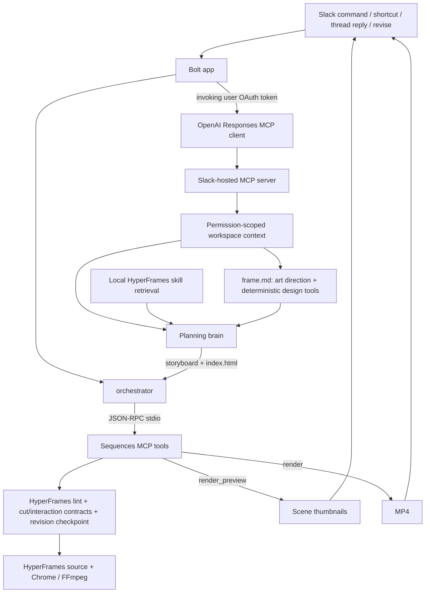

# ROADMAP.md — Current State, Priorities, and TODOs

> Slack Agent Builder Challenge · deadline July 13, 2026 at 8pm EDT.
> Rules: [HACKATHON_RULES.md](HACKATHON_RULES.md). Setup/deploy:
> [OPERATIONS.md](OPERATIONS.md). Agent/runtime boundaries: [CLAUDE.md](CLAUDE.md).
> Target design: [ARCHITECTURE.md](ARCHITECTURE.md).

## Product

Sequences for Slack turns a release message into a launch-video draft in the channel. A PM can create from `/sequences` or a message shortcut, inspect a storyboard immediately, receive an inline MP4 when rendering finishes, and ask for a revision without leaving Slack.

The product line is still “from shipped to shown.” The implementation strategy is:

- **HyperFrames is the primary authoring/rendering substrate and creative knowledge base.** Its native prompting already produces stronger motion graphics than the current Sequences/Forge abstractions.
- **Sequences contributes deterministic guardrails and Slack workflow plumbing:** direct-source validation, revision checkpoints, linting, repeatable previews, and resilient delivery.
- **Forge Stage remains useful as a component-making direction.** It is not the default visual system, but its component model can become a tool exposed to the agent later.

The live planning brain authors canonical HyperFrames HTML directly, dressed in a per-job `frame.md` design system (curated mood DNA plus art-directed tokens checked by deterministic design tools). The typed Sequences plan compiler remains only for the deterministic `/sequences demo` fallback while richer asset ingestion, capability sync, and component contracts are developed.

---

## Major Features (point agents here to optimize)

Scan this to find a capability and the file that owns it. To improve one — e.g.
"tighten the spatial placement audit" or "make context retrieval more resilient" —
point an agent at the listed file.

| Feature | Owner file(s) | What you'd tune |
| --- | --- | --- |
| Create / revise / undo / share · two-tier delivery | `src/index.ts`, `src/orchestrator.ts` | Slack UX, message flow, MCP-vs-local policy |
| Slack workspace context (hosted MCP retrieval) | `src/slackMcpContext.ts` | retrieval prompt, resilience/retry, degrade-gracefully note |
| Direct HyperFrames authoring | `src/engine/compositionRunner.ts`, `src/engine/directComposition.ts`, `src/engine/fallbackComposition.ts` | director prompt, storyboard/HTML parse, validation gate, model-free failure net |
| Per-job design system (`frame.md`) | `src/engine/frameDesign.ts`, `framePresets.ts`, `brandTokens.ts`, `frameTools.ts` | presets, palette/type derivation, contrast/font safety |
| Cinematography kit (light/material/grade/grain) | `src/engine/cinemaKit.ts`, `src/engine/templates/sequences-cinema.v1.css` | grain/vignette floor, key lights, lit materials, bloom, scene grades / color arc |
| Spatial / layout placement ("spacing" tool) | `frame.md` flow compositions + relational `data-layout-*` + `src/engine/layoutInspector.ts` | flow-first placement, safe-area / anchor / align / gap / optical audit |
| Cursor interactions | `src/engine/interactionContract.ts`, `src/engine/templates/sequences-interactions.v1.js` | hotspot / target / ripple geometry, interaction QA |
| Executable boundary cuts | `src/engine/cutContract.ts`, `src/engine/templates/sequences-cuts.v1.js` | typed cut styles, wrapper ownership, object-match bindings |
| Static motion-density guard | `src/engine/motionDensity.ts` | liveness repair warnings for long quiet gaps, front-loaded scenes, dense bursts |
| Temporal motion evidence | `src/engine/temporalInspector.ts` | development strips, cut triptychs, change curve, quiet-window review |
| Zero-token revise ("shorter" / "warmer") | `src/engine/tweakRunner.ts` | deterministic tweak matcher |
| Render + thumbnails | `src/engine/render.ts`, `src/engine/thumbs.ts` | Chrome / FFmpeg pipeline, draft vs HD |
| Curated model-free demo | `src/demo.ts` | the bulletproof preset reel |
| Golden Slack ad film | `scripts/slackAdFilm.ts` | cinematic quality bar and end-to-end cut proof (`npm run film:demo`) |
| Local `/sequences` simulator | `scripts/sequenceCheck.ts` | Slack-free create checks, model/provider receipts, validation, motion/artifact report |
| Self-check | `src/diagnostics.ts` | `/sequences mcp-test` coverage |
| Per-user OAuth + hosted MCP | `src/slackOAuth.ts`, `src/slackTokenStore.ts` | install flow, encrypted token storage |

---

## What is Built

### Slack Surface & Two-Tier Delivery
- `/sequences` opens the create modal.
- `/sequences demo` builds the curated five-scene Relay reel with no model call.
- The “🎬 Make a launch video” message shortcut reads the complete release thread and prefills a brief.
- Storyboard tier completes first (plan/apply and thumbnails upload immediately), updating to "storyboard ready — rendering the video...".
- Video tier MP4 rendering continues asynchronously; the message updates to "ready" once finished. If rendering fails, it falls back to thumbnails-only.
- Human replies in a reel thread trigger revision conversationally, guarded against retries and concurrent changes.
- Live Thinking Steps update as operations run, exposing Undo, Render HD, and Approve & share controls on ready drafts.

### MCP Integration
- Stdio MCP server runs as default unless `SLACK_SEQUENCES_USE_MCP=0`.
- Create/Revise invoke `submit_composition` → `render_preview` → `render`.
- Curated demo runs `submit_plan` → `render_preview` → `render` without model calls.
- Progress updates are posted as incremental `chat.update` Thinking Steps, settling with an argument-free build trace.

### Brand, Presets, and Spatial Intent
- Per-job `frame.md` design system choosing mood, harmony, typography, and spatial density.
- Five curated presets in `src/engine/framePresets.ts` (clean-corporate, dark-premium, editorial, bold-launch, crisp-dev) on embedded fonts.
- Deterministic brand color/font extraction (`brandTokens.ts`) + URL capture (`brandCapture.ts`). Enforced WCAG contrast and font safety (`frameTools.ts`).
- Semantic spatial/cursor foundation: storyboard can declare a stable focal part and hover/click/drag intent (`SpatialIntentV1` / `InteractionIntentV1`).
- Project-local pointer geometry resolution (`sequences-interactions.v1.js`) and interaction-time browser QA (`qa/spatial.json`).
- `frame.md` supplies six flow-first scene compositions plus semantic `.zone` / `.stack` / `.row` / `.cluster` helpers. Primary content stays in safe-area Grid/Flex flow; scoped absolute positioning remains available for decoration and deliberate hero overlap.
- Interaction targets are reconciled only when an exact element id or one unique semantic candidate makes the binding unambiguous; genuinely ambiguous interactions still quarantine safely.
- Browser-QA infrastructure failure now publishes a statically valid draft with an explicit QA marker. If storyboard/HTML authoring itself fails, `fallbackComposition.ts` produces a simple three-shot, frame-colored direct composition instead of surfacing a Slack error.
- Model A/B (July 1): DeepSeek remains the default production author. The GLM override emitted truncated/invalid inline JavaScript and failed all three static-validation attempts; GLM remains on bounded frame/storyboard decisions, where it is reliable and high leverage.
- Post-change paid RADAR smoke: guessed `top/left/right/bottom` pixel edges fell from 47 to 0, absolute rules from 20 to 11, and all four shots selected named flow layouts with ten semantic zones. Replaying its planned CTA click through the final binding normalizer produced clean interaction QA; arrival, press, and release all landed inside the target.

### Cinematography — the host light kit (2026-07-01)
- Diagnosis: choreography (typed cuts, sequential reveals, holds) was solved,
  but frames read as dim wireframe slides — no lighting model, near-zero
  surface/canvas separation, no color arc, timid scale. The film had
  choreography but no cinematography.
- `sequences-cinema.v1.css` (`src/engine/cinemaKit.ts`) is a versioned,
  host-owned static-CSS kit: automatic film grain (fixed-seed feTurbulence) +
  corner vignette on the composition root; `.keylight` directional light
  fields; `.bloom` hero halos; `.material` / `.material-hero` /
  `.material-chrome` / `.inset-well` lit-surface recipes; and scene grades
  (`.grade-cold|neutral|warm|noir`) that retint light per scene so a film has
  a color script instead of one flat palette.
- `compositionRunner.ts` injects it as an inline
  `<style id="sequences-cinema">` block into every live-authored document
  (inline, not a `<link>` — immune to static-server MIME quirks across QA,
  thumbnails, and the render producer) and adds `cinema-light` to the root for
  light-basis frames. Zero author output budget; a hand-written or stale kit
  block is replaced with the canonical source.
- `frame.md` renders per-job `--cinema-key` / `--cinema-bloom` values derived
  from the palette (atmosphere/accent) plus a "Cinematography (host kit)"
  section; `prompts/planning-director.md` teaches the vocabulary and the
  grade-arc doctrine (cold problem → neutral turn → warm payoff).
- Pure CSS: gradients + layered shadows only. No blend modes, filters,
  animation, randomness, or network — deterministic under seek by
  construction. Kit classes are enhancement-only; no new publication gate.
- The golden film (`npm run film:demo`) is rebuilt on the kit as the quality
  bar: cold→neutral→warm grade arc where the brand gold enters with the
  product, masked-rise typography, believable UI microcopy, 400px lit app
  windows, a bloomed player payoff, and a warm lockup hold — proven through
  validation, checkpoint, 48-sample browser QA, thumbnails, temporal
  evidence, and a local MP4 render.

### Motion Direction & Temporal Evidence
- Storyboard shots may declare a typed outgoing cut: `hard`,
  `cut-left/right/up/down`, `zoom-through`, `inverse-zoom`, `flash-white`, or
  `object-match`.
- `compositionRunner.ts` deterministically injects the canonical cut JSON island,
  local runtime, and compile call from the locked storyboard. The source author
  does not spend output budget reimplementing seams and cannot silently omit one.
- `cutContract.ts` normalizes timing/travel, validates source bindings, persists
  the resolved cut plan/runtime hash, and warns when authored scene-wrapper
  tweens compete with host-owned boundary motion.
- `sequences-cuts.v1.js` compiles velocity-matched directional/zoom/flash motion
  and a measured object-match bridge into the one paused GSAP timeline.
- Browser layout heuristics are suppressed only inside declared cut windows;
  runtime and interaction failures remain authoritative there.
- `npm run film:demo` builds the model-free 24-second Slack ad quality bar through
  submit, validation, checkpoint, 48-sample browser QA, thumbnails, and optional
  MP4 rendering.
- `temporalInspector.ts` produces a compact development strip, per-cut evidence
  sheets, visual-change curve, quiet windows, and promised-vs-observed movement.
  It is developer-facing in `film:demo`, not yet part of live create/revise.
- `motionDensity.ts` now runs in the live static validation path. For 10s+,
  3+ shot compositions it classifies scene starts/cuts as major activity,
  authored GSAP/component/camera beats as medium activity, and cursor
  interactions as medium activity. It asks bounded repair for long quiet gaps,
  front-loaded scenes, under-beaten 4.5s+ shots, and over-dense bursts, then
  persists a compact `motionDensity` summary in `motion-plan.json`. This is a
  liveness repair hint, not rendered temporal proof.
- **Paid live-authoring proof (2026-07-01, OpenRouter smoke):** GLM's storyboard
  pass chose sensible typed cuts unprompted (`cut-left`, `cut-down`,
  `inverse-zoom`, `hard` — each with a coherent editorial rationale), DeepSeek's
  authored source passed the gate after two bounded repair passes, and the host
  injected both the cut bindings and the cinematography kit; the author used
  kit classes (`.material-hero`, `.inset-well`) on its own surfaces. GLM's
  reasoning storyboard budget was raised 8K→16K after the first attempt proved
  8K truncates (reasoning eats the budget; provider ceiling is ~33K).

---

## Current Architecture

---

## Files That Define the System

| File | Responsibility |
| --- | --- |
| [`src/index.ts`](src/index.ts) | Bolt listeners, two-tier delivery, uploads |
| [`src/orchestrator.ts`](src/orchestrator.ts) | create/revise lifecycle, MCP-first fallback policy, receipts |
| [`src/messageEvents.ts`](src/messageEvents.ts) | Human-reply filter and event deduplication |
| [`src/engine/mcpClient.ts`](src/engine/mcpClient.ts) | stdio MCP client |
| [`src/engine/mcp.ts`](src/engine/mcp.ts) | typed project/preview/render tools |
| [`src/engine/compositionRunner.ts`](src/engine/compositionRunner.ts) | direct-authoring prompt (incl. frame.md), response parse, bounded retry |
| [`src/engine/directComposition.ts`](src/engine/directComposition.ts) | canonical source, validation, checkpoints, direct previews/renders |
| [`src/engine/fallbackComposition.ts`](src/engine/fallbackComposition.ts) | model-free three-shot direct composition used only when live authoring fails |
| [`src/engine/layoutInspector.ts`](src/engine/layoutInspector.ts) | spatial/layout placement audit (safe-area, anchor, align, gap, optical) |
| [`src/engine/interactionContract.ts`](src/engine/interactionContract.ts) | cursor interaction contract + hotspot/target/ripple QA |
| [`src/engine/cutContract.ts`](src/engine/cutContract.ts) | typed cut normalization, resolution, source validation, runtime staging |
| [`src/engine/cameraContract.ts`](src/engine/cameraContract.ts) | continuous-spatial-world camera rig: typed camera paths, drift auto-fill, source validation |
| [`src/engine/motionDensity.ts`](src/engine/motionDensity.ts) | static liveness budget: quiet gaps, staged beats, dense bursts |
| [`src/engine/temporalInspector.ts`](src/engine/temporalInspector.ts) | developer-facing motion strips, cut evidence, change/quiet-window report |
| [`src/engine/cinemaKit.ts`](src/engine/cinemaKit.ts) | host-owned cinematography kit: inline injection of `sequences-cinema.v1.css` |
| [`src/engine/frameDesign.ts`](src/engine/frameDesign.ts) | per-job `frame.md`: bounded art direction + deterministic fallback/render |
| [`src/engine/frameTools.ts`](src/engine/frameTools.ts) | palette derivation/contrast repair, embedded type validation, spatial tokens |
| [`src/engine/framePresets.ts`](src/engine/framePresets.ts) | 5 curated SaaS presets (colour/comp DNA on embedded fonts) |
| [`src/engine/brandTokens.ts`](src/engine/brandTokens.ts) | deterministic colour/font extraction + WCAG contrast utils |
| [`src/engine/brandCapture.ts`](src/engine/brandCapture.ts) | optional best-effort URL palette/font capture (HyperFrames-style) |
| [`src/agent/skillContext.ts`](src/agent/skillContext.ts) | bounded HyperFrames skill retrieval |
| [`src/blocks.ts`](src/blocks.ts) | modal/result UI and receipts |
| [`scripts/slackAdFilm.ts`](scripts/slackAdFilm.ts) | model-free golden Slack ad and executable-cut smoke |
| [`scripts/sequenceCheck.ts`](scripts/sequenceCheck.ts) | local Slack-free `/sequences` create simulator and consolidated agent report |
| [`skills/`](skills) | complete upstream HyperFrames agent-skill catalog |
| [`vendor/hyperframes/UPSTREAM.md`](vendor/hyperframes/UPSTREAM.md) | snapshot scope and provenance |

---

## Technical Todo Checklist

Legend: `[x]` done · `[~]` partial · `[ ]` not started

### 1. End-to-end HyperFrames authoring spike
- [x] **Direct composition authoring:** planning bot writes canonical HyperFrames HTML.
- [x] **New planning prompt:** System prompt in `prompts/planning-director.md`.
- [x] **Composition validation gate:** lint, inspect, duration check, local assets, finite timelines.
- [x] **Wire into two-tier delivery:** thumbnail -> render async -> upload path.
- [x] **Bound authoring cost:** completion ceilings, truncated craft contexts, reasoning disabled for DeepSeek, strict schema patches.
- [x] **Storyboard-first, frame-validated authoring:** pre-planning cuts, committing `STORYBOARD.md` + `motion-plan.json` before source generation.
- [x] **Flow-first placement vocabulary:** six named scene compositions and semantic zones in every job's `frame.md`.
- [x] **Never-error create fallback:** static-only publication on QA infrastructure failure plus a deterministic direct composition when authoring fails.

### 2. Revised architecture laws as the planning prompt
- [x] **Write `prompts/planning-director.md`:** instructing revised laws (transactional edits, scoped freedom, RAG index).
- [x] **Tone and creative direction:** motion design aesthetic over generic templates.
- [x] **Craft-specific guidance:** 3-layer composition, pairing type, color commitments, avoiding tells.
- [x] **Feed it `frame.md` + the capability index:** binding art-direction limits.

### 3. Design system — `frame.md` per job
- [x] **Frame preset library:** 5 presets distilled for embedded fonts.
- [x] **Deterministic brand design tools:** color derivation, WCAG repairs, radius/shadow mappings.
- [x] **`frame.md` content:** rendering visual systems and attaching them to Slack threads.
- [x] **One bounded art-direction decision:** choosing presets and deriving styles deterministically.

- [x] **Host cinematography kit (2026-07-01):** versioned `sequences-cinema.v1.css`
      injected inline into every direct composition (grain/vignette floor,
      keylights, blooms, lit materials, scene grades / color arc); per-job
      `--cinema-*` values rendered into `frame.md`; fallback composition and
      the golden film sit on the same kit.

### 4. Skills retrieval for HyperFrames
- [x] **Structured skill retrieval:** keyword router selects up to 4 blueprints and 8 rules.
- [x] **Skill context for revision:** tighter 22K budget passing current HTML and revision targets.
- [x] **Registry-aware retrieval:** retrieves indexed components, blueprints, and local recipes.

### 5. Cut-centered motion direction
- [x] **Storyboard-first planning:** shot targets, cameras, and cut anchors pre-defined.
- [x] **Cut graph:** defining tracking continuity (color fields, anchor components).
- [x] **Executable typed cuts (2026-07-01):** the storyboard's boundary is now a
      typed `cut` intent (`hard`, `cut-left/right/up/down`, `zoom-through`,
      `inverse-zoom`, `flash-white`, `object-match`) compiled by a deterministic
      local runtime (`engine/cutContract.ts` + `templates/sequences-cuts.v1.js`)
      into velocity-matched, seek-safe wrapper motion — including a live-measured
      FLIP bridge for object handoffs. The island/script/compile call are
      injected deterministically from the locked storyboard (zero author output
      cost); `validateCutContract` gates publication and warns on wrapper
      transform double-ownership; layout QA ignores heuristic geometry findings
      inside intentional cut windows. Invalid declarations degrade to `hard`.
      Proven end-to-end (validate → checkpoint → QA → thumbnails → MP4) by
      `npm run film:demo` (`scripts/slackAdFilm.ts`). **Verified on a paid OpenRouter
      live-authoring smoke (2026-07-01)** — the planner chose `cut-left` /
      `cut-down` / `inverse-zoom` / `hard` with coherent editorial rationale and
      the authored source passed the gate with host-injected bindings.
- [x] **Static liveness repair guard (2026-07-02):** `motionDensity.ts`
      detects PowerPoint-like long quiet windows and scenes with only a
      front-loaded entrance, feeds those warnings into the bounded author repair
      loop, and records the summary in `motion-plan.json`. Rendered temporal
      evidence remains separate and developer-facing.
- [x] **Continuous Spatial World / Camera Rig (2026-07-02):** the video frame is
      a fixed viewport; a scene's `data-camera-world` is a larger finite plane
      with named `data-region` stations the viewer never sees all at once. The
      storyboard declares a typed per-scene `camera` path (`hold`, `drift`,
      `pan`, `whip`, `push-in`, `pull-back`, `track-to-anchor`,
      `parallax-pass`, `orbit-lite`); `engine/cameraContract.ts` resolves it
      into a contiguous segment chain (gaps auto-filled with connective drift
      so the camera never silently freezes) and
      `templates/sequences-camera.v1.js` compiles seek-safe world transforms
      from live region/part measurement, plus `data-parallax` depth layers.
      The runtime also registers the curated Sequences ease library
      (`seqSwoosh`, `seqWhip`, `seqImpulse`, `seqSettle`, `seqGlide`,
      `seqDrift`, `seqAnticipate`, `seqMicrobounce`) for authored beats and is
      injected into every composition. The island/script/compile call are
      injected deterministically from the locked storyboard;
      `validateCameraContract` gates publication (world/region/part existence,
      island equality) and warns on world-plane double ownership. Storyboards
      now scale with duration (3-10 shots) under a framing-density floor
      (shots + camera moves ≈ every 3.5s); `motionDensity.ts` classifies
      camera moves as beats and flags empty typed holds; layout QA suppresses
      heuristics during camera transits and for off-frame world stations. The
      model-free fallback ships a camera world (hold → drift → pan) as the
      deterministic proof path.
- [~] **Execution passes:**
    - [ ] Lock story, shots, and cut graph.
    - [ ] Reuse/build components.
    - [ ] Compose shot assets/copy.
    - [x] Add shot camera transform (typed camera rig above).
    - [x] Resolve cut and continuity anchors (deterministic cut runtime above).
    - [~] Add micro-motion and validate (static liveness guard exists; rendered
          live evidence/critic still open).
- [ ] **Per-shot dispatch:** separate builders handle individual shots to bypass transform limits.
- [ ] **Slack test:** post `STORYBOARD.md` to thread first for early approval.

### 6. Music and sound direction (cue layer over HyperFrames beats)
- [ ] **Edit-structure analysis:** derive intro, build, drops, and energy envelopes.
- [ ] **Cue assignment to the cut graph:** assign SFX to transition cuts from `media-use`.
- [ ] **Mix in the render pass:** integrate cue mix with engine FFmpeg render.
- [ ] **Slack test:** beat-synced whooshes on cuts (toggleable).

### 7. SaaS motion examples (retrieval seed)
- [~] **Curated examples:** the golden Slack ad (`scripts/slackAdFilm.ts`) is the
      first hand-authored quality-bar composition — the hackathon hero narrative
      (fragmentation → overload → thread → film → lockup) exercising all four
      motion cut styles, component state choreography, and an intentional hold.
      Not yet registered in the capability index; 2-4 more examples open.
- [ ] **Example diversity:** dev tools, startup vision, rebrand campaign.

### 8. Component contracts (Forge Stage-inspired)
- [ ] **Source-derived contracts:** parse authored source to extract layers, parts, states, and anchors.
- [ ] **Morph continuity:** enforce compatibility before swap tweens via shared `morphGroup`.

### 9. Capability index + registry sync + in-Slack audition
- [~] **Registry sync:** sync items from pinned registry commit (still missing: compatibility checks/source approvals).
- [~] **Normalized index:** single schema for blocks, rules, blueprints, presets (still missing: local recipes/contrast scores).
- [x] **Capability-aware retrieval:** query synced offline index to select matches.
- [ ] **In-Slack audition:** Block Kit thumbnails for registry items allowing users to audition blocks.

### 10. Visual critic + continuity QA
- [ ] **Visual critic over rendered evidence:** sample snapshots to detect tiny text, overlap, or drift.
- [~] **Continuity tooling:** `engine/temporalInspector.ts` (2026-07-01) renders a
      per-shot development frame strip, before/at/after evidence sheets for every
      typed cut, a visual-change curve with "visually frozen" quiet windows, and
      a promised-vs-observed check that measures whether each boundary's
      wrappers/bridge actually move. Compact output under `build/qa/temporal/`
      (a handful of composited PNGs + `temporal.json`); developer-facing via
      `film:demo`, not yet in the live create path. Onion-skin overlays and
      focal trajectories still open.
- [x] **Deterministic cursor contract and QA:** measured Ripple, target checks, and Guide Overlay generation (`qa/spatial-guide.png`).
- [ ] **Full Figma-like layout guides:** render thirds/columns on contact sheets.
- [~] **Motion-plan sidecars:** committed `motion-plan.json` now includes a
      static `motionDensity` summary. Not done: rendered live create/revise
      evidence and shot-specific automated repair from pixels.

### 11. Deterministic utilities, component foundry, and library learning
- [ ] **Deterministic composition utilities:** responsive variants, safe centering, distribution grids.
- [x] **Cursor path planning:** local `cursor-interaction-v1` solver.
- [ ] **Component foundry:** mock segmenter converting screenshot -> sub-composition.
- [ ] **Library learning:** promote approved designs back into B2B RAG library.

---

## Build Order (Hackathon-Pragmatic)

**Current Fable queue (2026-07-02, after `cf0094b`):**

1. **Capability materialization + in-Slack audition** - instantiate known-good
   blocks/components instead of citing metadata and rebuilding them, then let
   the user audition candidates in Slack.
2. **Live temporal evidence + bounded visual critic** - put compact strips/cut
   sheets/change curves behind an opt-in live flag, then let a critic request
   one shot-specific repair for rendered dead zones or weak focal hierarchy.
3. **Component contracts + morph continuity** - extend the proven
   `data-part`/object-match/camera foundation into reusable state and morph
   contracts before broader component materialization gets more ambitious.

Historical backlog order:

1. **Prove typed cuts on one paid live-authoring smoke** — *(done 2026-07-01:
   cut selection, kit injection, validation/repair, and previews verified on a
   real OpenRouter run; a paid `SMOKE_RENDER=1` MP4 remains a nice-to-have.)*
2. **Put temporal evidence behind an opt-in live create/revise flag** — preserve
   compact Railway artifacts before considering automated visual repair.
3. **§9 finish capability source approval/materialization + in-Slack audition**
   — let the planner instantiate known-good components instead of citing
   metadata and rebuilding them.
4. **§8 component contracts + the bounded visual critic from §10** — extend the
   proven `data-part`/object-match bridge into reusable state and morph contracts.
5. **§6 music/sound cues & §11 utilities/foundry/learning** — final polish.
