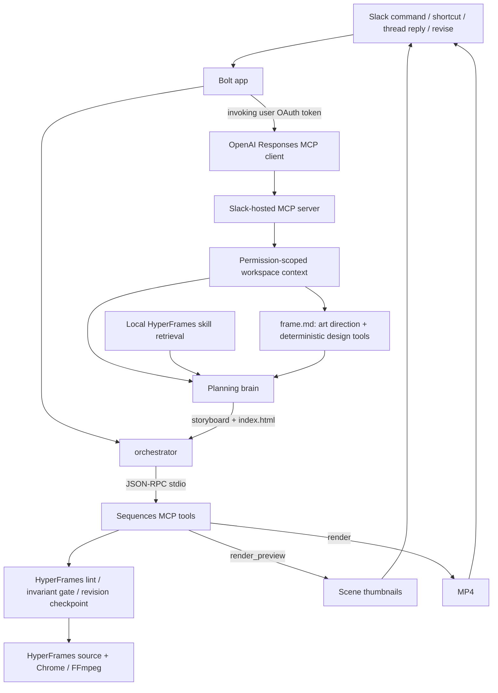

# ROADMAP.md — Current State, Priorities, and TODOs

> Slack Agent Builder Challenge · deadline July 13, 2026 at 8pm EDT.
> Rules: [HACKATHON_RULES.md](HACKATHON_RULES.md). Setup/deploy:
> [OPERATIONS.md](OPERATIONS.md). Agent/runtime boundaries: [CLAUDE.md](CLAUDE.md).
> Target design: [ARCHITECTURE.md](ARCHITECTURE.md).

## Product

Sequences for Slack turns a release message into a launch-video draft in the channel. A PM can create from `/sequences` or a message shortcut, inspect a storyboard immediately, receive an inline MP4 when rendering finishes, and ask for a revision without leaving Slack.

The product line is still “from shipped to shown.” The implementation strategy is:

- **HyperFrames is the primary authoring/rendering substrate and creative knowledge base.** Its native prompting already produces stronger motion graphics than the current Sequences/Forge abstractions.
- **Sequences contributes deterministic guardrails and Slack workflow plumbing:** direct-source validation, revision checkpoints, linting, repeatable previews, and resilient delivery.
- **Forge Stage remains useful as a component-making direction.** It is not the default visual system, but its component model can become a tool exposed to the agent later.

The live planning brain authors canonical HyperFrames HTML directly, dressed in a per-job `frame.md` design system (curated mood DNA plus art-directed tokens checked by deterministic design tools). The typed Sequences plan compiler remains only for the deterministic `/sequences demo` fallback while richer asset ingestion, capability sync, and component contracts are developed.

---

## Major Features (point agents here to optimize)

Scan this to find a capability and the file that owns it. To improve one — e.g.
"tighten the spatial placement audit" or "make context retrieval more resilient" —
point an agent at the listed file.

| Feature | Owner file(s) | What you'd tune |
| --- | --- | --- |
| Create / revise / undo / share · two-tier delivery | `src/index.ts`, `src/orchestrator.ts` | Slack UX, message flow, MCP-vs-local policy |
| Slack workspace context (hosted MCP retrieval) | `src/slackMcpContext.ts` | retrieval prompt, resilience/retry, degrade-gracefully note |
| Direct HyperFrames authoring | `src/engine/compositionRunner.ts`, `src/engine/directComposition.ts`, `src/engine/fallbackComposition.ts` | director prompt, storyboard/HTML parse, validation gate, model-free failure net |
| Per-job design system (`frame.md`) | `src/engine/frameDesign.ts`, `framePresets.ts`, `brandTokens.ts`, `frameTools.ts` | presets, palette/type derivation, contrast/font safety |
| Spatial / layout placement ("spacing" tool) | `frame.md` flow compositions + relational `data-layout-*` + `src/engine/layoutInspector.ts` | flow-first placement, safe-area / anchor / align / gap / optical audit |
| Cursor interactions | `src/engine/interactionContract.ts`, `src/engine/templates/sequences-interactions.v1.js` | hotspot / target / ripple geometry, interaction QA |
| Zero-token revise ("shorter" / "warmer") | `src/engine/tweakRunner.ts` | deterministic tweak matcher |
| Render + thumbnails | `src/engine/render.ts`, `src/engine/thumbs.ts` | Chrome / FFmpeg pipeline, draft vs HD |
| Curated model-free demo | `src/demo.ts` | the bulletproof preset reel |
| Self-check | `src/diagnostics.ts` | `/sequences mcp-test` coverage |
| Per-user OAuth + hosted MCP | `src/slackOAuth.ts`, `src/slackTokenStore.ts` | install flow, encrypted token storage |

---

## What is Built

### Slack Surface & Two-Tier Delivery
- `/sequences` opens the create modal.
- `/sequences demo` builds the curated five-scene Relay reel with no model call.
- The “🎬 Make a launch video” message shortcut reads the complete release thread and prefills a brief.
- Storyboard tier completes first (plan/apply and thumbnails upload immediately), updating to "storyboard ready — rendering the video...".
- Video tier MP4 rendering continues asynchronously; the message updates to "ready" once finished. If rendering fails, it falls back to thumbnails-only.
- Human replies in a reel thread trigger revision conversationally, guarded against retries and concurrent changes.
- Live Thinking Steps update as operations run, exposing Undo, Render HD, and Approve & share controls on ready drafts.

### MCP Integration
- Stdio MCP server runs as default unless `SLACK_SEQUENCES_USE_MCP=0`.
- Create/Revise invoke `submit_composition` → `render_preview` → `render`.
- Curated demo runs `submit_plan` → `render_preview` → `render` without model calls.
- Progress updates are posted as incremental `chat.update` Thinking Steps, settling with an argument-free build trace.

### Brand, Presets, and Spatial Intent
- Per-job `frame.md` design system choosing mood, harmony, typography, and spatial density.
- Five curated presets in `src/engine/framePresets.ts` (clean-corporate, dark-premium, editorial, bold-launch, crisp-dev) on embedded fonts.
- Deterministic brand color/font extraction (`brandTokens.ts`) + URL capture (`brandCapture.ts`). Enforced WCAG contrast and font safety (`frameTools.ts`).
- Semantic spatial/cursor foundation: storyboard can declare a stable focal part and hover/click/drag intent (`SpatialIntentV1` / `InteractionIntentV1`).
- Project-local pointer geometry resolution (`sequences-interactions.v1.js`) and interaction-time browser QA (`qa/spatial.json`).
- `frame.md` supplies six flow-first scene compositions plus semantic `.zone` / `.stack` / `.row` / `.cluster` helpers. Primary content stays in safe-area Grid/Flex flow; scoped absolute positioning remains available for decoration and deliberate hero overlap.
- Interaction targets are reconciled only when an exact element id or one unique semantic candidate makes the binding unambiguous; genuinely ambiguous interactions still quarantine safely.
- Browser-QA infrastructure failure now publishes a statically valid draft with an explicit QA marker. If storyboard/HTML authoring itself fails, `fallbackComposition.ts` produces a simple three-shot, frame-colored direct composition instead of surfacing a Slack error.
- Model A/B (July 1): DeepSeek remains the default production author. The GLM override emitted truncated/invalid inline JavaScript and failed all three static-validation attempts; GLM remains on bounded frame/storyboard decisions, where it is reliable and high leverage.
- Post-change paid RADAR smoke: guessed `top/left/right/bottom` pixel edges fell from 47 to 0, absolute rules from 20 to 11, and all four shots selected named flow layouts with ten semantic zones. Replaying its planned CTA click through the final binding normalizer produced clean interaction QA; arrival, press, and release all landed inside the target.

---

## Current Architecture

---

## Files That Define the System

| File | Responsibility |
| --- | --- |
| [`src/index.ts`](src/index.ts) | Bolt listeners, two-tier delivery, uploads |
| [`src/orchestrator.ts`](src/orchestrator.ts) | create/revise lifecycle, MCP-first fallback policy, receipts |
| [`src/messageEvents.ts`](src/messageEvents.ts) | Human-reply filter and event deduplication |
| [`src/engine/mcpClient.ts`](src/engine/mcpClient.ts) | stdio MCP client |
| [`src/engine/mcp.ts`](src/engine/mcp.ts) | typed project/preview/render tools |
| [`src/engine/compositionRunner.ts`](src/engine/compositionRunner.ts) | direct-authoring prompt (incl. frame.md), response parse, bounded retry |
| [`src/engine/directComposition.ts`](src/engine/directComposition.ts) | canonical source, validation, checkpoints, direct previews/renders |
| [`src/engine/fallbackComposition.ts`](src/engine/fallbackComposition.ts) | model-free three-shot direct composition used only when live authoring fails |
| [`src/engine/layoutInspector.ts`](src/engine/layoutInspector.ts) | spatial/layout placement audit (safe-area, anchor, align, gap, optical) |
| [`src/engine/interactionContract.ts`](src/engine/interactionContract.ts) | cursor interaction contract + hotspot/target/ripple QA |
| [`src/engine/frameDesign.ts`](src/engine/frameDesign.ts) | per-job `frame.md`: bounded art direction + deterministic fallback/render |
| [`src/engine/frameTools.ts`](src/engine/frameTools.ts) | palette derivation/contrast repair, embedded type validation, spatial tokens |
| [`src/engine/framePresets.ts`](src/engine/framePresets.ts) | 5 curated SaaS presets (colour/comp DNA on embedded fonts) |
| [`src/engine/brandTokens.ts`](src/engine/brandTokens.ts) | deterministic colour/font extraction + WCAG contrast utils |
| [`src/engine/brandCapture.ts`](src/engine/brandCapture.ts) | optional best-effort URL palette/font capture (HyperFrames-style) |
| [`src/agent/skillContext.ts`](src/agent/skillContext.ts) | bounded HyperFrames skill retrieval |
| [`src/blocks.ts`](src/blocks.ts) | modal/result UI and receipts |
| [`skills/`](skills) | complete upstream HyperFrames agent-skill catalog |
| [`vendor/hyperframes/UPSTREAM.md`](vendor/hyperframes/UPSTREAM.md) | snapshot scope and provenance |

---

## Technical Todo Checklist

Legend: `[x]` done · `[~]` partial · `[ ]` not started

### 1. End-to-end HyperFrames authoring spike
- [x] **Direct composition authoring:** planning bot writes canonical HyperFrames HTML.
- [x] **New planning prompt:** System prompt in `prompts/planning-director.md`.
- [x] **Composition validation gate:** lint, inspect, duration check, local assets, finite timelines.
- [x] **Wire into two-tier delivery:** thumbnail -> render async -> upload path.
- [x] **Bound authoring cost:** completion ceilings, truncated craft contexts, reasoning disabled for DeepSeek, strict schema patches.
- [x] **Storyboard-first, frame-validated authoring:** pre-planning cuts, committing `STORYBOARD.md` + `motion-plan.json` before source generation.
- [x] **Flow-first placement vocabulary:** six named scene compositions and semantic zones in every job's `frame.md`.
- [x] **Never-error create fallback:** static-only publication on QA infrastructure failure plus a deterministic direct composition when authoring fails.

### 2. Revised architecture laws as the planning prompt
- [x] **Write `prompts/planning-director.md`:** instructing revised laws (transactional edits, scoped freedom, RAG index).
- [x] **Tone and creative direction:** motion design aesthetic over generic templates.
- [x] **Craft-specific guidance:** 3-layer composition, pairing type, color commitments, avoiding tells.
- [x] **Feed it `frame.md` + the capability index:** binding art-direction limits.

### 3. Design system — `frame.md` per job
- [x] **Frame preset library:** 5 presets distilled for embedded fonts.
- [x] **Deterministic brand design tools:** color derivation, WCAG repairs, radius/shadow mappings.
- [x] **`frame.md` content:** rendering visual systems and attaching them to Slack threads.
- [x] **One bounded art-direction decision:** choosing presets and deriving styles deterministically.

### 4. Skills retrieval for HyperFrames
- [x] **Structured skill retrieval:** keyword router selects up to 4 blueprints and 8 rules.
- [x] **Skill context for revision:** tighter 22K budget passing current HTML and revision targets.
- [x] **Registry-aware retrieval:** retrieves indexed components, blueprints, and local recipes.

### 5. Cut-centered motion direction
- [x] **Storyboard-first planning:** shot targets, cameras, and cut anchors pre-defined.
- [x] **Cut graph:** defining tracking continuity (color fields, anchor components).
- [ ] **Execution passes:**
    - [ ] Lock story, shots, and cut graph.
    - [ ] Reuse/build components.
    - [ ] Compose shot assets/copy.
    - [ ] Add shot camera transform.
    - [ ] Resolve cut and continuity anchors.
    - [ ] Add micro-motion and validate.
- [ ] **Per-shot dispatch:** separate builders handle individual shots to bypass transform limits.
- [ ] **Slack test:** post `STORYBOARD.md` to thread first for early approval.

### 6. Music and sound direction (cue layer over HyperFrames beats)
- [ ] **Edit-structure analysis:** derive intro, build, drops, and energy envelopes.
- [ ] **Cue assignment to the cut graph:** assign SFX to transition cuts from `media-use`.
- [ ] **Mix in the render pass:** integrate cue mix with engine FFmpeg render.
- [ ] **Slack test:** beat-synced whooshes on cuts (toggleable).

### 7. SaaS motion examples (retrieval seed)
- [ ] **Curated examples:** 3-5 hand-authored HyperFrames compositions representing the B2B quality bar (registered in capability index).
- [ ] **Example diversity:** dev tools, startup vision, rebrand campaign.

### 8. Component contracts (Forge Stage-inspired)
- [ ] **Source-derived contracts:** parse authored source to extract layers, parts, states, and anchors.
- [ ] **Morph continuity:** enforce compatibility before swap tweens via shared `morphGroup`.

### 9. Capability index + registry sync + in-Slack audition
- [~] **Registry sync:** sync items from pinned registry commit (still missing: compatibility checks/source approvals).
- [~] **Normalized index:** single schema for blocks, rules, blueprints, presets (still missing: local recipes/contrast scores).
- [x] **Capability-aware retrieval:** query synced offline index to select matches.
- [ ] **In-Slack audition:** Block Kit thumbnails for registry items allowing users to audition blocks.

### 10. Visual critic + continuity QA
- [ ] **Visual critic over rendered evidence:** sample snapshots to detect tiny text, overlap, or drift.
- [ ] **Continuity tooling:** onion-skin transitions, focal trajectories.
- [x] **Deterministic cursor contract and QA:** measured Ripple, target checks, and Guide Overlay generation (`qa/spatial-guide.png`).
- [ ] **Full Figma-like layout guides:** render thirds/columns on contact sheets.
- [ ] **Motion-plan sidecars:** `*.motion.json` assertions checking liveness.

### 11. Deterministic utilities, component foundry, and library learning
- [ ] **Deterministic composition utilities:** responsive variants, safe centering, distribution grids.
- [x] **Cursor path planning:** local `cursor-interaction-v1` solver.
- [ ] **Component foundry:** mock segmenter converting screenshot -> sub-composition.
- [ ] **Library learning:** promote approved designs back into B2B RAG library.

---

## Build Order (Hackathon-Pragmatic)

1. **§9 capability sync + in-Slack audition** — enables the bot to see registry assets and avoid inventing them.
2. **§5 cut-centered planning** — enforces structural continuity across shot boundaries.
3. **§10 visual critic + continuity** — automates quality audits using rendered images.
4. **§6 music/sound cues & §11 utilities/foundry/learning** — final polish.
