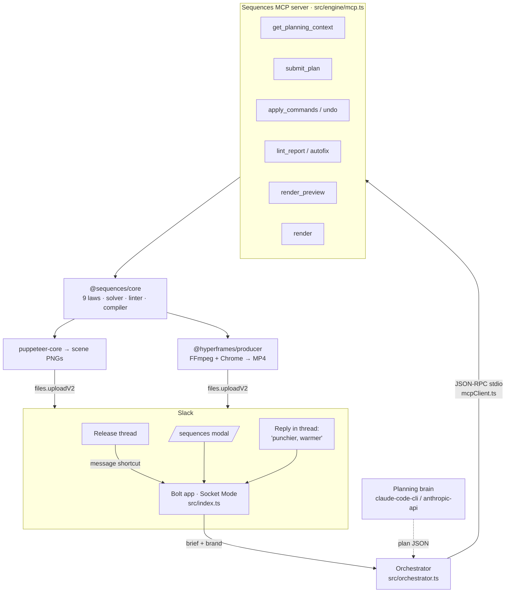

# Sequences for Slack — the plan to win

> **Slack Agent Builder Challenge** · solo builder · deadline **Jul 13, 2026 8pm EDT**.
> Rules digest: [HACKATHON_RULES.md](HACKATHON_RULES.md). Repo isolation + stack:
> [CLAUDE.md](CLAUDE.md). This document is prioritized the way the user asked:
> **(1) hackathon fit, (2) real use case, (3) buildable architecture, (4) the demo
> that wins.** Then the 15-day timeline and the foundation that already exists.

---

## TL;DR — the one-sentence pitch

> **Sequences for Slack turns the message where your team announces a release into a
> polished, on-brand launch video — in the channel, in ~90 seconds, revised by
> replying in the thread.** The Slack agent drives a real deterministic motion
> engine through **MCP tools**; it never hand-writes animation, so every draft is
> well-timed and on-brand by construction.

"From *shipped* to *shown*." Engineering teams ship constantly. Turning that into
something a human can *watch* — for customers, social, sales enablement, the
#announcements channel — is a recurring, designer-bottlenecked chore. We close
that gap where the work already happens: Slack.

---

## 1. Hackathon fit (highest priority — this is what we're graded on)

### 1.1 Required tech + track (we satisfy two of three techs)

| Requirement | Our answer | Why it's a *strong* fit, not a checkbox |
| --- | --- | --- |
| **Tech: MCP server integration** (primary) | The Slack agent is an **MCP client**. Every engine action — plan, validate, lint, revise, render — is a `tools/call` to the **Sequences MCP server** ([src/engine/mcp.ts](src/engine/mcp.ts)). | The agent needs a *toolset with a feedback loop* (plan → lint → fix → render), not one API call. That's literally what MCP is for. And the *same* server works in Claude Desktop / Cursor — portability we can show on camera. "Wouldn't be possible without it." |
| **Tech: Real-Time Search / fresh workspace context** (secondary) | "Make a video from **this thread**" reads the live release thread (`conversations.replies`) and turns it into the brief. Upgrades to the **RTS API** when enabled in the sandbox. | Makes the agent *Slack-native*: it acts on fresh, in-workspace context on demand — exactly the RTS intent. |
| **Track: New Slack Agent** | Automates a real cross-team workflow (eng → marketing/DevRel) and surfaces insight (your release) as media, inside Slack. | Clean, unambiguous fit. No Marketplace submission required (that's the Organizations track). |

We do **not** need the Organizations track (no Marketplace submission in 16 days),
but the build is Marketplace-shaped if we want it later.

### 1.2 Mapping to the four judging criteria (optimize all four)

1. **Technological Implementation.** A deterministic engine (`@sequences/core`, the
   **9 laws**) the agent drives through MCP. The agent selects *named building
   blocks* from a constrained catalog and writes short copy; a solver + linter make
   every timing/easing/stagger decision. **The model cannot emit bad motion** — it
   has no syntax for it. This is the headline "quality software" story and our best
   shot at the **Best Technological Implementation** bonus.
2. **Design.** Slack-native UX done well: one slash command, a clean Block Kit
   modal, a *message shortcut* on any release post, conversational revision in the
   thread, thumbnails-first then video, inline playback. Plus the output itself is
   designed (on-brand motion graphics).
3. **Potential Impact.** Recurring trigger (every release/sprint), real bottleneck
   removed (days + a designer → seconds), data already in Slack. See §2.
4. **Quality of the Idea.** Most entries return text. We return a *video* — the
   single most memorable artifact a judge will see in the gallery — backed by a
   genuinely novel engine. Creative and hard to copy.

### 1.3 What the brief says wins — and our move for each

- *"Solve a real, specific workflow problem inside Slack — not a generic chatbot in
  a Slack skin."* → The trigger is a real Slack moment (the release announcement),
  not a free-floating "make a video" box. **§2 is the part judges score hardest;
  we lead with it.**
- *"Use a required tech in a way that wouldn't be possible without it."* → MCP is
  load-bearing and visible (we can show the JSON-RPC tool calls).
- *"Clear impact / adoption potential."* → recurring + cross-team + measurable
  (§2.4).
- *"Polished demo video."* → our product *is* video; the demo can be gorgeous.

---

## 2. The use case (why an engineering team actually keeps this installed)

### 2.1 The real, recurring pain

Every sprint, engineering ships. Then someone has to **show** it:

- Marketing/DevRel needs a clip for the changelog, the launch tweet, LinkedIn.
- Sales/CS needs a "what's new" explainer for accounts.
- The team wants a 30-second demo for #announcements or the all-hands.

Today that means: write a brief → wait for a designer → After Effects → 2–4 days →
review cycles → maybe it ships. So most releases get **no video at all**. The
content (what shipped, screenshots, the metric that matters) is already sitting in
the **release thread in Slack** — it just never becomes anything watchable.

### 2.2 The hero workflow (the spine of the demo)

```
#launch-relay  (a real release thread)
  PM: "Relay v2 is live 🚀 — sub-100ms traces, 1-click rollback, 40% faster cold starts"
  Eng: [drops a screenshot of the new trace view]

  → right-click the message → "🎬 Make a launch video"
  → bot (in-thread): "On it — drafting a 30s launch reel…"
  → ~15s: posts the scene outline + 5 thumbnails (instant, near-zero cost)
  → ~75s: edits the same message → an inline 30s MP4, on-brand

  → PM replies in thread: "punchier, drop the quote scene, warmer tone"
  → bot revises (deterministic where it can, model where it must) → new draft
  → PM clicks "Approve & share" → posts to #announcements
```

Two entry points, same pipeline:

- **`/sequences`** — from-scratch modal (product, what shipped, audience, tone,
  length, optional screenshot). For planned launches.
- **Message shortcut "🎬 Make a launch video"** — zero-friction, reads the thread.
  For the 90% of releases that would otherwise get nothing.

### 2.3 Personas

- **PM / EM** — owns the release thread; wants the announcement to look good without
  begging design.
- **DevRel / developer-marketing** — turns ships into social/teaser content weekly.
- **Founder (seed/Series A)** — no design team; this *is* their design team.
- **Sales/CS enablement** — "what's new" clips per release.

### 2.4 Why it's defensible (and the impact story for judges)

- **Recurring, not one-off.** Tied to the dev cadence → real adoption, not a toy.
- **On-brand by construction.** Brand colors/fonts + the motion catalog mean output
  is consistent every time — the thing that makes design say no to AI video.
- **Measurable.** Time-to-video days → seconds; videos-per-release ~0 → ~1; zero
  designer hours. Easy, honest numbers for the Devpost "impact" section.
- **In Slack, on purpose.** The brief, the screenshots, the approvals, the sharing
  all live in Slack already. Leaving Slack is the friction we delete.

### 2.5 Honest scope (so it reads as a focused tool, not a toy)

Slack does **create / revise / approve / share**. Deep editing (per-layer tweaks,
exotic motion) stays in the Sequences app. We say this out loud — it signals
product judgment, and it's the line that keeps the build finishable in 16 days.

---

## 3. Architecture (buildable — grounded in the engine that already exists)

### 3.1 The key insight (don't rebuild the engine)

`@sequences/core` is a finished deterministic pipeline:

```
Project (zod-validated scene graph)
  → materialize (archetype layout + profile motion table + overrides)
  → solve (staggers, ~65% overlap, settle gaps, one-loud-motion)
  → compile (HyperFrames HTML + GSAP master timeline)
  → lint (deterministic critic; fixes are commands)
```

A **Plan** is the agent's only output: `{ motionProfile, scenes:[{archetype, layout?,
durationFrames?, slots, camera?}] }` — **no motion numbers**. The solver + linter own
all timing. This constraint *is* the quality story (§1.2.1). We do not invent a scene
schema; we reuse `PlanSchema` → `planToCommands` → `ProjectStore.apply` (validated,
journaled, undoable — law 1).

Real vocabulary (verified in the registry):

| Concept | Real ids |
| --- | --- |
| `motionProfile` (3) | `crisp-saas`, `warm-startup`, `bold-launch` |
| `archetype` (7) | `hook-opener`, `feature-reveal`, `stat-callout`, `ui-walkthrough`, `social-proof`, `logo-sting-cta`, `stat-chart` |
| `camera` (2) | `pushIn`, `pullBack` (≤2 scenes) |

### 3.2 The diagram (for the Devpost submission)



### 3.3 Components

| Component | File | Role |
| --- | --- | --- |
| **Bolt app** | [src/index.ts](src/index.ts) | Slash command, modal, message shortcut, working Revise action. Socket Mode (no public URL). |
| **Orchestrator** | [src/orchestrator.ts](src/orchestrator.ts) | `createVideo()` / `reviseVideo()`. Owns the per-project lifecycle; drives the engine through MCP. |
| **MCP client** | [src/engine/mcpClient.ts](src/engine/mcpClient.ts) | ~120-line stdio JSON-RPC client. Spawns the server with `node --import tsx`. |
| **MCP server** | [src/engine/mcp.ts](src/engine/mcp.ts) | Copied from the engine. The tools the agent drives. |
| **Engine glue** | [src/engine/](src/engine/) | Copied + adapted `projectIo`, `render`, `thumbs`, `projectTemplates`, `planRunner`, `tweakRunner`. |
| **Job store** | [src/jobStore.ts](src/jobStore.ts) | JSON map: Slack interaction (channel/thread/ts) ↔ `projectDir`, status, message_ts. |
| **Block Kit** | [src/blocks.ts](src/blocks.ts) | Modal + result-message builders. |
| **Shared pkgs** | `@sequences/core`, `@sequences/platform` | Imported directly (allowed — shared infra, not the paused apps). |

### 3.4 Why MCP is genuinely on the path (not theater)

The orchestrator never mutates a project directly. It: (1) builds the plan prompt
from `get_planning_context`, (2) asks the planning brain for plan JSON, (3) calls
`submit_plan` (validate + apply + persist + lint), (4) `render_preview`, (5)
`render`. Revisions call `apply_commands` / `tweak` / `undo` over the same server.
We can print the live tool-call log during the demo — proof the agent is *driving
tools*, and the same server is registered in Claude Desktop to show portability.

> **Reliability note:** the orchestrator keeps an **in-process fallback** (calls the
> copied glue directly) if the MCP subprocess fails to spawn, so a flaky host never
> breaks a demo. MCP is the default path; the fallback is invisible insurance.

### 3.5 Storage = a directory (no database)

A project is a folder under `apps/slack/.data/projects/<jobId>/` (gitignored):
`project.json` (scene graph) · `events.log` (journal → undo + "context used"
receipt) · `assets/` (uploaded screenshots, hashed + probed) · `build/` · `renders/`
(MP4 + thumbnail PNGs). The only new persistence is the tiny `jobStore.json` mapping
Slack interactions to project dirs.

### 3.6 Getting media back into Slack (tunnel problem: solved)

Use **`files.uploadV2`** (`files:write`) to upload thumbnails and the MP4 **directly
into the thread** — Slack renders the video inline. **No public URL, no tunnel.**
(A tunnel is only needed for the optional "Open in Sequences" web link.)

### 3.7 Provider (planning brain) — no API key required

`claude-code-cli` (uses the Claude Code subscription login, zero key) is the default;
`anthropic-api` (`ANTHROPIC_API_KEY`, model `claude-sonnet-4-6`) is the fallback for
the cloud sandbox. The pipeline (prompt → JSON → validate → commands) is identical
regardless of brain — quality comes from the schema + solver, not the model.

### 3.8 Scopes

`commands`, `chat:write`, `channels:join`, `files:write`, `app_mentions:read`, plus
`message.channels` shortcut + `channels:history`/`groups:history` for the
thread-reading shortcut and in-thread revise. Verify request signatures (Bolt does
this in Socket Mode via the app token).

---

## 4. The demo that wins (first 60 seconds decide it)

Judges spend ~5–7 min/project and the first 60s matter most. Script the reel so the
**"wow" lands in the first 20 seconds**: a real Slack message becoming a real video.

### 4.1 ~2:45 demo storyboard (official limit: under 3 minutes)

| t | On screen | Voiceover beat |
| --- | --- | --- |
| 0:00–0:10 | Real-looking `#launch-relay` thread; PM announces "Relay v2 is live". | "Every team ships. Almost nobody turns it into something you can watch." |
| 0:10–0:22 | Right-click → **🎬 Make a launch video** → bot replies "On it…". | "Watch. One click on the message that's already there." |
| 0:22–0:38 | Scene outline + thumbnail grid appear in-thread (fast). | "In seconds, a planned, on-brand storyboard — hook, the feature, the metric, the CTA." |
| 0:38–1:00 | Same message updates to an **inline 30s MP4**; let it play. | "And the video. The agent never wrote animation — it chose from a motion catalog; a deterministic engine timed every frame." |
| 1:00–1:25 | Reply in thread: "punchier, drop the quote, warmer tone" → new draft. | "Revisions are a Slack reply. Common edits are deterministic and instant — zero tokens." |
| 1:25–1:50 | Split screen: terminal showing **MCP `tools/call` log** during a revise. | "Under the hood, the Slack agent drives our Sequences MCP server — plan, lint, render — real tools, real feedback loop." |
| 1:50–2:10 | The *same* MCP server registered in Claude Desktop driving a project. | "Because it's MCP, the exact same engine works in any agent. Build once, drive anywhere." |
| 2:10–2:30 | "Approve & share" → posts to #announcements. Architecture diagram. | "From shipped to shown, without leaving Slack — or waiting on design." |
| 2:30–2:45 | Logo sting (generated by the product itself). | "Sequences for Slack." |

### 4.2 Submission checklist (Devpost)

- [ ] <3-min video (target ~2:45; storyboard above) — record on day 15.
- [ ] Text: features + the §1 tech/track mapping + §2.4 impact numbers.
- [ ] **Architecture diagram** (export §3.2; an Excalidraw version is nice-to-have).
- [ ] Sandbox URL; grant `slackhack@salesforce.com` + `testing@devpost.com`.
- [ ] Confirm MCP is demonstrably used (tool-call log in the video).

---

## 5. The 15-day timeline (then 1 day to submit)

Today (Jun 27) = **Day 0**: the foundation in §7 is built. Build runs Days 1–14
(Jun 28 – Jul 11), Day 15 (Jul 12) is polish + record, **Jul 13 reserved for you to
submit, QA, and grant access** before 8pm EDT.

Each day ends **green** (`npm test`, `npm run typecheck`; the 9 laws + compiler
handshake stay passing — that's our "quality of code" evidence).

| Day | Date | Deliverable | Done = |
| --- | --- | --- | --- |
| **0** | Jun 27 | **Foundation (built tonight, §7).** Engine glue copied; orchestrator + MCP client + job store + modal scaffold; `typecheck` green; smoke script runs the pipeline. | Vertical slice compiles + runs locally. |
| **1** ✅ | Jun 28 | Slack sandbox + **checked-in app manifest** ([manifest.json](manifest.json)) + scopes + Socket Mode tokens. `/sequences` opens the modal in a real workspace; **`/sequences demo`** builds a curated reel; **🎬 message shortcut** added. [SETUP.md](SETUP.md) makes it reproducible on clone. | **Done.** Modal opens; submit acked; demo reel runs end-to-end. |
| **2** 🟡 | Jun 29 | Modal submit → orchestrator (in-process) → outline + thumbnails posted via `files.uploadV2`. (Pipeline wired + verified model-free via `npm run demo`; remaining: confirm upload in the live workspace.) | Real thumbnails in Slack. |
| **3** | Jun 30 | Async MP4 render → `chat.update` the message with the inline video. Two-tier preview (thumbs now, MP4 after). | Inline MP4 in Slack. |
| **4** | Jul 1 | **Switch the in-app hot path to MCP** (orchestrator → `mcpClient` → server). In-process becomes the fallback. | Tool-call log shows real MCP traffic. |
| **5** | Jul 2 | Buttons: **Revise**, **Render HD**, **Approve & share**, **Undo**. | Full button loop works. |
| **6** | Jul 3 | **Revise = `tweak`** (zero-token matcher first, model fallback) → re-thumb → re-render. | "shorter / warmer" works. |
| **7** | Jul 4 | **Message shortcut** "🎬 Make a launch video": read thread → brief → pipeline. | Right-click → video. |
| **8** | Jul 5 | **In-thread conversational revise** (reply → revise). | Reply edits the draft. |
| **9** | Jul 6 | Screenshot upload → `assets/` + metadata → media-slot archetypes (`feature-reveal`, `ui-walkthrough`) light up. | Real screenshots in the video. |
| **10** | Jul 7 | **"Context used" receipt** from `events.log` + Undo; trust + audit story. | Receipt renders in Slack. |
| **11** | Jul 8 | Claude Desktop registration of the same MCP server (portability demo beat). RTS/thread-context polish. | Same server, second client. |
| **12** | Jul 9 | Polish one profile/arc preset so the **default** video looks excellent; brand inference from the workspace. | Default reel is demo-grade. |
| **13** | Jul 10 | Block Kit polish (empty/error/loading states); resilience (render failure → graceful thumbnails-only). | No ugly states. |
| **14** | Jul 11 | Build the demo workspace + believable `#launch-relay` thread; dry-run the full script end-to-end. | Clean end-to-end run. |
| **15** | Jul 12 | Record + edit the <3-min video; draft Devpost text; export diagram. | Assets ready. |
| **—** | **Jul 13** | **Reserved for you:** final QA, submit, grant judge access (before 8pm EDT). | Submitted. |

**Cut-line (if time collapses):** Days 0–6 alone are a complete winning entry —
`/sequences` → real plan → thumbnails + inline MP4 → MCP-driven revise. Days 7–14
are amplifiers (shortcut, in-thread, screenshots, portability, polish), each
independently shippable.

---

## 6. Risks & cut-lines

| Risk | Mitigation |
| --- | --- |
| **Render host deps** (FFmpeg + Chrome/Edge). | `render.ts` auto-detects WinGet FFmpeg + Edge on Windows. Pre-warm on the demo box. **Thumbnails need only Chrome/Edge** → the thumbnails-only cut always works. |
| **Render is slow** (~0.5–2 min). | Two-tier: post thumbnails instantly, `chat.update` the MP4 when ready. Draft quality for the demo; "Render HD" on demand. |
| **MCP subprocess flakiness on the host.** | In-process fallback (§3.4) keeps the app working; MCP stays the default + demoed path. |
| **Provider availability in the cloud sandbox.** | `claude-code-cli` locally; `anthropic-api` key in the sandbox. Plan results memoized. |
| **Scope creep into in-Slack editing.** | Hard line (§2.5): create/revise/approve/share only. Deep edits stay in the app. |
| **Don't break the frozen engine.** | Never modify `packages/*`, `apps/forge`, `apps/sequences`. Copy-and-adapt into `src/engine/`. End green. |

---

## 7. Foundation status (what's built as of Day 0)

See [src/](src/). `typecheck`-green:

- `src/engine/` — copied + adapted engine glue: `projectIo.ts`, `render.ts`,
  `thumbs.ts`, `projectTemplates.ts`, `planRunner.ts`, `tweakRunner.ts`, the MCP
  server `mcp.ts` + `mcpServer.ts` entry, and `templates/dashboard.svg`.
- `src/engine/mcpClient.ts` — stdio JSON-RPC MCP client.
- `src/orchestrator.ts` — `createVideo()` (MCP path + in-process fallback; a
  `presetPlan` shortcut that skips the brain) and the modal→brief mapping.
- `src/demo.ts` — `DEMO_BRIEF` + `buildDemoPlan()`: the curated, lint-clean,
  five-beat *Relay v2* reel behind `/sequences demo` (no model, no key).
- `src/jobStore.ts` — JSON-file Slack-interaction ↔ project-dir map.
- `src/blocks.ts` — Block Kit modal + result message.
- `src/index.ts` — `/sequences` (+ `demo`/`help`), modal, **🎬 message shortcut**,
  working Revise action → pipeline → `files.uploadV2`.
- `src/slackApi.ts` — public-channel auto-join/retry and actionable permission
  errors; background Slack API failures do not terminate the bot.
- `manifest.json` + `SETUP.md` — reproducible app creation (scopes, command,
  shortcut, Socket Mode) so a fresh clone can stand the bot up.
- `scripts/demoSmoke.ts` — model-free demo-plan smoke, asserts real thumbnails
  (`npm run demo`).
- `scripts/smoke.ts` — whole pipeline without Slack (`npm run smoke`).
- `scripts/mcpDemo.ts` — exercises the MCP server end-to-end (`npm run mcp:demo`).

Run it:

```powershell
npm run typecheck --workspace @sequences/slack   # green
npm run test --workspace @sequences/slack        # Slack edge-case unit tests
npm run demo --workspace @sequences/slack         # model-free; writes real thumbnails to .data/
npm run smoke --workspace @sequences/slack -- "Relay v2 is live: sub-100ms traces, 1-click rollback"
npm run dev --workspace @sequences/slack          # once .env has the two tokens → /sequences demo
```

---

**Pitch (for the README + Devpost):** *Sequences for Slack turns the message where
your team announces a release into a polished, on-brand launch video — in the
channel, in ~90 seconds, revised by replying in the thread. The agent drives a real
deterministic motion engine over MCP, so every draft is well-timed and on-brand by
construction. From shipped to shown, without leaving Slack.*
