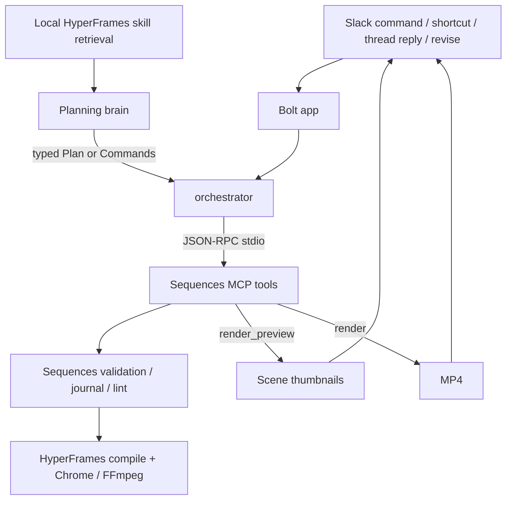

# Sequences for Slack — current state and direction

> Slack Agent Builder Challenge · deadline July 13, 2026 at 8pm EDT.
> Rules: [HACKATHON_RULES.md](HACKATHON_RULES.md). Setup:
> [SETUP.md](SETUP.md). Agent/runtime boundaries: [CLAUDE.md](CLAUDE.md).

## Product

Sequences for Slack turns a release message into a launch-video draft in the
channel. A PM can create from `/sequences` or a message shortcut, inspect a
storyboard immediately, receive an inline MP4 when rendering finishes, and ask
for a revision without leaving Slack.

The product line is still “from shipped to shown.” The implementation strategy
has changed:

- **HyperFrames is the primary authoring/rendering substrate and creative
  knowledge base.** Its native prompting already produces stronger motion
  graphics than the current Sequences/Forge abstractions.
- **Sequences contributes deterministic guardrails and Slack workflow
  plumbing:** typed plans/commands, validation, journaling, linting, repeatable
  previews, and resilient delivery.
- **Forge Stage remains useful as a component-making direction.** It is not the
  default visual system, but its component model can become a tool exposed to
  the agent later.

This is a bridge state, not the final architecture: today the planning brain
still emits a typed Sequences plan that compiles onto HyperFrames. The newly
vendored HyperFrames skills now improve that brain’s motion/creative context.
The next generation should let the agent author and compose more directly in
HyperFrames while keeping deterministic validation around the result.

## What is built

### Slack surface

- `/sequences` opens the create modal.
- `/sequences demo` builds the curated five-scene Relay reel with no model call.
- The “🎬 Make a launch video” message shortcut prefills a brief from a message.
- The shortcut reads the complete release thread, not only the clicked message.
- Create and Revise both post real thumbnails and an inline MP4.
- Human replies in a reel thread trigger Revise conversationally; self/bot posts,
  event retries, and concurrent changes are guarded.
- Live Thinking Steps update as mutation, storyboard, and render operations run.
- Ready drafts expose Undo, Render HD, and Approve & share controls.
- Public-channel `not_in_channel` failures auto-join/retry; background Slack API
  failures do not terminate the bot.

### True two-tier delivery

1. **Storyboard tier:** plan/apply and scene thumbnails complete first. The
   result message switches to “storyboard ready — rendering the video…” and the
   thumbnails upload immediately.
2. **Video tier:** MP4 rendering continues asynchronously. The same message
   becomes “is ready” and Slack receives the MP4 inline.

If Chrome or FFmpeg is unavailable, the result settles as thumbnails-only
instead of crashing.

### MCP is the default live path

MCP is opt-out. Unless `SLACK_SEQUENCES_USE_MCP=0`, the orchestrator drives a
per-project stdio MCP server:

| Lifecycle | MCP calls |
| --- | --- |
| Create | `submit_plan` → `render_preview` → `render` |
| Revise | `apply_commands` → `render_preview` → `render` |
| Deterministic demo | same tool path, but the plan is a curated preset and no planning model runs |

Each operation emits a progress event before and after it runs. Slack turns that
into incremental `chat.update` Thinking Steps, including successful calls,
in-process fallback, failures, duration, and render quality. The settled result
contains a compact, argument-free **build trace**. This is observable proof of
the actual path, not a static “powered by MCP” badge.

The fallback stays intentionally narrow. It applies the same command through
the same project store or invokes the same preview/render implementation
in-process. It does not change the plan or silently substitute a second model.

### HyperFrames skills and source

The June 27 HyperFrames `0.7.17` snapshot is under
[`vendor/hyperframes`](vendor/hyperframes), trimmed to relevant runtime source,
practical docs, licensing, and provenance. It is not yet the production package
version; the verified Slack runtime remains pinned during the migration.

All 19 upstream skills live intact in [`skills/`](skills), including their
references, scripts, assets, examples, and sub-agent prompts. The local
[`src/agent/skillContext.ts`](src/agent/skillContext.ts) retriever:

1. reads the HyperFrames router first;
2. selects the launch workflow and relevant domain skills;
3. ranks markdown sections against the brief/revision;
4. injects a bounded excerpt into the model prompt;
5. preserves the required Sequences Plan/Command JSON response contract.

Slack displays the selected skill names as an **Agent context** receipt.
`/sequences demo` reports no skills because it deliberately skips the brain.

## Current architecture



Important honesty: model planning happens before `submit_plan`; it is not itself
an MCP tool call. Project mutations, previews, and renders are MCP calls.

## Files that define the system

| File | Responsibility |
| --- | --- |
| [`src/index.ts`](src/index.ts) | Bolt listeners, two-tier delivery, uploads |
| [`src/orchestrator.ts`](src/orchestrator.ts) | create/revise lifecycle, MCP-first fallback policy, receipts |
| [`src/messageEvents.ts`](src/messageEvents.ts) | Human-reply filter and event deduplication |
| [`src/engine/mcpClient.ts`](src/engine/mcpClient.ts) | stdio MCP client |
| [`src/engine/mcp.ts`](src/engine/mcp.ts) | typed project/preview/render tools |
| [`src/agent/skillContext.ts`](src/agent/skillContext.ts) | bounded HyperFrames skill retrieval |
| [`src/blocks.ts`](src/blocks.ts) | modal/result UI and receipts |
| [`skills/`](skills) | complete upstream HyperFrames agent-skill catalog |
| [`vendor/hyperframes/UPSTREAM.md`](vendor/hyperframes/UPSTREAM.md) | snapshot scope and provenance |

## Verification

```powershell
npm run typecheck --workspace @sequences/slack
npm run test --workspace @sequences/slack
npm run mcp:demo --workspace @sequences/slack
npm run demo --workspace @sequences/slack
$env:VERIFY_RENDER='1'; npm run demo --workspace @sequences/slack
```

The first four are the routine gate. The last command additionally requires
Chrome/Edge and FFmpeg and verifies the asynchronous MP4 stage.

## Next priorities

1. Reinstall from the updated manifest and prove create → conversational revise
   → HD → share in the Slack sandbox.
2. Move from “Sequences plan enriched by HyperFrames skills” toward direct
   HyperFrames composition authoring with validation around it.
3. Expose better deterministic tools: inspect composition, lint, render frame,
   compare frames, and repair invalid timing/media wiring.
4. Add component tools inspired by Forge Stage, including reusable components
   that can morph across scenes.
5. Curate SaaS-specific skills and retrieve only the context a scene needs.
6. Later, add bounded sub-agents for component/frame construction.

Not built yet: screenshot asset ingestion, direct HyperFrames authoring,
assistant-status API integration, or component sub-agents. Motion-system and
creative-output changes are intentionally deferred; this pass only changes
Slack workflow, observability, encoding quality, and reliability.
