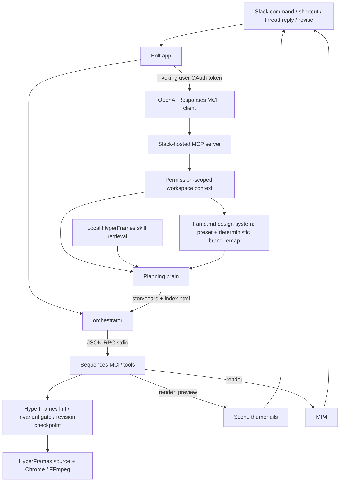

# Sequences for Slack — current state and direction

> Slack Agent Builder Challenge · deadline July 13, 2026 at 8pm EDT.
> Rules: [HACKATHON_RULES.md](HACKATHON_RULES.md). Setup/deploy:
> [OPERATIONS.md](OPERATIONS.md). Agent/runtime boundaries: [CLAUDE.md](CLAUDE.md).
> Target design: [ARCHITECTURE.md](ARCHITECTURE.md).

## Product

Sequences for Slack turns a release message into a launch-video draft in the
channel. A PM can create from `/sequences` or a message shortcut, inspect a
storyboard immediately, receive an inline MP4 when rendering finishes, and ask
for a revision without leaving Slack.

The product line is still “from shipped to shown.” The implementation strategy
has changed:

- **HyperFrames is the primary authoring/rendering substrate and creative
  knowledge base.** Its native prompting already produces stronger motion
  graphics than the current Sequences/Forge abstractions.
- **Sequences contributes deterministic guardrails and Slack workflow
  plumbing:** direct-source validation, revision checkpoints, linting, repeatable
  previews, and resilient delivery.
- **Forge Stage remains useful as a component-making direction.** It is not the
  default visual system, but its component model can become a tool exposed to
  the agent later.

The live planning brain now authors canonical HyperFrames HTML directly, dressed
in a per-job `frame.md` design system (a curated preset deterministically remapped
to the brand). The typed Sequences plan compiler remains only for the
deterministic `/sequences demo` fallback while richer asset ingestion, capability
sync, and component contracts are developed.

## What is built

### Slack surface

- `/sequences` opens the create modal.
- `/sequences demo` builds the curated five-scene Relay reel with no model call.
- The “🎬 Make a launch video” message shortcut prefills a brief from a message.
- The shortcut reads the complete release thread, not only the clicked message.
- Create and Revise both post real thumbnails and an inline MP4.
- Human replies in a reel thread trigger Revise conversationally; self/bot posts,
  event retries, and concurrent changes are guarded.
- Live Thinking Steps update as mutation, storyboard, and render operations run.
- Ready drafts expose Undo, Render HD, and Approve & share controls.
- Public-channel `not_in_channel` failures auto-join/retry; background Slack API
  failures do not terminate the bot.

### True two-tier delivery

1. **Storyboard tier:** plan/apply and scene thumbnails complete first. The
   result message switches to “storyboard ready — rendering the video…” and the
   thumbnails upload immediately.
2. **Video tier:** MP4 rendering continues asynchronously. The same message
   becomes “is ready” and Slack receives the MP4 inline.

If Chrome or FFmpeg is unavailable, the result settles as thumbnails-only
instead of crashing.

### MCP is the default live path

MCP is opt-out. Unless `SLACK_SEQUENCES_USE_MCP=0`, the orchestrator drives a
per-project stdio MCP server:

| Lifecycle | MCP calls |
| --- | --- |
| Create | `submit_composition` → `render_preview` → `render` |
| Revise | `submit_composition` → `render_preview` → `render` |
| Deterministic demo | `submit_plan` → `render_preview` → `render`; no planning model runs |

Each operation emits a progress event before and after it runs. Slack turns that
into incremental `chat.update` Thinking Steps, including successful calls,
in-process fallback, failures, duration, and render quality. The settled result
contains a compact, argument-free **build trace**. This is observable proof of
the actual path, not a static “powered by MCP” badge.

The fallback stays intentionally narrow. It applies the same command through
the same project store or invokes the same preview/render implementation
in-process. It does not change the plan or silently substitute a second model.

### HyperFrames skills and source

The June 27 HyperFrames `0.7.17` snapshot is under
[`vendor/hyperframes`](vendor/hyperframes), trimmed to relevant runtime source,
practical docs, licensing, and provenance. It is not yet the production package
version; the verified Slack runtime remains pinned during the migration.

All 19 upstream skills live intact in [`skills/`](skills), including their
references, scripts, assets, examples, and sub-agent prompts. The local
[`src/agent/skillContext.ts`](src/agent/skillContext.ts) retriever:

1. selects the launch workflow and relevant domain skills;
2. deterministically chooses a bounded candidate set of scene blueprints and
   motion rules from the brief/revision;
3. loads only those exact recipe files plus the core composition contract;
4. ranks a few supporting skill sections against the request;
5. injects the bounded context into the direct storyboard + HTML authoring prompt.

Slack displays the selected skill names as an **Agent context** receipt.
`/sequences demo` reports no skills because it deliberately skips the brain.

## Current architecture



Important honesty: model authoring happens before `submit_composition`; it is not itself
an internal Sequences MCP tool call. Slack workspace retrieval is a remote call
to Slack's hosted MCP server; project mutations, previews, and renders are calls
to the internal stdio Sequences MCP process. Railway does not expose a public
`/mcp` endpoint for Slackbot.

## Files that define the system

| File | Responsibility |
| --- | --- |
| [`src/index.ts`](src/index.ts) | Bolt listeners, two-tier delivery, uploads |
| [`src/orchestrator.ts`](src/orchestrator.ts) | create/revise lifecycle, MCP-first fallback policy, receipts |
| [`src/messageEvents.ts`](src/messageEvents.ts) | Human-reply filter and event deduplication |
| [`src/engine/mcpClient.ts`](src/engine/mcpClient.ts) | stdio MCP client |
| [`src/engine/mcp.ts`](src/engine/mcp.ts) | typed project/preview/render tools |
| [`src/engine/compositionRunner.ts`](src/engine/compositionRunner.ts) | direct-authoring prompt (incl. frame.md), response parse, bounded retry |
| [`src/engine/directComposition.ts`](src/engine/directComposition.ts) | canonical source, validation, checkpoints, direct previews/renders |
| [`src/engine/frameDesign.ts`](src/engine/frameDesign.ts) | per-job `frame.md`: one preset decision + deterministic remap + render |
| [`src/engine/framePresets.ts`](src/engine/framePresets.ts) | 5 curated SaaS presets (colour/comp DNA on embedded fonts) |
| [`src/engine/brandTokens.ts`](src/engine/brandTokens.ts) | deterministic colour/font extraction + WCAG contrast utils |
| [`src/engine/brandCapture.ts`](src/engine/brandCapture.ts) | optional best-effort URL palette/font capture (HyperFrames-style) |
| [`src/agent/skillContext.ts`](src/agent/skillContext.ts) | bounded HyperFrames skill retrieval |
| [`src/blocks.ts`](src/blocks.ts) | modal/result UI and receipts |
| [`skills/`](skills) | complete upstream HyperFrames agent-skill catalog |
| [`vendor/hyperframes/UPSTREAM.md`](vendor/hyperframes/UPSTREAM.md) | snapshot scope and provenance |

## Verification

```powershell
npm run typecheck --workspace @sequences/slack
npm run test --workspace @sequences/slack
npm run mcp:demo --workspace @sequences/slack
npm run direct:demo --workspace @sequences/slack
npm run demo --workspace @sequences/slack
$env:VERIFY_RENDER='1'; npm run direct:demo --workspace @sequences/slack
```

The first four are the routine gate. The last command additionally requires
Chrome/Edge and FFmpeg and verifies the asynchronous MP4 stage.

## Next priorities

The foundation and first direct-authoring spike are complete. The next phase is
making the quality system repeatable around that working loop. See
[ARCHITECTURE.md](ARCHITECTURE.md) and [TODO.md](TODO.md).

1. **Capability index + registry sync + in-Slack audition** (TODO §9) — stop the
   bot rebuilding registry blocks it can't yet see; most demoable next feature.
2. **Seed real SaaS-motion examples** for retrieval/inspiration (provenance
   tracked).
3. Expose deterministic tools: inspect composition, lint, render frame, compare
   frames, repair invalid timing/media wiring.
4. Screenshot asset ingestion → media-slot archetypes use real product UI.
5. Component tools inspired by Forge Stage (reusable, morph across scenes); later,
   bounded sub-agents for component/frame construction.

Built: per-job `frame.md` design system — a curated preset chosen by one small
model decision, then a deterministic brand remap (colour/font extraction from the
evidence pack, optional URL capture, WCAG contrast safety) that binds the
director's palette + typography. The chosen frame.md is shown in the result
message and attached to the thread.

Not built yet: Slack screenshot ingestion, per-scene second-pass retrieval,
capability/registry sync, Brag audio cues, or component sub-agents.
