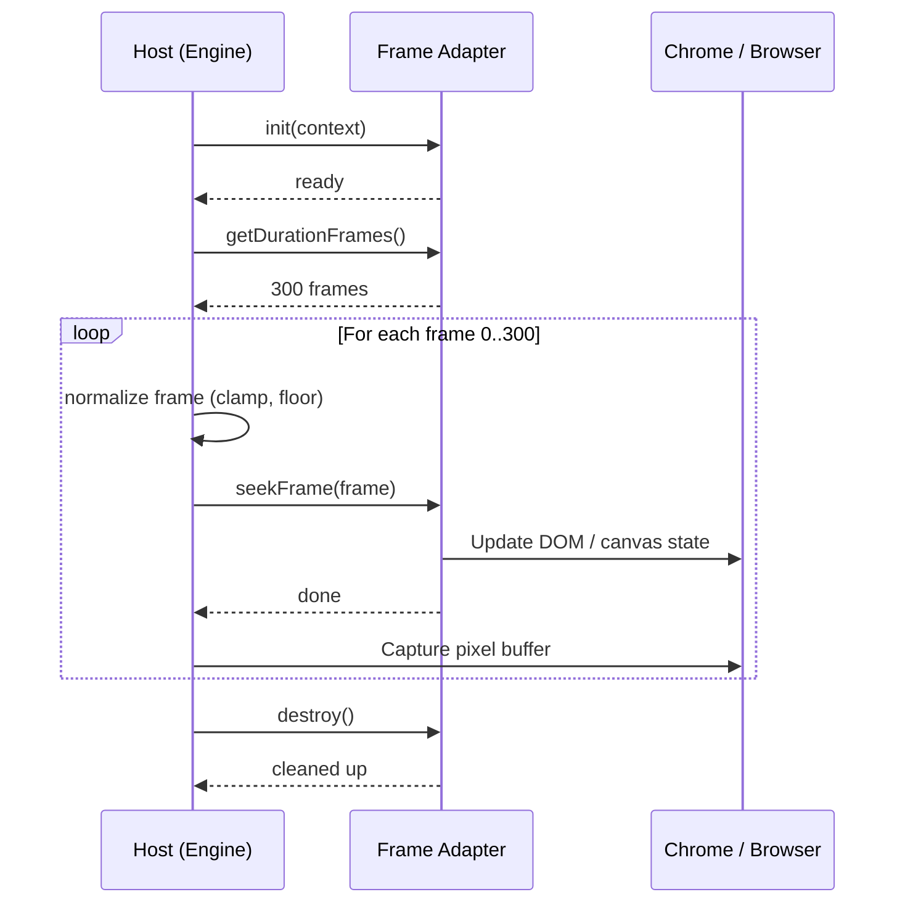

The Frame Adapter pattern is how Hyperframes supports multiple animation runtimes. The core question every adapter answers:

> What should the screen look like at frame N?

If a runtime can answer that, it can plug into Hyperframes.

<Info>
  The Adapter API is currently at **v0** (experimental). Breaking changes are possible until v1. The core contract (seek-by-frame, deterministic output) is stable, but method signatures may evolve.
</Info>

## How It Works

The host application (the [engine](/packages/engine) or [producer](/packages/producer)) drives rendering by calling adapter methods in a strict sequence. The adapter never controls its own clock -- it only responds to seek commands.



## Adapter API (v0)

```typescript adapters/types.ts
type FrameAdapterContext = {
  compositionId: string;
  fps: number;
  width: number;
  height: number;
  rootElement?: HTMLElement;
};

type FrameAdapter = {
  id: string;
  init?: (ctx: FrameAdapterContext) => Promise<void> | void;
  getDurationFrames: () => number;
  seekFrame: (frame: number) => Promise<void> | void;
  destroy?: () => Promise<void> | void;
};
```

## Required Semantics

- `getDurationFrames()` must return a finite integer >= 0
- `seekFrame(frame)` must support arbitrary seek order (forward, backward, random)
- `seekFrame(frame)` must be idempotent for the same input frame
- `seekFrame(frame)` must clamp internal time to the adapter's range
- Adapters should be paused/seek-driven, not clock-driven

## Host Orchestration

The host normalizes frames before calling the adapter:

```typescript engine/render-loop.ts
normalizedFrame = clamp(Math.floor(frame), 0, durationFrames);
```

A typical render loop:

```typescript engine/render-loop.ts
await adapter.init?.({ compositionId, fps, width, height, rootElement });
const durationFrames = adapter.getDurationFrames();

for (let frame = 0; frame <= durationFrames; frame += 1) {
  await adapter.seekFrame(frame);
  // capture pixel buffer for this frame
}

await adapter.destroy?.();
```

## Determinism Contract

These rules are non-negotiable for any adapter. They are the foundation of Hyperframes' [deterministic rendering](/concepts/determinism) guarantee.

- Canonical clock: `t = frame / fps`
- No wall-clock dependencies (`Date.now`, drift-dependent logic)
- No unseeded randomness
- No render-time network fetches
- Fixed output params (`fps`, `width`, `height`)
- Finite duration only
- Deterministic frame quantization before seek

## Supported Runtimes

First-party runtime adapters:

All runtime adapters live in the `/hyperframes-animation` skill — invoke it for the runtime-specific seek API as well as motion rules, scene blueprints, and transitions.

| Runtime | Seek Method | Skill |
|---------|-------------|-------|
| [GSAP](/guides/gsap-animation) | `timeline.totalTime(timeSeconds)` or `timeline.seek(timeSeconds)` | `/hyperframes-animation` |
| Anime.js | `instance.seek(timeMs)` for animations registered on `window.__hfAnime` | `/hyperframes-animation` |
| CSS keyframes | Browser `Animation.currentTime`, with paused negative-delay fallback | `/hyperframes-animation` |
| Lottie / dotLottie | `goToAndStop(timeMs, false)`, raw-frame setters, or player seek APIs | `/hyperframes-animation` |
| Three.js / WebGL | `hf-seek` events plus `window.__hfThreeTime` for deterministic scene rendering | `/hyperframes-animation` |
| Web Animations API | `document.getAnimations()` and `animation.currentTime` | `/hyperframes-animation` |

Community adapters are welcome -- if it can seek by frame, it belongs in Hyperframes.

## Conformance Tests

Every adapter should pass these minimum tests:

1. **Repeatability** -- seek same frame twice, get identical output
2. **Random seek** -- seek order `[90, 10, 50, 10]` produces deterministic results
3. **Bounds** -- negative and overflow frame values do not break
4. **Duration** -- returned duration is a finite integer
5. **Cleanup** -- no leaked timers/listeners after `destroy`

## Next Steps

<CardGroup cols={2}>
  <Card title="Deterministic Rendering" icon="lock" href="/concepts/determinism">
    Understand the determinism guarantees adapters must uphold
  </Card>
  <Card title="GSAP Animation" icon="wand-magic-sparkles" href="/guides/gsap-animation">
    See the first-party GSAP adapter in action
  </Card>
  <Card title="@hyperframes/engine" icon="gear" href="/packages/engine">
    The capture engine that drives adapters during rendering
  </Card>
  <Card title="Contributing" icon="code-branch" href="/contributing">
    Build and contribute your own adapter
  </Card>
</CardGroup>
